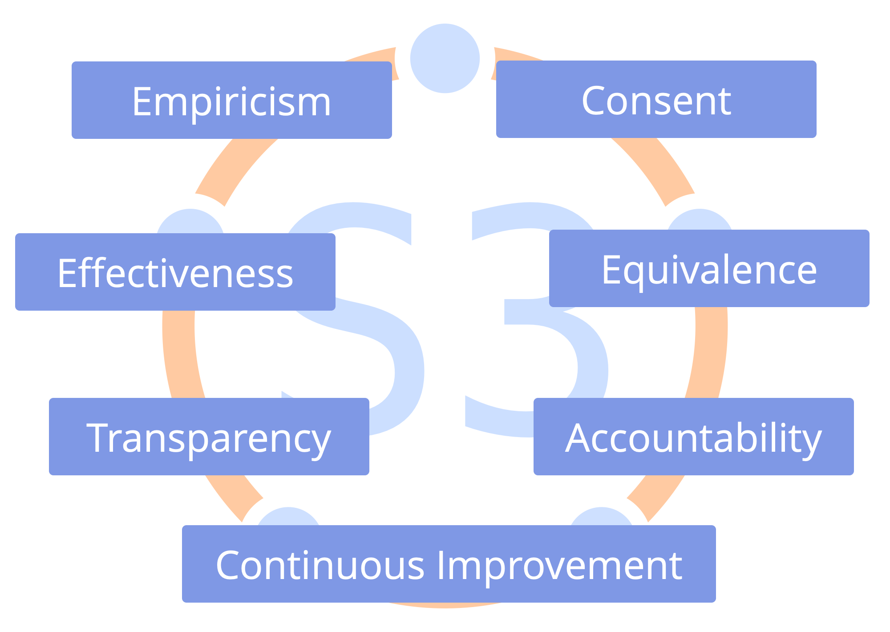

Alinear la colaboración con los Siete Principios.

La adopción de los Siete Principios reduce el número de acuerdos explícitos requeridos, y guía la adaptación de los patrones de S3 para encajar con el contexto de la organización.

Los valores de una organización necesitan aceptar los Siete Principios.

