## ¿Qué es la Sociocracia 3.0?

La Sociocracy 3.0 — también conocida como "S3" — es una <a href="glossary.html#entry-social-technology" class="glossary-tooltip" data-toggle="tooltip" title="Tecnología Social: La tecnología social es cualquier proceso, técnica, método, habilidad o cualquier otro enfoque que la gente pueda utilizar para influir en los sistemas sociales — organizaciones, sociedades, comunidades, etc. — apoyar la consecución de objetivos compartidos y orientar la interacción y el intercambio significativos.">tecnología social</a> para desarrollar organizaciones agile y resilientes de cualquier tamaño, desde pequeñas nuevas empresas hasta grandes redes internacionales y colaboraciones entre múltiples instituciones.

Dentro de esta guía práctica descubrirás una colección completa de conceptos **probados y testados, principios y prácticas para mejorar el rendimiento, el compromiso y el bienestar** en las organizaciones.

Desde su publicación en 2015, los patrones de S3 han estado ayudando a personas en un variado espectro de contextos organizacionales a sacar el máximo provecho de la colaboración. Desde start-ups hasta pequeñas y medianas empresas, grandes organizaciones internacionales, organizaciones financiadas por inversores y organizaciones sin fines de lucro, familias y comunidades.

Usar S3 puede **ayudarte a alcanzar tus objetivos** y navegar con éxito la complejidad. Puedes hacer cambios paso a paso, **sin necesidad de una reorganización radical repentina** o planificar una iniciativa de cambio a largo plazo:

-   Comienza simplemente identificando tus áreas de mayor necesidad y selecciona una o más prácticas o pautas que te sirvan de ayuda.
-   Ves a tu propio ritmo, y desarrolla tus habilidades y competencias a medida que vayas avanzando.

**Independientemente de tu posición en la organización**, encontrarás muchas ideas probadas que son relevantes y útiles para ti.

**Sociocracia 3.0 es gratuita**, y está bajo una Licencia Cultura Libre Creative Commons.

### ¿Cómo ayuda la Sociocracia 3.0?

S3 es una tecnología transformativa tanto para individuos como para organizaciones enteras que te ayudará a averiguar cómo hacer frente a los mayores desafíos de tu organización, aprovechar las oportunidades que se te presentan y resolver los problemas más persistentes.

Sociocracia 3.0 está diseñada para ser flexible y apoya la experimentación y el aprendizaje. Puedes tomar lo que necesites, adaptar las cosas a tu contexto y enriquecer tu enfoque actual.

S3 integra conceptos y prácticas fundamentales encontrados en metodologías agile, gestión lean, Kanban (y KMM), Pensamiento de diseño, Organizaciones Teal y la familia de métodos de gobernanza basados en la sociocracia (SCM/Gobernanza dinámica, Holacracy® etc.). Es gratuito y compatible con cualquier marco agile o lean, incluyendo pero no limitado a Scrum y sus diversos marcos de escala.

### Un enfoque basado en patrones para el cambio organizacional

S3 ofrece un enfoque basado en patrones para el cambio organizacional.

Un **patrón** es un proceso, práctica o pauta que sirve como una plantilla para responder con éxito a un tipo específico de desafío u oportunidad. Los patrones de S3 se descubren mediante la observación de personas trabajando juntas en organizaciones para resolver problemas y responder a las oportunidades a las que se enfrentan. Cuando te das cuenta de que tu forma habitual de hacer las cosas no logra los resultados que esperabas o deseabas, puedes buscar en la S3 patrones que te puedan ayudar.

Los patrones son modulares y adaptables, pueden utilizarse de forma independiente y se refuerzan mutuamente, complementándose entre sí cuando se utilizan en combinación. Los patrones de S3 pueden evolucionarse y adaptarse para satisfacer tus necesidades específicas.

En esta guía, los patrones se agrupan por tema en once categorías para ayudarte a identificar más fácilmente aquellos que son útiles para ti:

- Producción de sentido y toma de decisiones
- Evolucionando organizaciones
- Desarrollo entre iguales
- Habilitadores de cocreación
- Construyendo organizaciones
- Incorporando la S3
- Definiendo acuerdos
- Formatos de reunión
- Prácticas de reunión
- Organización del trabajo
- Estructura organizacional

Proporcionando un menú de patrones entre los que escoger según las necesidades, S3 fomenta un **enfoque del cambio orgánico, iterativo, sin una gran inversión inicial**. Encuentra a las personas donde están y les ayuda a avanzar utilizando distintos patrones a su propio ritmo y de acuerdo a su contexto particular.

### ¿Qué hay en esta guía?

Dentro de este guía práctica descubrirás:

-   Conceptos útiles que te ayudarán a **entender mejor tu organización** y comunicarte de modo más efectivo sobre dónde se necesita el cambio.
-   Un **enfoque al cambio orgánico, iterativo, ** que se encuentra con las personas allá donde están y les ayuda a avanzar a su propio ritmo y de acuerdo a su particular contexto y necesidades.
-   **Siete principios centrales** de colaboración agile y sociocrática
-   Una colección coherente de **más de 70 prácticas y pautas** para ayudarte a navegar la complejidad y mejorar la colaboración:
    -   **Formatos simples, facilitados** que ayudan a los equipos a tomar de la inteligencia colectiva del grupo y procesar gradualmente la información disponible para la mejora continua de los procesos de trabajo, servicios y habilidades.
    -   **Prácticas grupales** para ayudar a las organizaciones a utilizar de la mejor manera posible el talento del que ya disponen, a través de **personas que se apoyan mutuamente** en la formación de habilidades, responsabilidad y compromiso.
    -   Herramientas **simples para aclarar quién hace cada cosa**, liberando a la gente para decidir y actuar por sí misma tanto como sea posible, dentro de restricciones claramente definidas que permiten la experimentación y el desarrollo.
    -   Patrones para una **desarrollar la estructura organizacional más allá de las jerarquías** hacia redes flexibles, descentralizadas donde el flujo de información e influencia apoya directamente la creación de valor.
-   El **Marco de Sentido Común**; una herramienta para comprender a equipos y organizaciones y averiguar cómo empezar con S3.
-   Un **glosario** con explicaciones de todos los términos con los que puedes no estar familiarizada.

Esta guía práctica de Sociocracia 3.0 está escrita y publicada por las tres personas codesarrolladoras de Sociocracia 3.0.

Fiel a la postura de S3, este libro siempre será un trabajo en curso que crece y cambia a medida que aprendemos de personas que están experimentando con S3 en organizaciones de todo el mundo. Desde que comenzamos hace 5 años, hemos publicado varias actualizaciones cada año y seguiremos haciéndolo en los próximos años.

A pesar de que varias secciones de este libro son breves y todavía puede que todavía necesiten ser pulidas, el contenido y las explicaciones han sido suficientes para que mucha gente comience con S3 y consiga cambios positivos en sus organizaciones. Esperamos que también lo encuentres útil.

### Influencias e historia de la Sociocracia 3.0

El significado literal del término **sociocracia** es "regla de los compañeros": *socio* — del latín *socius*— significa "compañera/o", o "amiga/o" y el sufijo *-cracia* - del griego antiguo κράτος (krátos) - significa "poder", o "gobierno".

La palabra sociocracia se remonta a 1851, cuando **Auguste Comte** sugirió aplicar un enfoque científico a la sociedad: los estados serían gobernados por un cuerpo de científicos que fuesen expertos sobre la sociedad (que él llamó "sociólogos"). En su opinión, este futuro, aunque todavía no fuese alcanzable, era inevitable.

Unas décadas después, **Lester Frank Ward**, utilizó la palabra "sociocracia" para describir el gobierno de las personas con relaciones entre ellas. En lugar de tener a los sociólogos en el centro, quería dar más poder y responsabilidad al individuo. Se imaginó a los sociólogos en un papel de investigadores y consultores.

En 1926, el educador reformista neerlandés y cuáquero **Kees Boeke**, estableció una escuela residencial basada en el principio del consentimiento. El personal y los estudiantes fueron tratados como participantes iguales en la gobernanza de la escuela, todas las decisiones debían ser consideradas aceptables por todos. Creó esta versión de la sociocracia sobre principios y prácticas cuáqueras, y describió la sociocracia como una evolución de la democracia en su ensayo de 1945 "Democracia como podría ser".

**Gerard Endenburg**, también un cuáquero y un estudiante en la escuela de Boeke, quería aplicar la sociocracia en el negocio de su familia, Endenburg Elektrotechniek. Creó y evolucionó el *Método de Organización del Círculo Sociocrático* (SCM, por sigla en inglés), que más adelante sería conocido como el "Método Sociocrático", integrando la forma de sociocracia de Boeke con ingeniería y cibernética. En 1978 Endenburg fundó el Centro Sociocrático en Utrecht (que ahora es el Centro Sociocrático en Rotterdam) como un medio para promover la sociocracia dentro y fuera de los Países Bajos. Desde 1994 las organizaciones neerlandesas que utilizan SCM están exentas del requisito legal de tener un consejo de trabajadores.

A finales de los años 1990 y principios de los años 2000, varias personas que no hablaban holandés se encontraron con la sociocracia, pero no fue hasta 2007 cuando **Sharon Villines y John Buck** lanzaron su libro, "Nosotros, el pueblo", que la sociocracia se volvió ampliamente accesible al mundo de habla inglesa, y desde allí ha comenzado a migrar a varias otras lenguas.

La sociocracia ha demostrado ser efectiva para muchas organizaciones y comunidades de todo el mundo, pero aún no se ha vuelto viral.

En 2014 **James Priest y Bernhard Bockelbrink** se unieron para cocrear un conjunto de recursos de aprendizaje con licencia Creative Commons, resumiendo ideas de la Sociocracia, Agile y Lean. Descubrieron que organizaciones de todos los tamaños necesitan un menú flexible de prácticas y estructuras, apropiado para su contexto específico, que permita la evolución de un enfoque más sociocrático y agile para lograr una mayor eficacia, coherencia, plenitud y bienestar. La primera versión de **Sociocracia 3.0.** se publicó en marzo de 2015.

**Liliana David** se unió al equipo poco después. Juntas, colaboran regularmente para que la S3 esté disponible y aplicable al mayor número posible de organizaciones y proporcionar recursos bajo una **Licencia de Cultura Libre de Creative Commons** para personas que quieran aprender, aplicar e informar a otros sobre Sociocracy_3.0.

#### El Movimiento Sociocracia 3.0

Al crecer el interés en la Sociocracia 3.0 hay una comunidad de personas en rápido crecimiento con una diversidad de procedencias — consultores pioneros, coaches, facilitadores de aprendizaje, y personas que aplican S3 en sus distintos contextos — que comparten el aprecio por el potencial transformador de la Sociocracia 3.0 para ayudar a las organizaciones y a sus miembros a prosperar y desarrollarse. Muchos dedican amablemente parte de su tiempo a experimentar y compartir sobre S3, y colaboran para aprender unos de otros y documentar experiencias para informar sobre el desarrollo y evolución en curso de la S3 y sus diversas aplicaciones.

### ¿Por qué "3.0"?

La sociocracia como forma de gobierno ha sido mencionada desde 1851. Posteriormente ha sido desarrollada y adaptada por muchas personas y organizaciones diferentes, incluyendo Gerard Endenburg, The Sociocracy Group (TSG) y Brian Robertson (HolacracyOne).

No obstante, fuera de los Países Bajos la sociocracia hasta hace poco seguía siendo en gran medida desconocida.

Amamos la sociocracia porque vemos cómo las organizaciones y sus miembros crecen y prosperan cuando utilizan elementos de la misma para enriquecer o transformar lo que están haciendo.

También amamos agile, lean, Kanban, los Core Protocols, NVC y muchas otras ideas también. Creemos que el mundo será un mejor lugar a medida que más organizaciones aprendan a utilizar esta cornucopia de prácticas increíbles que están surgiendo hoy en día en el mundo, y aprendan a sintetizarlas con lo que ya saben.

Por lo tanto, decidimos dedicar parte de nuestro tiempo a desarrollar y evolucionar sociocracia, integrándola con muchas de estas otras ideas potentes, para hacerla accesible y aplicable al mayor número de organizaciones posible.

Con este fin, reconocemos el valor de una identidad fuerte, una forma radicalmente diferente de distribución, y de adaptar el *Método de Organización del Círculo Sociocrático* para mejorar su aplicabilidad.

#### El nombre

El nombre "*Sociocracia 3.0*" demuestra respeto por el linaje y es también un paso adelante significativo.

También ayuda a evitar la percepción de que tergiversamos el *Método de Organización del Círculo Sociocrático* (SCM) promovido por el Grupo Sociocracia.

#### El nuevo modelo de distribución

*Sociocracia 3.0* utiliza un modelo no centralizado para la distribución. Es un cambio de paradigma en la forma en que la sociocracia es llevada a las personas y a las organizaciones, y uno con el que muchas personas pueden identificarse.

Apoyamos la distribución "viral" a través de dos estrategias clave:

* **Sociocracia 3.0 está abierta:** Queremos fomentar el crecimiento de un ecosistema vibrante de aplicaciones y tonalidades de la sociocracia, donde las personas comparten y discuten sus percepciones y las adaptaciones que están haciendo para su contexto específico. Con este fin, Sociocracia 3.0 pone énfasis en comunicar los principios subyacentes e invita explícitamente a la creatividad de todos para remezclar, ampliar y adaptar las cosas para satisfacer sus necesidades.
* **Sociocracia 3.0 es gratis:** Para eliminar la barrera de entrada para personas y organizaciones, proporcionamos recursos gratuitos bajo una *Licencia de Cultura Libre Creative Commons* para aprender, practicar y enseñar *Sociocracia 3.0*. Todo el mundo puede utilizar nuestros recursos sin nuestro permiso explícito, incluso en un contexto comercial, o como base para construir sus propios recursos, siempre y cuando compartan sus nuevos recursos bajo la misma licencia. Esperamos y apoyamos a otras organizaciones, consultores, coaches, facilitadores de aprendizaje e instructores para seguir nuestro ejemplo y liberar también sus recursos.

#### La evolución del Método de la Organización del Círculo Sociocrático

Tal vez tengamos que hacer esto explícito: Sociocracia 3.0 no está dirigido específicamente a la comunidad existente de personas que exploran el *Método de Organización del Círculo Sociocrático*, o en The Sociocracy Group (TSG). El *Método de Organización del Círculo Sociocrático* (SCM, por su sigla en inglés) ya está bien desarrollado y mucha gente parece estar suficientemente contenta con él.

Sin embargo, a partir de nuestra experiencia directa, incluso para aquellas organizaciones que han oído hablar de sociocracia, existen muchos obstáculos para que se involucren realmente. Con *Sociocracia 3.0* trabajamos activamente para abordar y eliminar lo que se interpone en el camino.

##### Reducción del riesgo y la resistencia

*Sociocracia 3.0* encuentra a las organizaciones allá donde están y las invita a un viaje de mejora continua. No hay ningún cambio radical ni reorganización. *Sociocracia 3.0* proporciona una colección de patrones independientes y basados en principios que una organización puede tomar uno a uno para volverse más efectiva. Todos los patrones se refieren a un conjunto de principios básicos, por lo que pueden adaptarse fácilmente al contexto.

##### Cambiando el foco de objetivo (o propósito) a necesidad

*Sociocracia 3.* mueve el foco principal de la visión, misión, objetivos o propósito, hacia la fuente de motivación, y alinea la organización para descubrir y abordar lo que necesita. Las organizaciones que ya están impulsadas por necesidades, por valor o centradas en el cliente, encuentran esto inmediatamente accesible.

##### Condensado a lo esencial

Al examinar las normas, el *Método de Organización del Círculo Sociocrático* puede parecer grande y aterrador. Al enfocarse solo en lo esencial, *Sociocracia 3.0* ofrece un enfoque ligero para adaptarse y sobre lo que construir según sea necesario.

Esto no significa decir que todo sea fácil: escoger incorporar patrones de *Sociocracia 3.0* requiere una inversión en aprendizaje y desaprendizaje. Esta es la razón por la que es importante incorporar solo lo que necesitas, porque no tiene sentido cambiar las cosas si lo que estás haciendo ya es suficientemente bueno.

##### Integración con el pensamiento agile y lean

El *Método de Organización del Círculo Sociocrático* es un método "vacío" cuando se trata de operaciones y de crear una cultura de colaboración estrecha. Muchas organizaciones ya implementan o muestran preferencia por el pensamiento lean y agile para operaciones y colaboración. Creemos que esta es una gran idea, así que *Sociocracia 3.0* está diseñada para una fácil implementación en organizaciones lean y agile.

##### Una nueva forma de evolucionar la estructura organizacional

La estructura organizacional de acuerdo con el *Método de Organización del Círculo Sociocrático* está modelada en una jerarquía de dominios. Vemos una creciente aparición de entornos colaborativos de múltiples partes interesadas y la necesidad de una mayor variedad de patrones para la estructura organizacional. La evolución de la estructura organizacional ocurre de modo natural cuando el flujo de información e influencia en una organización se alinea gradualmente al flujo de valor. *Sociocracia 3.0* proporciona una variedad de patrones estructurales que pueden combinarse para evolucionar la estructura según sea requerido y de una manera flexible.

## Los siete principios

La Sociocracia 3.0 se basa en siete principios fundacionales que permiten la colaboración sociocrática y agile. Dado que los siete principios se reflejan en todos los patrones, entender estos principios es útil para adoptar, y fundamental para adaptar, los patrones de Sociocracia 3.0.

Prácticar la Sociocracia 3.0 ayuda a la gente a apreciar el valor esencial que estos principios básicos aportan – tanto a los individuos como a las organizaciones – y apoya su integración en la cultura organizacional.

**_El Principio de la Efectividad_:**

***Dedica tiempo solo a lo que te acerca a alcanzar los objetivos generales de tu organización**, para que puedas hacer el mejor uso de tu tiempo, energía y recursos limitados.*

**_El Principio de Consentimiento_:**

***Plantea, busca y resuelve objeciones a decisiones y acciones,** para que puedas reducir el potencial de consecuencias indeseables y descubrir formas valiosas de mejorar.*

**_El Principio del Empirismo_:**

***Pon a prueba todas las suposiciones en las que te basas a través de experimentos y revisión continua**, para poder aprender rápido, que las cosas tengan sentido y navegar la complejidad de la manera más efectiva posible.*

**_El Principio de la Mejora Continua_:**

***Revisa regularmente el resultado de lo que estás haciendo, y luego haz mejoras incrementales de lo que haces y cómo lo haces basándote en lo que aprendes**, para que puedas adaptarte a cambios cuando sea necesario, y mantener o mejorar la efectividad con el tiempo.*

**_El Principio de Equivalencia_:**

***Involucra a las personas en la toma de decisiones que les afectan y su evolución**, para que puedas aumentar el compromiso y la responsabilidad, y hacer uso de la inteligencia distribuida con vistas a lograr tus objetivos y evolucionarlos.*

**_El Principio de la Transparencia_:**

***Registra toda la información que sea valiosa para la organización y ponla a disposición de todas las personas en la organización, a menos que exista una razón para la confidencialidad**, a fin de que todos tengan la información que necesitan para entender cómo hacer su trabajo de una manera que contribuya de modo más efectivo al conjunto.*

**_El Principio de la Rendición de Cuentas_:**

***Responde cuando se necesita algo, haz lo que has acordado hacer y acepta tu parte de responsabilidad por el curso de la organización,** para que lo que necesita hacerse se haga, nada se pase por alto y todo el mundo haga lo que pueda para contribuir a la efectividad e integridad de la organización.*

### El principio de efectividad

_**Dedica tiempo solo a lo que te acerca a alcanzar los objetivos generales de tu organización**, para que puedas hacer el mejor uso de tu tiempo, energía y recursos limitados._

El principio de efectividad nos invita a pensar conscientemente sobre lo que hacemos y cómo lo hacemos. Conlleva una consideración intencionada de las consecuencias de nuestras acciones, tanto ahora como con el pasar del tiempo, sobre nuestras organizaciones, pero también sobre el entorno más amplio y el mundo en general.

La búsqueda de efectividad requiere que actuemos con la intención de minimizar el malgasto, eliminar impedimentos y, siempre que sea posible, conducirnos de maneras que con el tiempo lleven a la creación del mayor valor posible, a través de la sinergia de nuestra creatividad, recursos, energía y tiempo.

#### Aclarar el por qué

Ser efectivo comienza con aclarar por qué quieres hacer algo y establecer una idea aproximada de lo que quieres lograr. Definir por qué existe la organización y los objetivos que está tratando de alcanzar ayuda a todos a entender mejor por lo que están trabajando y cómo pueden contribuir de una manera significativa. Sin esta claridad, es difícil para las personas contextualizar su trabajo en una visión más amplia. También es más difícil calificar y cuantificar qué aporta valor y de qué manera.

#### Mantén tus opciones abiertas

Es posible que haya muchas maneras de lograr tus objetivos y, a veces, tu primera elección podría no lograr satisfacer la necesidad. Mantén tus opciones abiertas para evitar quedar atascado en una trayectoria particular mientras vas aprendiendo modos de mejorar. Evita converger demasiado pronto y adopta un enfoque iterativo siempre que puedas. En la complejidad, encuentra maneras de poner a prueba cualquier hipótesis rápidamente, lleva a cabo múltiples experimentos pequeños si es posible, y viaja ligero para que puedas cambiar de dirección con rapidez.

#### Aspira a ser eficaz de una manera eficiente

La efectividad consiste en lograr el resultado deseado, mientras que la eficiencia consiste en hacer las cosas con el menor malgaste posible de esfuerzos, recursos y tiempo. Es totalmente posible hacer lo “equivocado” de manera muy eficiente, así que antes de optimizar la eficiencia, asegúrate de que el resultado es lo que pretendías. Solo entonces busca mejoras que merezcan la pena para producir el mismo resultado de una manera más eficiente.

#### Tener en cuenta la visión más amplia, monitorear, evaluar y aprender

Estate atento a posibles efectos secundarios y consecuencias imprevistas antes, durante y después de cualquier intervención que hagas. Considera los costos directos e indirectos y las externalidades negativas y estate preparado para evolucionar o cambiar tus actividades u objetivos, en función de lo que aprendas.

Hay escalas de efectividad (y eficiencia) que solo se pueden apreciar si consideramos el contexto más amplio y las consecuencias de nuestras acciones a través del tiempo. A veces nuestras actividades pueden lograr los resultados que pretendíamos a corto plazo, pero con consecuencias desfavorables y costos ocultos que solo se revelan con el tiempo.  Por ejemplo,  la agricultura industrial, a gran escala, produce enormes rendimientos de manera muy eficiente, pero a largo plazo conduce a un agotamiento crítico de la capa superior del suelo y a una creciente dependencia de fertilizantes, insecticidas y herbicidas. Este puede ser un caso de ganancia a corto plazo, pero prejuicio a largo plazo.

En entornos complejos a veces es difícil averiguar qué significaría realmente la efectividad. Considera la perspectiva de los demás, incluso si estás tomando una decisión para ti mismo.  Aprovecha al máximo la experiencia y el conocimiento distribuido a través de su organización y busca a personas con puntos de vista alternativos. Que otros consideren tus ideas puede evitarte consecuencias que prefieres evitar e identificar formas de mejorar que merezcan la pena.

Decide cómo medirás la efectividad, y si estás colaborando con otros, desarrolla y mantén una comprensión compartida de lo que esto va a significar. Habiendo establecido un claro “_por qué_” y definido el resultado que pretendes conseguir, considera cómo medirás los resultados de una manera que te permita ver cómo estás progresando (¡y si las cosas que estás haciendo sirven para algo!)

La efectividad a veces solo puede determinarse en retrospectiva. Presta atención y reflexiona sobre las consecuencias de tus acciones, y luego utiliza lo que aprendes para mejorar tu efectividad la próxima vez.

#### Sé consciente de las dependencias y restricciones

Intenta liberar a todo el mundo para que puedan actuar de la manera más autónoma posible y haz lo que tengas que hacer para liberarte a ti mismo también. Haz explícita cualquier dependencia necesaria entre ciertos individuos y equipos, y reúnete para cocrear y evolucionar un sistema coherente para abordarlas, para que puedas entregar un valor rápido también cuando las dependencias no puedan ser evitadas.

Clarifica cualquier restricción en la que necesitas operar. ¿Cuáles son las expectativas, directrices o normas internas y externas? ¿Cómo permiten o limitan los valores implícitos o explícitos de tu organización y el contexto más amplio en el que está operando, las decisiones y acciones que tomas? ¿Cómo vas a operar dentro de límites específicos? ¿Con quién necesitas comunicarte si ves un argumento para cambiar algo, o para hacer una excepción a una regla?

#### Priorizar y elegir con sabiduría

Establece prioridades y cíñete a ellas a menos que te des cuenta de algún motivo para cambiar. Las distracciones, el cambio de contexto y la falta de pausas o de tiempo de descanso conducirán inevitablemente al malgasto.

Además de tener claridad sobre QUÉ HARÁS, sé claro sobre lo que NO harás también, y trata de resolver los impedimentos a medida que surjan.

### El principio de consentimiento

_**Plantea, busca y resuelve objeciones a decisiones y acciones,** para que puedas reducir el potencial de consecuencias indeseables y descubrir formas valiosas de mejorar._

La búsqueda intencionada de objeciones es una forma de aprovechar la inteligencia colectiva distribuida a través de una organización y de beneficiarse de los puntos de vista que si no podríamos perdernos. Examinar las propuestas, decisiones y actividades a través de la lente de distintas perspectivas ayuda a identificar los motivos por los que una decisión o actividad podría conducir a consecuencias que sería mejor evitar, y si hay maneras de mejorar las cosas que merezcan la pena.

La adopción del principio de consentimiento invita a un cambio de enfoque en la toma de decisiones, pasando de la intención de buscar alcanzar un acuerdo: ¿están todos de acuerdo con esto? - a la práctica de comprobar deliberadamente si hay objeciones - ¿hay algún argumento que muestre por qué esto no es suficientemente bueno, seguro, o que hay formas de mejorar que valen la pena?

El consentimiento no significa que todos participen activamente en la toma de todas las decisiones, ya que esto sería ineficaz. En cambio, es útil tomar decisiones que, con el tiempo, liberen a las personas tanto como sea posible a fin de que puedan decidir y actuar para crear valor por sí mismas. Esto requiere, no obstante, una adecuada _transparencia_ y atención plena por parte de los que toman las decisiones, para informar e involucrar a las personas que serían impactadas (en distintos grados), o invitar a aquellos que pueden aportar experiencia o conocimientos relevantes (véase _El principio de equivalencia_).

#### Invita la discrepancia

Al lidiar con la complejidad, considerar diferentes perspectivas, experiencias y conocimiento es una manera simple pero eficaz de desarrollar una comprensión compartida coherente, a partir de la cual se pueden tomar decisiones más efectivas.

Desarrollar una cultura que dé la bienvenida a opiniones discrepantes y donde la gente examine esas opiniones para descubrir cualquier valor que puedan aportar, genera un mayor compromiso, seguridad psicológica y apoyo a las decisiones.

#### Poner la supremacía en los argumentos sólidos en vez de en las personas

Al comparar los paradigmas disponibles para la toma de decisiones, la diferencia esencial radica en dónde se pone en última instancia la autoridad para tomar una decisión. En sistemas autocráticos la supremacía reside en un grupo individual o pequeño. En un sistema gobernado por voto mayoritario, la supremacía reside en la mayoría (o en aquellos que pueden convencer a la mayoría de su postura). En un sistema que aspira a un consenso con unanimidad, la supremacía reside en cualquiera que decida bloquear una propuesta o un acuerdo existente. En estos tres casos, se toma una decisión independientemente de si el motivo de esos actores está alineado con el interés del sistema o no.

Cuando un grupo u organización adopta el principio del consentimiento, la supremacía pasa de cualquier individuo o grupo específico, a los argumentos razonados que revelan el potencial de consecuencias indeseables que sería mejor evitar o modos de mejorar que merecen la pena. De esta manera, las personas –independientemente de su posición, rango, función o rol– son incapaces de bloquear decisiones basándose únicamente en la opinión, las preferencias personales o el rango. El consentimiento invita a todo el mundo a ser al menos razonable, dejando al mismo tiempo espacio para que los individuos expresen distintas perspectivas, opiniones e ideas.

#### Distinguir entre opinión o preferencia, y objeciones

El consentimiento utiliza la inteligencia distribuida a través de una organización, no solo invitando a la gente a plantear posibles _objeciones_, sino también invitando a la gente a examinar esos argumentos, arrancando de raiz cualquiera que sea infundado, evolucionando aquellos que descubren que son sólo parcialmente ciertos, y revelando aquellos que son objeciones válidas. Por lo tanto, normalmente es una buena idea _comprobar si los argumentos califican como objeciones_ y solo actuar en aquellos que lo hacen. Esto ayuda a evitar perder tiempo en argumentos basados meramente en opiniones, preferencias personales o prejuicios.

Los argumentos que califican como objeciones —al menos en la medida en que las partes interesadas saben de ellos— ayudan a un grupo a dirigir sus esfuerzos hacia la realización de cambios en aquellas áreas en las que es necesario o valioso adaptarse y mejorar. La mejora gradual basada en el descubrimiento y el aprendizaje está incorporada en el consentimiento y es una consecuencia inevitable de adoptar el principio.

Adoptar el principio de consentimiento desplaza el objetivo de la toma de decisiones hacia la identificación de una solución suficientemente buena por ahora y donde no hay mejoras obvias importantes que justifiquen gastar más tiempo. Este enfoque es mucho más eficaz que intentar llegar a un consenso por unanimidad, donde el objetivo es dar cabida a las preferencias e ideas personales de todos.

#### Integrar el aprendizaje de las objeciones

Las objeciones informan a la gente de las cosas que pueden mejorarse. _Resolver objeciones_ normalmente significa evolucionar acuerdos (propuestos) y cambiar la actividad de maneras que hagan que ese argumento sea nulo. Sin embargo, a veces puede haber una razón por la cual es más beneficioso dejar las cosas sin cambios a pesar de la existencia de una objeción válida.  En última instancia, resolver las objeciones implica sopesar los pros y contras de cualquier decisión, tanto en relación con la situación específica que una decisión pretende abordar, como en el contexto de la organización en su conjunto. En la complejidad normalmente no hay decisiones perfectas o totalmente correctas, solo aquellas que (por ahora al menos) parecen lo suficientemente buenas por ahora y lo suficientemente seguras como para ser probadas. A menudo todo lo que se necesita es un paso adelante suficientemente bueno que nos permita aprender empíricamente y adaptar y evolucionar la decisión con el pasar del tiempo.

Esta facilitación del aprendizaje natural y gradual se basa en la diversidad de conocimientos, experiencias y habilidades distribuidos a través de una organización. Ayuda pasar de un paradigma arraigado en el pensamiento binario y la polarización (o esto o aquello) a un proceso continuo de sinergias (esto y aquello) que con el tiempo también fomenta relaciones más fuertes entre iguales.

#### El contrato implícito del consentimiento

Adoptar el principio de consentimiento en un equipo, o en la organización en su conjunto, tiene implicaciones sobre cómo la gente enfoca la toma de decisiones, el diálogo y las actividades. Considera hacer explícito este contrato de consentimiento implícito, para apoyar a los miembros de la organización a adoptar y aplicar el principio de consentimiento:

1. En ausencia de objeciones a un acuerdo, voy a intentar cumplir el acuerdo de la mejor manera que pueda.
2. Cuando me haga consciente de cualquier objeción posible a acuerdos y actividades (propuestos), las compartiré con los responsables directos de los mismos.
3. Consideraré objeciones a las propuestas, acuerdos y actividades de las que soy responsable, y trabajaré para resolver la objeción si puedo.
4. Consideraré activamente los acuerdos a los que les toca revisión, para comprobar si hay posibles objeciones.

### El principio de empirismo

_**Pon a prueba todas las suposiciones en las que te basas a través de experimentos y revisión continua**, para poder aprender rápido, que las cosas tengan sentido y navegar la complejidad de la manera más efectiva posible._

El empirismo —el fundamento del método científico— es un principio esencial que adoptar si queremos navegar efectivamente en un mundo complejo. No solo los entornos en los que las organizaciones operan son complejos, sino que una organización en sí misma también es un sistema adaptativo complejo. El conocimiento sobre un sistema organizacional y sus interacciones a menudo es tentativo y altamente dependiente del contexto.

El empirismo puede ayudarnos a aumentar la certeza y reducir el autoengaño para que podamos hacer el mejor uso de nuestro tiempo. En nuestros intentos por dar sentido a las cosas y tener una sensación de certeza sobre lo que está sucediendo, por qué está sucediendo, lo que debería ocurrir a continuación y lo que se necesita para lograrlo, a menudo extraemos conclusiones sin comprobar si las suposiciones sobre las que se basan son verdaderas y exactas. En la complejidad, lo que percibimos como causalidad puede resultar ser a menudo una mera correlación o coincidencia, y los resultados de las intervenciones que realizamos siempre conducirán a algunas consecuencias que no podíamos predecir.

Observar y sondear sistemas, y hacer uso de la experimentación para informar un enfoque iterativo del cambio, fomenta un aprendizaje continuo y ayuda a que una organización se desarrolle continuamente para que siga siendo eficaz y capaz de responder al cambio.

#### Clarificar tu hipótesis

Una hipótesis es una explicación tentativa de una relación entre una causa y un efecto específicos que puede ser puesta a prueba y es falsable. Proporciona un punto de partida para experimentos que prueban o refutan esa hipótesis.

En el contexto de las organizaciones, podrías desarrollar hipótesis sobre cómo un cambio en un proceso de trabajo o en la estructura organizacional mejoraría la efectividad o reduciría los costos. O sobre cómo reprogramar una reunión aumentaría la participación, o hacer un cambio determinado en un producto atraería un nuevo segmento de clientes manteniendo felices al mismo tiempo a los clientes actuales, y así sucesivamente.

Cuando se está ante la incertidumbre, ayuda hacer explícitos cualquier pregunta y supuestos que tengas y describir una hipótesis clara que permita responder a esas preguntas y validar si tus supuestos son verdaderos. Una descripción vaga o ambigua hará que las suposiciones sean difíciles o incluso imposibles de probar, y tratar de probar demasiadas suposiciones a la vez, podría ponerte en un camino largo donde aprendes pocas cosas de valor. Menos a menudo es más.

Una habilidad esencial a desarrollar la hora de diseñar experimentos es la habilidad de **distinguir entre conocimiento consolidado y meras suposiciones**. Al reconocer lo que aún no sabes y lo que supones que es más o menos cierto, puedes identificar preguntas y suposiciones alrededor de las cuales construir una hipótesis.

En dominios complejos, un enfoque impulsado por hipótesis se basa en experimentos para validar o refutar hipótesis, para poder encontrar ideas viables o falsearlas rápidamente. Hacer que las cosas tengan sentido mediante la experimentación, no solo te permite lograr de forma más efectiva lo que necesitas o deseas, sino que también puede ayudarte a validar los supuestos que tienes sobre qué objetivos vale la pena perseguir ya de entrada.

#### Diseñar buenos experimentos

Un experimento es una prueba controlada diseñada para probar o refutar una hipótesis. Los experimentos te proporcionan un aprendizaje validado sobre cómo responder mejor a los retos y oportunidades a los que te enfrentas. Los resultados a menudo te brindan la oportunidad de mejorar tus hipótesis, o incluso desarrollar nuevas hipótesis que puedes probar con más experimentos.

Antes de comenzar un experimento, es importante definirlo y documentarlo completamente. En el contexto de una organización, un buen experimento consistirá en una lista de cosas que necesitas hacer y, si es de ayuda, cómo necesitas hacerlas, así como una lista de variables que monitorearás antes, durante y/o después del experimento.

Define y documenta umbrales específicos para el éxito y el fracaso del experimento relacionado con tus variables y añade detalles sobre esto a tus criterios de evaluación. En particular, considera lo que aceptarías como evidencia de que tu hipótesis es falsa. Mientras se está ejecutando un experimento, evita hacer cambios en él, y si cambias algo, documenta esos cambios, de lo contrario tus mediciones podrían dejar de tener sentido. Es vital que **hagas medidas antes de comenzar el experimento** para asegurarte que no se haya alcanzado ya el umbral de éxito por haber cometido un error en el diseño de su experimento.

#### Tratar las decisiones como experimentos

En un sistema complejo, es imposible predecir todas las formas en que el sistema reaccionará ante una determinada intervención de cambio. Por este motivo también puedes aplicar el concepto de experimentación al modo en que enfocas la toma de decisiones. Es valioso considerar todas las decisiones operativas y de gobernanza importantes que tomas como experimentos, y documentar los resultados pretendidos y los criterios de evaluación en cada caso. Tomar una decisión por vez comenzando por lo que parece ser un punto de partida apropiado o lógico y evolucionando de forma iterativa, en función de lo que aprendas.

### El principio de mejora continua

_**Revisa regularmente el resultado de lo que estás haciendo, y luego haz mejoras incrementales de lo que haces y cómo lo haces basándote en lo que aprendes**, para que puedas adaptarte a cambios cuando sea necesario, y mantener o mejorar la efectividad con el tiempo._

Mientras que los principios de _empirismo_ y _consentimiento_ revelan oportunidades de aprendizaje, la mejora continua está relacionada a lo que hacemos con lo que aprendemos. La mejora continua se aplica a la forma en que llevamos a cabo nuestras operaciones, pero también a la gobernanza. Todo desde la evolución de estrategias, políticas, procesos y directrices, hasta el desarrollo de productos, servicios, competencias y habilidades, actitudes y comportamiento, valores escogidos y herramientas, todo puede mejorarse continuamente.

#### Tomar un enfoque iterativo al cambio

A menudo la evolución es más eficaz y sostenible que la revolución, que rara vez es necesaria o vale la pena, a menos que no consigas mejorar continuamente un sistema cuando es necesario. Especialmente en un entorno complejo, hacer muchos cambios en un sistema al mismo tiempo puede conducir a un lío que sea difícil de arreglar. Las consecuencias resultantes de intervenciones mayores a menudo son difíciles de medir eficazmente, especialmente en complejidad, y la relación entre causa y efecto será difícil, si no imposible de determinar y evaluar.

En cambio, considera cambiar las cosas de forma gradual, siempre que veas una oportunidad para una pequeña y valiosa mejora, reduciendo significativamente la necesidad de una gran intervención. Esto te ayudará a adaptarte efectivamente a entornos cambiantes, mantener tu organización y sistemas listos para cumplir su propósito, y evitar que las cosas desciendan hacia un estado que es costoso o incluso imposible de reparar.

**Incluso cuando se necesita un gran cambio, ves paso a paso**, averiguando cómo deben ser las cosas y **ajusta lo que estás haciendo sobre la base de lo que aprendes**. Con pequeños cambios, los supuestos se pueden poner a prueba rápidamente y el fracaso es más manejable. Cuando un experimento pequeño falla, puedes aprender rápido y si es necesario, utilizar lo que has aprendido para desarrollar un experimento mejor. Cuando fracasa un gran experimento, se puede gastar mucho tiempo y esfuerzo sin aprender demasiado.

Ten en cuenta que si cambias varias cosas al mismo tiempo, tal vez no seas capaz de determinar cuál de los cambios conduce a los efectos que ves, así que **intenta hacer uno o solo unos pocos cambios simultáneos a la vez**.

#### Monitorea, mide y cambia cosas en función de lo que aprendes

**Define el _resultado pretendido_** al que esperas que va a conducir un cambio y sé claro sobre cómo evaluarás lo que suceda. Cuando realices cambios, sé claro sobre los detalles específicos de lo que quieres mejorar. ¿Qué consecuencias positivas quieres amplificar y qué consecuencias negativas quieres atenuar?

**Controla las consecuencias de tus acciones** y reflexiona sobre lo que aprendes. Preste atención a lo que realmente ocurre y si los resultados de tus intervenciones reflejan o no tus supuestos e intenciones. Esto te ayudará a monitorear si tus cambios condujeron o no a algún tipo de mejora.

Recuerda que incluso si las cosas no salen como esperas a veces, esto no significa necesariamente que los resultados sean negativos. A veces las cosas resultan diferentes a lo que habíamos asumido o pretendido. Todos los resultados nos ayudan a aprender. **Mantente abierto a cualquier cosa que ocurra**, considera los pros y los contras de cualquier consecuencia imprevista que surja y reconoce cuándo sería beneficioso hacer las cosas de forma diferente, o para buscar diferentes resultados.

### El principio de equivalencia

_**Involucra a las personas en la toma de decisiones que les afectan y su evolución**, para que puedas aumentar el compromiso y la responsabilidad, y hacer uso de la inteligencia distribuida con vistas a lograr tus objetivos y evolucionarlos._

La equivalencia es importante en los sistemas organizacionales, precisamente porque las personas no son iguales entre sí de diversas maneras y dependiendo del contexto.

La equivalencia aumenta el compromiso al dar a las personas afectadas por las decisiones la oportunidad de influir en algún grado en esas decisiones.

Al incluir a las personas en la toma y evolución de una decisión que les afecta, obtienen una compresión más profunda sobre la decisión resultante, la situación que pretende abordar, y los pros y los contras que se han ponderado en el proceso. También ayuda a mantener los sistemas más abiertos y transparentes y reduce el potencial de que información vital para la decisión sea pasada por alto o ignorada. Dependiendo del nivel de implicación, la gente también podría tener la oportunidad de moldear las cosas según sus preferencias, y, en cualquier caso, la participación en la toma de decisiones conduce a que las personas sientan más como suya la decisión tomada.

Es más probable que las personas asuman la responsabilidad de cumplir las decisiones cuando participan en la toma de la decisión. Esto se refuerza aún más cuando se garantiza que las partes afectadas tengan influencia en la adaptación de esas decisiones más adelante, si descubren razones por las que una decisión ya no es suficientemente buena, o si descubren una manera viable de mejorar algo.

Las decisiones que desarrollemos juntas siempre serán '_nuestras_' decisiones, mientras que las decisiones tomadas por otros, siempre será ‘_de ellas_’ y será apreciado y apoyado más o menos por los demás, dependiendo de su preferencia personal y punto de vista.

Algunas decisiones afectarán a un gran grupo de personas, por ejemplo, a un departamento entero, o incluso a la organización en su conjunto. Incluir a los afectados en el proceso de toma de decisiones dará beneficios que van mucho más allá de la decisión en cuestión. La gente construirá conexión, confianza y un mayor sentido de comunidad y pertenencia. Para involucrar eficazmente a un gran número de partes interesadas en el proceso de toma de decisiones, puedes utilizar una variedad de técnicas de facilitación de grupos y herramientas en línea.

#### Delegar responsabilidad y poder para influir

Para tornarse o seguir siendo efectivas, las organizaciones de todos los tamaños se benefician de distribuir el trabajo, y el poder de influir en las decisiones relativas a ese trabajo, a través de toda la organización. Esto ayuda a eliminar dependencias innecesarias, para que la gente pueda crear valor sin impedimentos, sin quedar atascadas, esperando a una jerarquía de toma de decisiones o alguna información de otros que están más alejados del trabajo.

Para asuntos que afectan a un gran número de personas, tiene sentido delegar la responsabilidad de crear y evolucionar acuerdos en un grupo más pequeño que tenga la experiencia y conocimientos necesarios, que pueda después informar y consultar con otras personas de la organización durante su proceso de toma de decisiones. Con una transparencia adecuada y cierta proactividad a la hora de informar a las personas afectadas por decisiones de cualquier cosa que les resulte útil conocer, las posibles objeciones de todas las partes interesadas todavía pueden ser identificadas rápidamente, calificadas y, si es necesario, resueltas. De esta manera, la equivalencia permite la delegación de responsabilidades a individuos o grupos pequeños, manteniendo al mismo tiempo todo el sistema abierto para descubrir y aprovechar la inteligencia colectiva de todos los implicados.

Alternar periódicamente quién toma la iniciativa en la toma de decisiones ayuda a generar confianza, responsabilidad y un entendimiento más ampliamente compartido del contexto en el que se toman las decisiones, porque un número cada vez mayor de personas adquirirán experiencia en ese rol.

#### Considere quién debería estar involucrado y cómo

Todos los miembros de una organización se ven afectados por todas las decisiones en algún grado, porque cada decisión afectará al conjunto de alguna manera. La equivalencia en la toma de decisiones no significa que todos deban estar involucrados en cada decisión todo el tiempo. Tampoco significa que todos deban tener la misma cantidad de influencia en todos los contextos en los que se vean afectados. Equivalencia significa garantizar que los afectados por las decisiones pueden, al menos, influir en esas decisiones, sobre la base de argumentos que revelan consecuencias no deseadas para la organización que es preferible evitar, y/o formas válidas sobre cómo pueden mejorarse las cosas. Dicho de otro modo, el requisito mínimo para que haya equivalencia es escuchar y considerar cualquier posible objeción planteada por las personas afectadas por las decisiones, y trabajar para garantizar que esas objeciones sean resueltas.

El grado de implicación adecuado depende del contexto. En un extremo del espectro, podría bastar con que las decisiones que afectan a otros sean tomadas inicialmente por un individuo o un grupo más pequeño y que estas decisiones sean después probadas para ver si hay alguna objeción de los afectados. En el otro extremo del espectro, la equivalencia podría manifestarse como un proceso totalmente colaborativo en el que los afectados participan en la toma de decisiones de principio a fin. Una postura intermedia es un enfoque participativo que mantiene a la gente informada sobre el progreso e invita a aportaciones específicas en varias etapas a lo largo del camino.

La equivalencia debe equilibrarse con _Efectividad_, posibilitada a través de _Transparencia_ y restringida por _Consentimiento_, para que funcione del mejor modo posible. Es valioso sopesar los beneficios de más o menos implicación, frente al costo en términos de recursos, energía y tiempo.

Para cualquier decisión de importancia es bueno preguntarse quién, si es que alguien, debería estar involucrado, y en qué grado. Considera a aquellos que tendrán un impacto directo o indirecto y a aquellos que tendrán la responsabilidad de actuar en función de lo que decidas. Aunque no esté directamente relacionado con la Equivalencia, también podría ser prudente considerar a personas que no son afectados de un modo obvio por una decisión, pero que podrían contribuir con su influencia, experiencia y conocimientos.

#### Asegúrate de que toda la información necesaria está al alcance de todos

Para que las personas contribuyan de un modo efectivo, necesitan acceso a la información pertinente relativa a la decisión en cuestión. Es útil desarrollar un sistema para visualizar decisiones importantes y transmitírselas a otros. La visibilidad y la opción de un diálogo abierto sobre lo que está ocurriendo en la organización ayuda a crear una comprensión compartida, que, a su vez, contribuye a que se tomen decisiones más eficaces.

#### Invertir en aprendizaje y desarrollo

Al involucrar a la gente en la toma de decisiones, que todo el mundo entienda qué es una objeción -y en qué se diferencia de una preocupación, opinión o preferencia – ayudará a las personas a contribuir a las decisiones de maneras más significativas y efectivas. Establece formas de recolectar las posibles objeciones que la gente plantee y desarrolla un sistema para ponerlas fácilmente a disposición de las personas directamente responsables de tomar y evolucionar esas decisiones.

Cuando las personas son responsables de elaborar y evolucionar acuerdos juntos de forma regular, invierte en que todos desarrollen la competencia y habilidades necesarias. Esto incluye aprender habilidades básicas de comunicación y desarrollar fluidez en el proceso de toma de decisiones que utilices.

#### Invitar influencia externa

Algunos procesos de toma de decisiones mejorarán al incluir una gama de perspectivas y conocimientos. Cuando busques personas que puedan aportar una perspectiva valiosa, considera a la organización más amplia y también a su entorno externo. ¿Quién tiene conocimientos o experiencias valiosos en otras partes de la organización y quiénes son tus clientes, inversores y otras partes interesadas? Todas estas personas se ven afectadas de alguna manera por las consecuencias de las decisiones que tomas. Además de estar abiertos a considerar sus sugerencias y puntos de vista, puede haber momentos en los que invitar activamente su opinión o involucrarlos en ciertas decisiones que necesitas tomar, te proporcionará información sobre mejores maneras de alcanzar tus metas.

### El principio de transparencia

_**Registra toda la información que sea valiosa para la organización y ponla a disposición de todas las personas en la organización, a menos que exista una razón para la confidencialidad**, a fin de que todos tengan la información que necesitan para entender cómo hacer su trabajo de una manera que contribuya de modo más efectivo al conjunto._

La transparencia en una organización ayuda a la gente a entender lo que está pasando, qué esperar y por qué las cosas se hacen como se están haciendo. Reduce la incertidumbre, refuerza la confianza y la credibilidad y fomenta la rendición de cuentas.

Una transparencia adecuada significa que las personas tienen acceso directo a la información que necesitan, o que al menos saben a dónde ir o a quién preguntar, para tener acceso a ella. La transparencia ayuda a todos a entender cuándo pueden decidir y actuar de forma segura y efectiva por sí mismos y cuándo necesitan involucrar a otros para responder a las dependencias que comparten.

La transparencia nos ayuda a aprender de, y con, otros. Ayuda a reducir el potencial de que pequeños problemas se vuelvan grandes porque es más probable que detectemos antes errores y consecuencias negativas imprevistas.

La transparencia facilita el continuo desarrollo y mantenimiento de una organización de aprendizaje coherente y adaptativo. Tener acceso a información relevante nos ayuda a identificar rápidamente necesidades y cambios importantes y a responder rápidamente.

#### Clarificar la motivación para (más) transparencia

La transparencia es un medio para alcanzar un fin, no un fin en sí mismo, así que si estás buscando aumentar la transparencia en tu organización, tómate el tiempo para aclarar las razones que te llevan a hacerlo. ¿Cuáles son los retos que estás intentando resolver introduciendo más transparencia y/o cuáles son las oportunidades que estás buscando?

Introduce más transparencia en tu organización como una forma de apoyar el aprendizaje y liberar a la gente, no como una forma de controlarlos. Utilízala como una manera de mejorar el rendimiento, no dejar a la gente sintiéndose insegura de hacer nada porque está ansiosa por ser observada. La transparencia puede permitir la cocreación y la innovación, pero en un contexto en el que el fracaso es considerado como algo negativo, en lugar de una oportunidad para aprender, obstruirá la disposición de la gente de asumir riesgos y experimentar.

#### Considerar razones para la confidencialidad

Sé claro acerca de la información que es inapropiado compartir. Si bien el secretismo puede asociarse a asuntos ilícitos o dudosos, existen muchas razones legítimas para la confidencialidad en las organizaciones.  A veces el secretismo es necesario, por ejemplo, la protección de datos y cuestiones personales de las personas, la seguridad de los bienes o protección de la propiedad intelectual que ayude a una organización a alcanzar sus objetivos.

#### Identificar qué información es valiosa para registrar y compartir

Considera cuidadosamente qué información vale la pena registrar. La información que normalmente vale la pena registrar incluye:

-   decisiones que se han tomado, junto con la información en la que se basaron, quién las tomó y las razones por las que se tomaron
-   cualquier información que ayude a las personas a tomar decisiones efectivas, tales como detalles sobre el contexto, las posibilidades exploradas y cualquier restricción importante
-   información que ayude a evaluar el progreso y los resultados, incluyendo criterios de evaluación, parámetros, descripciones de los resultados deseados y detalles de cualquier hipótesis en base a las cuales se están tomando decisiones
-   información que reduce la incertidumbre y apoya el desarrollo de la confianza, como las finanzas y los planes futuros
-   información útil y aprendizaje
-   actas de reuniones

#### Crear y mantener un sistema coherente para registrar información

Documentar la información relevante de una manera coherente y accesible es una tarea continua que depende de que todos los miembros de la organización hagan su parte. Desarrollar un sistema para guardar y compartir información y mantenerla actualizada requiere tiempo y esfuerzo. Elige herramientas que faciliten crear, actualizar y hacer referencias cruzadas, así como buscar y recuperar información cuando sea requerida. Deja claro qué información es registrada y actualizada, por quién y cuándo, y estructura los registros correspondientemente. Tómate tiempo para comprobar regularmente tus registros, asegúrate de que tu sistema siga siendo útil y mantén un archivo de información histórica de referencia.

### Principio de responsabilidad

_**Responde cuando se necesita algo, haz lo que has acordado hacer y acepta tu parte de responsabilidad por el curso de la organización,** para que lo que necesita hacerse se haga, nada se pase por alto y todo el mundo haga lo que pueda para contribuir a la efectividad e integridad de la organización._

Siempre que formamos parte de un sistema (p. ej. una organización, una comunidad, familia o estado) las consecuencias de nuestras acciones o de nuestra inacción afectarán a los otros en ese mismo sistema, para bien o para mal. Por lo tanto, tenemos una cierta cantidad de responsabilidad por el bienestar del sistema.

En particular, cuando elegimos formar parte de una organización, entramos en una relación transaccional con otros, donde podemos esperar recibir algo a cambio de atender a una o más de las necesidades específicas que tiene la organización.

La promesa que hacemos de asumir la responsabilidad de cosas que hay que hacer, crea una dependencia entre nosotros y aquellos que dependen del cumplimiento de esa promesa.

#### Reconoce la responsabilidad compartida

Las consecuencias de nuestras acciones o de nuestra inacción afectará de alguna manera a la organización. Así que al formar parte de una organización, estamos asumiendo cierta responsabilidad por el bienestar del conjunto. Muchas responsabilidades dentro de una organización son difíciles de anticipar, son indefinidas y no han sido delegadas. Por lo tanto, cuando los miembros de una organización reconocen que _comparten responsabilidad_ por la organización en su conjunto, están más inclinados a dar un paso adelante,  a prestar atención a cuestiones importantes y a asumir la responsabilidad de ciertas cosas cuando es necesario. Es más probable que se reconozcan y se aborden los problemas y las oportunidades y se reduce el riesgo de desarrollar una cultura de mirar hacia otro lado, o peor aún, una cultura de culpa.

Muchas responsabilidades se distribuyen normalmente a través de una organización por medio de la _delegación_, lo que significa que las personas asumen la responsabilidad de un trabajo y toma de decisiones específico. Siempre que una responsabilidad es delegada por una parte (la <a href="glossary.html#entry-delegator" class="glossary-tooltip" data-toggle="tooltip" title="Persona delegadora: Un individuo o grupo que delega la responsabilidad de un dominio a otro(s).">persona delegadora</a>) a otra parte (la <a href="glossary.html#entry-delegatee" class="glossary-tooltip" data-toggle="tooltip" title="Persona(s) delegada(s): Un individuo o grupo que acepta la responsabilidad de un dominio que le ha sido delegado, convirtiéndose en un guardián de rol o un equipo.">persona delegada</a>), la responsabilidad por los resultados es compartida entre ambas partes. Esto se debe a que las elecciones y acciones (o inacción) de cualquiera de las partes afectarán los resultados. Además, la persona delegadora es responsable de su decisión de delegar estas responsabilidades y de su decisión sobre a quién delegarlas.

Aunque normalmente es productivo que el delegado(s) tome la iniciativa para decidir cómo cuidar de su <a href="glossary.html#entry-domain" class="glossary-tooltip" data-toggle="tooltip" title="Dominio: Un área específica de influencia, actividad y toma de decisiones dentro de una organización.">dominio</a>, la comunicación periódica entre la persona delegadora y la(s) persona(s) delegada(s) proporciona una perspectiva más amplia que, a su vez, apoya el desarrollo estratégico y la ejecución efectiva del trabajo.

Cuando la gente se considera responsable solo de las cosas que impactan su esfera de responsabilidad inmediata, muchas de las cosas que requieren atención pero que no han sido delegadas a nadie en particular, o que parecen ser los problemas que otra persona debe resolver, pueden quedar sin hacer.

Cada vez que veas un asunto importante, asegúrate de que alguien se ocupa de él, ya sea llamando la atención de otros que se ocuparán de él, u ocupándote de él tú misma.

#### Haz explícita la jerarquía de responsabilidad

La mayoría de las organizaciones tienen una jerarquía de delegación y, por lo tanto, una jerarquía de responsabilidad. Esto significa que la responsabilidad por los resultados se distribuye por toda la organización, mientras que la responsabilidad general por la integridad de la organización queda en manos de quien asume la responsabilidad legal de esa organización en su conjunto. En muchas organizaciones hoy en día, esto suele apuntar a través de una jerarquía de liderazgo hasta alguien en quien recae la responsabilidad. Sin embargo, en otros contextos, como una comunidad por ejemplo, la responsabilidad general recae en todos los implicados por igual.

Cualquiera que sea tu contexto organizacional particular, hacer explícita la jerarquía de  responsabilidad es útil porque revela la relación entre la persona delegadora y la(s) persona(s) delegada(s).

#### Pasar de "exigir responsabilidades" a la responsabilidad propia

El principio de responsabilidad se aplica a todos. Promueve pasar de que alguien te considere responsable por algo, lo cual a menudo conduce a una cultura del miedo y la culpa, a una cultura de auto responsabilidad en la que todos reconocen el impacto que sus acciones o inacción tiene en los demás, y en el sistema en su conjunto, y actúa en consecuencia. En tus relaciones con otros, se refiere a comprometerte y mantener los compromisos que asumes, gestionar las expectativas, haciendo lo que has acordado hacer y respondiendo cuando no lo haces.

#### Crear condiciones que permitan que la rendición de cuentas prospere y se desarrolle

Simplemente aclarar lo que la gente puede y no puede hacer no es suficiente para fomentar una cultura que acoja positivamente la responsabilidad. De hecho, por si solo, eso puede provocar el efecto contrario. Para aumentar el grado de auto responsabilidad en una organización hay varios factores que pueden ayudar:

-   **Implicación**: cuanto más son capaces las personas de influir en las decisiones que les afectan, mayor es su identificación, y se vuelve más probable que compartan un sentido de la responsabilidad por los resultados (ver también: _El principio de equivalencia_)
-   **Acceso a la información**: cuando la gente tiene la oportunidad de averiguar qué está pasando en la organización y por qué se toman ciertas decisiones, pueden entender cómo pueden contribuir mejor al conjunto y ser un miembro activo y creativo de la organización (ver también: _El principio de la transparencia_)
-   **Seguridad para disentir**: cuando las personas son libres de expresar sus opiniones y aprenden a escuchar y discrepar de manera constructiva. la organización puede confiar en un espectro más amplio de perspectivas, experiencias y conocimientos, y las personas se sentirán más seguras psiológicamente y con mayor sensación de control. (ver también: _El principio del consentimiento_)

#### Hacer explícitas las responsabilidades implícitas

Cuando las responsabilidades no están claras, esto puede llevar a suposiciones equivocadas sobre quién es responsable de qué, a repetición de tareas, a que alguien sobrepase límites importantes, o que no emprenda una acción en respuesta a situaciones importantes. Al mismo tiempo, cuando se clarifican las responsabilidades, es importante evitar sobrecargar a las personas porque hacerlo limita su capacidad para tomar decisiones importantes, innovar y actuar. Esto conduce a que tengan menos ganas de aceptar la rendición de cuentas.

Demasiada especificidad o demasiada ambigüedad en torno al alcance de la autoridad que la gente tiene para influir puede llevar a la indecisión y al desperdicio. Y en el peor de los casos puede significar que cosas importantes no sean abordadas en absoluto.

_Clarificar dominios_ proporciona una manera de delinear explícitamente áreas de responsabilidad y definir dónde se encuentra el límite de la autonomía de las personas.

#### Fomentar la auto responsabilidad

Para fomentar una cultura con un alto nivel de auto responsabilidad, cumple tu parte creando un entorno de trabajo en el que las personas asuman voluntariamente las siguientes responsabilidades:

-   Actúa dentro de las restricciones de cualquier acuerdo que gobierne dominios de los que tú eres responsable, esto incluye acuerdos relacionados con la propia organización, con los equipos de los que eres parte, y con los roles de los que encargas.
-   Actúa de acuerdo con cualquier valor organizacional explícitamente definido.
-   Sé transparente y proactivo en tu comunicación con aquellos con quienes compartes la rendición de cuentas, si te das cuenta de que lo que has acordado no es el mejor camino a seguir.
-   Encuentra a otros que te puedan ayudar si descubres que no puedes asumir tus responsabilidades.
-   Rompe acuerdos cuando estés seguro de que el beneficio para la organización supera el coste de esperar a enmendar el acuerdo. Y asume la responsabilidad por cualquier consecuencia, incluyendo dar seguimiento lo antes posible a los afectados.
-   Habla sin reservas si no estás de acuerdo con algo o si crees que puede mejorarse de una manera que valga la pena, planteando posibles objeciones tan pronto como seas consciente de ellas.
-   Sé proactivo en responder a situaciones que podrían ayudar o dañar a la organización, ya sea abordándolas directamente, o encontrando a gente que puede hacerlo, e informándoles.
-   Intenta contribuir lo mejor que puedas, tanto a través del trabajo que estás realizando como en la forma en que cooperas o colaboras directamente con otros.
-   Asume la responsabilidad de tu continuo aprendizaje y desarrollo, y apoya a otros para que hagan lo mismo.

## Conceptos clave para comprender las organizaciones

En esta sección aprenderás sobre los siguientes conceptos clave:

- Driver
- Dominio
- Acuerdo
- Objeción
- Gobernanza y Operaciones

También descubrirás cómo estos conceptos se relacionan con el valor (y el malgaste), la delegación (y la responsabilidad), la autoorganización, la autogobernanza y la semiautonomía.

Cuando las personas entienden estos conceptos, les proporciona un lenguaje común para describir claramente lo que está ocurriendo en la organización. Esto ayuda a aumentar la comprensión compartida y permite un diálogo constructivo sobre lo que hay que hacer.

Para cualquier término que no entiendas, revisa el glosario al final.

### Drivers

_Un **driver** es el motivo de una persona o un grupo para responder a una situación específica._

Drivers:

- pueden ser usados para obtener metas, objetivos, aspiraciones, misión, visión, propósito
- pueden cambiar con el tiempo

#### Drivers, valor y desperdicio

_**Valor** es la importancia, beneficio o utilidad de alguna cosa con relación a un driver._

_**Desperdicio** es cualquier cosa innecesaria - o que obstaculiza el camino - para responder de forma (más) efectiva a un driver._

Adoptar el concepto de valor y desperdicio, hace que muchas herramientas e ideas de la **producción lean** y el **desarrollo del software lean** puedan ser utilizadas por organizaciones que emplean patrones S3:

- mapeo del flujo de valor
- diversas estrategias para eliminar el desperdicio
- el método Kanban

### Dominios

_Un **dominio** es un área específica de influencia, actividad y toma de decisiones dentro de una organización._

Para emplear mejor su limitado tiempo, energía y recursos, la gente en las organizaciones se reparte el trabajo entre ella creando roles o formando equipos, unidades o departamentos. En el proceso están explícita o implícitamente definiendo dominios - áreas distintas de responsabilidad y autonomía. Todos los dominios están dentro del dominio general de una organización y pueden solaparse y/o estar completamente contenidos dentro de otros dominios.

Cualquier rol o propósito de un equipo es contribuir al propósito general de la organización, ocupándose de una necesidad específica de la organización. Los dominios inadecuadamente definidos normalmente llevan a que las partes interesadas tengan distintas suposiciones sobre las áreas de responsabilidad y autonomía. Como consecuencia, tanto la colaboración como la distribución del trabajo es afectada negativamente por dependencias desapercibidas, trabajo duplicado, o trabajo simplemente no realizado.

_Clarificar dominios_ vuelve explícito el contrato entre la *persona delegadora* (quien delega la responsabilidad de un dominio) y la(s) *persona(s) delegada(s)* (a quien se le delega el dominio), permitiendo que todos aprendan sobre lo que funciona y lo que no, y entiendan quién es responsable de qué. Una descripción clara del dominio con una cantidad razonable de detalle es un requisito necesario para que las personas evalúen adecuadamente y mejoren continuamente su trabajo.

#### Evaluar y evolucionar dominios con regularidad

La comprensión de las personas sobre la organización es limitada y el entorno siempre está cambiando. Por lo tanto, es esencial que la persona delegadora, la persona delegada y otras partes interesadas relevantes se tomen con regularidad el tiempo para evaluar y evolucionar, tanto el diseño del dominio como la forma en que las personas dan cuenta de él a medida que su comprensión del dominio se profundiza.

Las personas pueden hacer una gran labor dando cuenta de un dominio en el modo en que está diseñado, pero el diseño del dominio puede ser primitivo o tener errores. Por otro lado, incluso si el diseño de un dominio no está bien hecho en la primera iteración, a través de este proceso mejorará con el tiempo.

#### Delegando responsabilidad para dominios

_La delegación es la concesión de autoridad de una parte (la persona delegadora) a otra parte (la persona delegada) para dar cuenta de un dominio (es decir, hacer ciertas cosas y/o tomar ciertas decisiones), sobre el cual la persona delegadora mantiene la responsabilidad general._

La responsabilidad de los dominios se delega en grupos o individuos, que luego actúan dentro de las restricciones que se han establecido sobre su autonomía e influencia.

Cuando se delega un dominio a un grupo de personas, se convierte en un , cuando se delega a un individuo, se convierte en un <a href="glossary.html#entry-role-keeper" class="glossary-tooltip" data-toggle="tooltip" title="Encargado de Roles: Un individuo que asume la responsabilidad de un rol.">guardián del rol</a>.

La(s) <a href="glossary.html#entry-delegatee" class="glossary-tooltip" data-toggle="tooltip" title="Persona(s) delegada(s): Un individuo o grupo que acepta la responsabilidad de un dominio que le ha sido delegado, convirtiéndose en un guardián de rol o un equipo.">persona(s) delegada(s)</a> puede hacer lo que crea que la pueda ayudar a lograr su propósito, a menos que esté fuera del dominio de la organización, explícitamente prohibido, viole el dominio (explícito) de otra persona, o impida la contribución de otras personas a la organización de alguna otra manera.

**Nota:** *Las cosas que están prohibidas incluyen las restricciones explícitas dispuestas en la descripción del dominio, cualquier otro acuerdo que la(s) persona(s) delegada(s) deba cumplir, y los requisitos legales y reglamentarios.*

La <a href="glossary.html#entry-delegator" class="glossary-tooltip" data-toggle="tooltip" title="Persona delegadora: Un individuo o grupo que delega la responsabilidad de un dominio a otro(s).">persona delegaora</a> retiene todavía la responsabilidad general de ese dominio, asigna **recursos** y a menudo define:

- la **necesidad organizacional** a la que el dominio está diseñado a responder
- las **responsabilidades fundamentales** (entregables clave, riesgos críticos a ser gestionados, otros trabajos esenciales y las tomas de decisión delegadas)
- las **restricciones a la autonomía e influencia** de la(s) personas(s) delegada(s), generalmente relacionadas con la propia organización (dependencias, implicación de la persona delegadora, elaboración de informes, etc.)

#### Drivers y dominios

También es posible entender un dominio en relación con los drivers organizacionales:

- el **driver principal del dominio** - el driver principal al que la(s) persona(s) delegada(s) responde
- el conjunto de sub-drivers a los que la organización le puede beneficiar tratar al responder al driver principal del dominio, que incluye: 
    - **responsabilidades clave** (cualquier driver que se sigue directamente del driver principal del dominio)
    - **dependencias** y **limitaciones externas** (drivers relacionados con otros dominios o con el entorno más allá de la organización) que restringen la autonomía de las personas delegadas

### Objeciones

_Una **objeción** es un argumento, relacionado con una propuesta, acuerdo, actividad o el estado actual de las cosas, que revela consecuencias o riesgos que preferirías evitar, o muestra maneras valiosas de mejorar._

Puedes pensar en las objeciones como una herramienta simple para recolectar inteligencia distribuida y mejorar la toma de decisiones.

Ten en cuenta que no expresar las objeciones puede perjudicar la capacidad de individuos, equipos o toda la organización de alcanzar sus objetivos.

Es la responsabilidad de cada individuo en una organización formular objeciones a las propuestas, decisiones, <a href="glossary.html#entry-agreement" class="glossary-tooltip" data-toggle="tooltip" title="Acuerdo: Una pauta, proceso, protocolo o política que ha sido acordado y se ha diseñado para guiar el flujo de valor.">acuerdos</a> existentes o actividades.

Los responsables de una actividad o acuerdo (propuesto) que está siendo cuestionado, están a cargo de *considerar los argumentos y hacer frente a las objeciones* que se formulen, cuando hacerlo ayude a cumplir los objetivos de la organización.

Al buscar objeciones potenciales, considera:

- por qué el <a href="glossary.html#entry-intended-outcome" class="glossary-tooltip" data-toggle="tooltip" title="Resultado esperado: El resultado esperado de un acuerdo, acción, proyecto o estrategia.">resultado pretendido</a> no sería (completamente) alcanzado: **efectividad**
- por qué sería un desperdicio proceder como se ha propuesto (o previamente acordado): **eficiencia**
- las consecuencias negativas que esto tendría en otros escenarios (en el mismo <a href="glossary.html#entry-domain" class="glossary-tooltip" data-toggle="tooltip" title="Dominio: Un área específica de influencia, actividad y toma de decisiones dentro de una organización.">dominio</a>, en la organización en general o más allá): **efectos colaterales**

La información revelada por las objeciones pueden ser usada para mejorar:

-   actividades en marcha y planeadas
-   como ejecutan las personas las decisiones
-   acuerdos existentes
-   propuestas
-   entendimientos compartidos de drivers

Crea una cultura donde las personas se sientan cómodas para plantear *posibles* objeciones en cualquier momento, para que puedan relajarse en la toma de decisiones *suficientemente buenas por ahora y lo suficientemente seguras como para probarlas*. Esto fomenta el desarrollo de una preferencia por probar las cosas, en lugar de intentar anticipar y dar cuenta de todas las posibilidades de antemano.

Utiliza una diversidad de perspectivas y mantente abierto a poner en duda la propia, para descubrir cuándo y qué cambiar, y disfruta iterando con más rapidez, realizando experimentos y aprendiendo de los resultados a medida que avanzas.

#### Preocupaciones

**No todos los argumentos planteados son objeciones, pero puede que revelen preocupaciones:**

_Una **preocupación** es una suposición que no puede (al menos por ahora) ser respaldada por el razonamiento o la evidencia suficiente para demostrar su relevancia o validez a quienes la están considerando._

Las preocupaciones pueden así informar a las personas sobre formas de evolucionar más los acuerdos, incluyendo la introducción de cambios en un acuerdo que alivien la preocupación, la adición de ciertos criterios de evaluación, o el ajuste de la frecuencia de la evaluación. Plantea preocupaciones si crees que es valioso tenerlas en cuenta.

Determinar si un argumento es una objeción o una preocupación a veces depende del contexto.

Si tienes dudas sobre si tienes una objeción o preocupación, sé proactivo y comparte el asunto con otros para ver lo que piensan. (véase _Comprobar si los argumentos califican como objeciones_).

### Acuerdos

_Un **acuerdo** es acordado según pautas, procesos, protocolos o políticas diseñadas para guiar el flujo de valor._

Las pautas compartidas sobre por qué, cómo y cuándo actuar, y lo específicamente requerido, permiten una colaboración eficaz.

Los acuerdos son creados en respuesta a los <a href="glossary.html#entry-organizational-driver" class="glossary-tooltip" data-toggle="tooltip" title="Motivante de la organización: Un motivante es la razón de una persona o grupo para responder a una situación específica. Un motivante es considerado un **motivante organizacional** si responder a este ayudaría a la organización generar valor, eliminar desperdicio o evitar consecuencias no deseadas.">drivers organizacionales</a>, son **revisados con regularidad** y se los evoluciona cuando es necesario.

La **responsabilidad general** de un acuerdo recae en las personas que lo establecen.

Un acuerdo puede incluir una **delegación de responsabilidades específicas** a individuos o grupos.

### Gobernanza y operaciones

Cuando la gente piensa en gobernanza, a menudo piensa en gobernanza empresarial, el marco de reglas, prácticas y procesos que se utilizan para dirigir y administrar la empresa. Tradicionalmente, se considera que muchas de estas decisiones son realizadas por gerentes en una jerarquía de gestión, pero muchos otros a lo largo de una organización a menudo también toman o al menos contribuyen a tomar decisiones de gobernanza, con independencia de que sean conscientes o no de que lo están haciendo. La gobernanza no tiene lugar solo en el ámbito de las organizaciones, sino también dentro de los equipos e incluso a nivel individual.

La mayoría de las organizaciones y equipos hoy en día se benefician de desarrollar la capacidad de crear sentido de modo colectivo y emplear una diversidad de perspectivas para tomar y evolucionar, de manera efectiva, las decisiones necesarias para navegar en un mundo complejo.

Como hay tantas decisiones que tomar para que una organización funcione de modo eficaz, S3 busca fomentar la productividad liberando a las personas para que hagan y decidan por ellas mismas tanto como sea posible, garantizando al mismo tiempo coherencia en la colaboración para que haya una organización exitosa y efiectiva.

Una mayor autonomía de las personas y equipos requiere <a href="glossary.html#entry-agreement" class="glossary-tooltip" data-toggle="tooltip" title="Acuerdo: Una pauta, proceso, protocolo o política que ha sido acordado y se ha diseñado para guiar el flujo de valor.">acuerdos</a> claros (es decir, orientaciones y restricciones) que permitan una colaboración fluida entre esos equipos y personas, y que apoyen el logro de objetivos tanto a largo como a corto plazo. Las revisiones iterativas y la evolución incremental de los acuerdos llevadas a cabo con regularidad, garantizan que estén y se mantengan ajustados al propósito.

Mientras que una decisión con consecuencias a corto plazo puede ser rectificada fácilmente en el momento, establecer acuerdos más significativos que restringen el comportamiento y la actividad de las personas, a menudo se beneficia de un _proceso de toma de decisiones_ más participativo y ponderado. Estos acuerdos incluyen pero no se limitan a asuntos tales como: la estrategia, las prioridades, la distribución de responsabilidades y poder para influir, los procesos de trabajo y muchas decisiones sobre productos y servicios.

Este tipo de acuerdos deben quedar documentados, tanto para recordarlos como para facilitar una _revisión_ efectiva, y para ser comunicados a las personas afectadas (que idealmente también están _involucradas en la creación y evolución_ de esos acuerdos).

Por lo tanto, es importante distinguir entre dos categorías de actividades en una organización, a una de las cuales nos referimos como gobernanza, y a la otra como operaciones:

_La **gobernanza** en una organización (o un dominio dentro de ella) es el proceso de establecer objetivos y tomar y evolucionar decisiones que orientan a la gente hacia el logro de esos objetivos._

_**Operaciones** es hacer el trabajo y organizar actividades diarias dentro de las limitaciones definidas a través de la gobernanza._

Para cada <a href="glossary.html#entry-domain" class="glossary-tooltip" data-toggle="tooltip" title="Dominio: Un área específica de influencia, actividad y toma de decisiones dentro de una organización.">dominio</a> en una organización hay un *órgano de gobierno*: personas con el mandato de hacer y desarrollar acuerdos que gobiernen cómo las personas que hacen el trabajo en ese dominio crean valor.

Hay muchas formas de distribuir el trabajo y la gobernanza. A veces el órgano de gobierno es una sola persona, por ejemplo, en el caso de un gerente que dirige a otros. Otras veces un _grupo de personas se gobiernan a sí mismos_ y todos los miembros comparten la responsabilidad de la gobernanza dentro de las restricciones de su dominio.

Las **decisiones de gobernanza** establecen restricciones sobre las actividades y orientan futuras decisiones. Se refieren a temas como:

- Procesos de trabajo
- Políticas y procedimientos sobre cómo las personas trabajan juntas
- Estructura organizacional: 
    - Distribuir responsabilidades y poder de influencia diseñando dominios y seleccionando a personas para que se responsabilicen de ellos
    - Dar cuenta de las dependencias entre equipos
- Distribución de recursos
- Estrategia (para toda la organización, para un equipo, producto o rol), 
- Prioridades y objetivos
- Decisiones importantes sobre productos, servicios, herramientas, tecnología, seguridad, etc.

Dependiendo del contexto, un equipo podría tomar decisiones de gobernanza:

- en _reuniones de gobernanza_ especializadas que se lleven a cabo regularmente
- al vuelo, durante días laborables
- en una reunión única para tratar un tema específico
- en otros tipos de reuniones como reuniones de productos, _reuniones de planificación_ o _retrospectivas_, etc.

En cualquier lugar y momento en que tomes decisiones de gobernanza, una cosa que vale la pena tener en mente es _documentarlas de alguna manera_. De este modo podrás recordar lo que se acordó, al igual que los demás, y tendrás algo a lo que recurrir cuando llegue el momento de la revisión.

#### Conceptos relacionados

**Autogobierno:** Gente que se gobierna a sí misma dentro de las limitaciones de un dominio.

**Semiautonomía:** La autonomía de las personas para decidir por sí mismas cómo crear valor, dentro de las limitaciones de su dominio, y por objeciones presentadas por el delegado, los representantes u otros.

**Autoorganización:** Cualquier actividad o proceso mediante el cual las personas organizan el trabajo. La auto-organización ocurre dentro de las limitaciones de un dominio, pero sin la influencia directa de los agentes externos. En cualquier organización o equipo, la auto-organización coexiste con influencia externa (por ejemplo, objeciones externas o decisiones de gobernanza que afectan al dominio).

Dependiendo de las restricciones establecidas por la persona delegadora, los equipos tienen más o menos libertad para gestionar la gobernanza y decidir cómo organizan sus operaciones, y por lo tanto están más o menos autogobernados y autoorganizados.

## Los patrones

S3 ofrece un enfoque basado en patrones para el cambio organizacional.

_Un **patrón** es un proceso, práctica o pauta que sirve como una plantilla para responder con éxito a un tipo específico de desafío u oportunidad._

Los patrones son modulares y adaptables, pueden utilizarse de forma independiente y se refuerzan mutuamente, complementándose entre sí cuando se utilizan en combinación. Los patrones de S3 pueden evolucionarse y adaptarse para satisfacer tus necesidades específicas.

En esta guía, los patrones se agrupan por tema en once categorías para ayudarte a identificar más fácilmente aquellos que son útiles para ti:

- [Producción de sentido y toma de decisiones](sense-making-and-decision-making.html)
- [Evolucionando organizaciones](evolving-organizations.html)
- [Desarrollo entre iguales](peer-development.html)
- [Habilitadores de cocreación](enablers-of-co-creation.html)
- [Construyendo Organizaciones](building-organizations.html)
- [Integrar la S3](bringing-in-s3.html)
- [Definiendo acuerdos](defining-agreements.html)
- [Formatos de reunión](meeting-formats.html)
- [Prácticas de reunión](meeting-practices.html)
- [Organización del trabajo](organizing-work.html)
- [Estructura organizacional](organizational-structure.html)

### Producción de sentido y toma de decisiones

#### Responder a drivers organizacionales

Clarificar los drivers organizacionales (p. ej. qué está pasando y qué se necesita en relación con la organización) y responder tal y como sea necesario.

Las respuestas a los <a href="glossary.html#entry-organizational-driver" class="glossary-tooltip" data-toggle="tooltip" title="Motivante de la organización: Un motivante es la razón de una persona o grupo para responder a una situación específica. Un motivante es considerado un **motivante organizacional** si responder a este ayudaría a la organización generar valor, eliminar desperdicio o evitar consecuencias no deseadas.">drivers organizacionales</a> incluyen:

- acción directa (<a href="glossary.html#entry-operations" class="glossary-tooltip" data-toggle="tooltip" title="Operaciones: Hacer el trabajo y organizar actividades diarias dentro de las limitaciones definidas a través de la gobernanza.">operaciones</a>)
- organizar cómo se va a hacer el trabajo
- tomar decisiones de gobernanza

La respuesta a un driver organizacional es normalmente tratada como un experimento que se evalúa y evoluciona con el tiempo.

##### Calificar drivers como drivers organizacionales

Un motivante es la razón de una persona o grupo para responder a una situación específica. Un motivante es considerado un **motivante organizacional** si responder a este ayudaría a la organización generar valor, eliminar desperdicio o evitar consecuencias no deseadas.

Una forma simple de calificar si un driver entra o no dentro del <a href="glossary.html#entry-domain" class="glossary-tooltip" data-toggle="tooltip" title="Dominio: Un área específica de influencia, actividad y toma de decisiones dentro de una organización.">dominio</a> de una organización es comprobando lo siguiente:

_¿Responder a este driver ayudaría a la organización? ¿Y si no lo hacemos conllevaría consecuencias no deseadas para la organización?_

#### Navegar a través de la tensión

Presta atención a la tensión que experimentas en relación con la organización, investiga la causa y pasa los drivers organizacionales que descubras a las personas responsables del dominio apropiado.

Los **retos y oportunidades** son revelados a la organización por personas que traen conciencia a los motivos por los cuales experimentan tensión.

**Nota:** En este contexto, una _tensión_ es una experiencia personal: un síntoma de disonancia entre la percepción de un individuo de una situación y sus expectativas (o preferencias).

Para **descubrir drivers**, investiga lo que estimula la tensión, y describe lo que está sucediendo y lo que se necesita. A veces una investigación revela ideas erróneas y la tensión desaparece.

Cuando se pasa un driver a otro dominio, es a menudo suficiente comunicar lo que está sucediendo y por qué piensas que importa (el efecto en la organización). Deja que los responsables piensen lo que es necesario y qué hacer al respecto.

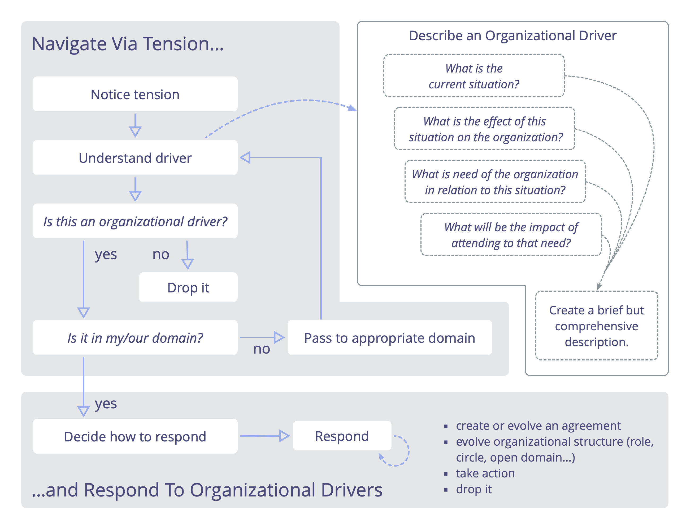

#### Describe los Drivers Organizacionales

Describe los drivers (motivadores) organizacionales para entenderlos, comunicarlos y recordarlos.

Los <a href="glossary.html#entry-organizational-driver" class="glossary-tooltip" data-toggle="tooltip" title="Motivante de la organización: Un motivante es la razón de una persona o grupo para responder a una situación específica. Un motivante es considerado un **motivante organizacional** si responder a este ayudaría a la organización generar valor, eliminar desperdicio o evitar consecuencias no deseadas.">drivers</a> pueden ser descritos por un grupo o por un individuo. Dependiendo de la perspectiva, pueden decidir explicar un driver como un **problema** a resolver o una **oportunidad** a ser aprovechada.

Una forma simple de describir un driver es explicando:

-   **Qué está ocurriendo …**
    -   la **situación actual**
    -   el **efecto** de esta situación en la organización
-   ... y **qué se necesita**
    -   la **necesidad** de la organización en relación con esta situación
    -   el **impacto** de atender esa necesidad

Escribe un resumen breve, pero exhaustivo, que contenga la cantidad necesaria de información para comunicar de manera clara la necesidad de una acción o una decisión.

Intenta obtener una o dos frases para que la información sea fácil de recordar y procesar.

Además del resumen, se pueden anotar más detalles sobre el driver en el registro.

##### Ejemplo:

> _"La cocina está desordenada: no hay tazas limpias, el fregadero está lleno de platos y no es posible servirse rápido un café y regresar a trabajar. Necesitamos que la cocina esté en condiciones de ser usada para que nos podamos enfocar en nuestro trabajo."_

##### 1. Situación actual

> _"La cocina está desordenada: no hay tazas limpias, el fregadero está lleno de platos"_

Describe la situación actual;

- Resume en pocas palabras lo fundamental de lo que está pasando, y, si es necesario, describe el contexto en el que ocurre
- Sé objetivo - describe las observaciones y evita las evaluaciones.

##### 2. Efecto

> _"... no es posible servirse un café rápido y regresar al trabajo."_

Explica el efecto que tiene esta situación en la organización:

- Aclara **por qué** esta situación necesita ser atendida: ¿cómo afecta a la organización?
- Sé explícito sobre si los efectos ya están teniendo lugar o son previstos.
- Explica los retos, pérdidas, oportunidades o ganancias.

##### 3. Necesidad

> _"Necesitamos que la cocina esté en condiciones de ser usada"_

Explica la <a href="glossary.html#entry-need" class="glossary-tooltip" data-toggle="tooltip" title="Necesidad: La falta de algo deseado o considerado necesario (un requerimiento).">necesidad</a> de la organización en relación con esta situación:

- Una **necesidad de una organización** es cualquier cosa que un equipo (o individuo) requiera para dar cuenta adecuadamente de un <a href="glossary.html#entry-domain" class="glossary-tooltip" data-toggle="tooltip" title="Dominio: Un área específica de influencia, actividad y toma de decisiones dentro de una organización.">dominio</a>
- Sé específico sobre de quién es esa necesidad ("nosotros necesitamos", "ellos necesitan", "yo necesito").
- Si hay un desacuerdo acerca de la necesidad, ayuda mirar más allá de las soluciones específicas y enfocarse en que le está faltando a la organización en esta situación.

##### 4. Impacto

> _"... para que podamos mantenernos enfocados en nuestro trabajo.""_

Describe el impacto previsto de resolver esa necesidad:

- Explica los potenciales beneficios potenciales, oportunidades o incluso el  <a href="glossary.html#entry-intended-outcome" class="glossary-tooltip" data-toggle="tooltip" title="Resultado esperado: El resultado esperado de un acuerdo, acción, proyecto o estrategia.">resultado deseado</a> de responder a esa necesidad.
- El impacto puede parecer obvio o implícito, especialmente cuando los efectos de la situación actual ya están descritos.

##### Revisa los drivers

Asegúrate de revisar los drivers con regularidad, para comprender con mayor profundidad qué está pasando y qué se necesita.

Algunas preguntas que pueden ser de utilidad en una revisión son:

-   ¿La descripción de la situación (todavía) es correcta?
-   ¿Aún asociamos las mismas necesidades con la situación?
-   ¿El driver aún está dentro de nuestro dominio?
-   ¿El driver aún es relevante?

#### Toma de decisiones por consentimiento

Un proceso de grupo (facilitado) para la toma de decisiones: invitar objeciones, y considerar la información y el conocimiento revelados para evolucionar más las propuestas o acuerdos existentes.

El consentimiento invita a la gente a (al menos) ser razonable y abrirse a oportunidades de aprendizaje y mejora. Cuando aplicas el  _principio de consentimiento_, estás de acuerdo en buscar intencionalmente _objeciones_.

_Una **objeción** es un argumento, relacionado con una propuesta, acuerdo, actividad o el estado actual de las cosas, que revela consecuencias o riesgos que preferirías evitar, o muestra maneras valiosas de mejorar._

Las propuestas se convierten en <a href="glossary.html#entry-agreement" class="glossary-tooltip" data-toggle="tooltip" title="Acuerdo: Una pauta, proceso, protocolo o política que ha sido acordado y se ha diseñado para guiar el flujo de valor.">acuerdos</a> cuando se consideran suficientemente buenas para este momento y lo suficientemente seguras como para probarlas hasta la próxima revisión. Las objeciones impiden que las propuestas se conviertan en acuerdos, pero las preocupaciones no.

Guardarse objeciones puede perjudicar la capacidad de individuos, equipos o toda la organización de alcanzar sus objetivos.

No todos los argumentos planteados son objeciones, pero pueden revelar _preocupaciones_:

_Una **preocupación** es una suposición que no puede (al menos por ahora) ser respaldada por el razonamiento o la evidencia suficiente para demostrar su relevancia o validez a quienes la están considerando._

##### Paso 1: Aceptar el driver

_Asegúrate de que el <a href="glossary.html#entry-driver" class="glossary-tooltip" data-toggle="tooltip" title="Driver: El motivo de una persona o de un grupo para responder a una situación específica.">driver</a> está resumido de un modo suficientemente claro y que es relevante que el grupo responda a él._

**La persona facilitadora pregunta:** _¿Hay alguna objeción a que este driver sea descrito con suficiente claridad y relevancia como para que podamos responder?_

**Nota:** Si ya has aceptado el driver en una etapa previa del proceso, no hay necesidad de repetir este paso aquí. Sin embargo, en un caso en el que alguien está presentando una propuesta a un grupo de  partes interesadas que no participaron en su creación, o si hay personas que sólo ahora se están uniendo al proceso de toma de decisiones, comprueba que todos entienden el driver de la propuesta, y asegúrate de que se describe con suficiente claridad y de que es pertinente para los presentes responder a él, antes de considerar la propuesta en sí.

Como recomendación general, busca completar este paso con los asistentes a la reunión de forma asincrónica, _antes de la reunión_. Esto le dará la oportunidad de llevar a cabo cualquier tipo de mejora con antelación y evitar que se pierda un valioso tiempo de reunión.

En caso de objeciones que indiquen:

-   **El driver no está descrito con suficiente claridad:** tómate tiempo para aclarar y hacer los cambios necesarios en la manera en que se resume el driver hasta que no haya más objeciones. A menos que esto sea una solución rápida, considera hacer esto después de la reunión y aplaza tomar la decisión hasta que el driver esté claro.
-   **El driver no es relevante para esta reunión / grupo:** pásalo a la persona o equipo correspondiente, o descártalo.

##### Paso 2: Presentar la propuesta

_Comparte la propuesta con todos y todas._

**La persona facilitadora pregunta a la persona autora o autores de la propuesta:** _¿Podrías por favor presentarles la propuesta a todos los demás?_

La persona autora o autores de la propuesta (sintonizadores), la presentan al grupo, incluyendo detalles sobre quién es responsable de qué, una fecha o frecuencia sugerida de revisión, y cualquier criterio de evaluación identificado.

**Preparación:** Cuando sea posible, envía la propuesta antes de la reunión para que la gente pueda familiarizarse con el contenido, pedir cualquier aclaración o incluso compartir sugerencias de mejora antes de la reunión. Esto evita emplear un valioso tiempo de reunión presencial en cosas que se pueden hacer fuera de la reunión.

Las propuestas son creadas habitualmente por un individuo o grupo con antelación, pero a veces son sugeridas "al vuelo".

Si tú eres quien presenta una propuesta, escríbela, compártela con los demás previamente si es posible y busca mantener tu explicación concisa y clara. Descríbela de una manera que maximice la probabilidad de que otros entiendan lo que propones, sin necesidad de más explicación.

**Nota:** La participación de las partes interesadas en la creación de una propuesta puede aumentar el compromiso y la responsabilidad de lo que se decida porque es más probable que la gente haga suyo un acuerdo cuando participa en su creación. Por otro lado, una toma de decisiones participativa o colaborativa requiere tiempo y esfuerzo de las personas, así que utilízala únicamente cuando los beneficios merezcan la pena.

##### Paso 3: Entender la propuesta

_Asegúrate de que todos entienden la propuesta._

**El facilitar pregunta:** _¿Alguien tiene alguna pregunta a fin de entender esta propuesta tal y como está escrita aquí?_

Este _no_ es un momento para entablar un diálogo sobre _por qué_ una propuesta ha sido elaborada de una cierta manera, sino simplemente para comprobar que todo el mundo entiende _lo que_ se propone. Evita preguntas sobre el "_por qué_" y concéntrate en vez en preguntas "_qué quieres decir con…_".

Las preguntas clarificadoras a veces revelan formas útiles de cambiar el texto de la propuesta para hacerlo más claro. Puedes utilizar este tiempo para hacer modificaciones a la propuesta, si eso ayuda a que sea comprendida la gente, pero ten cuidado de no cambiar lo que está siendo de hecho propuesto en esta etapa.

**Nota:** Si el grupo tiene experiencia en el uso de la toma de decisiones por consentimiento, puedes entonces hacer fácilmente mejoras de la propuesta en esta etapa. Sin embargo, si no la conoces tan bien, ten cuidado, es muy probable que se convierta en otra sesión de afinar la propuesta, esta vez con todo el mundo involucrado. Corres el riesgo de perder tiempo intentando llegar a un consenso, en lugar de continuar con el proceso y la evolución de la propuesta con base en las objeciones (en el paso 7).

**Consejos para la persona facilitadora:**

-   Utiliza una ronda e invita a los afinadores (o a quien haya creado la propuesta) a responder una pregunta por vez.
-   Detecta cualquier pregunta de "_por qué_" o "_por qué no_" y recuerda a la gente que el propósito de este paso consiste solo en asegurarnos de comprender la propuesta actual y no por qué la propuesta se ha elaborado de esta manera concreta.

**Consejos para todos:**

-   Di "_paso_" si no tienes una pregunta o no estás del todo claro en este momento sobre cuál es tu pregunta.
-   Mantén sus preguntas y respuestas breves y concretas.
-   Evita preámbulos y cíñete a la cuestión, p.ej. "_Bueno, una cosa que no está tan clara para mí, o al menos, que quiero asegurarme de que entiendo correctamente es …_" o "_no estoy seguro de cómo decir esto, pero déjame probar_", etc.

##### Paso 4: Respuesta breve

_Hazte una idea de cómo la propuesta es recibida por todos._

La **persona facilitadora pregunta:** ¿Qué piensas y sientes sobre esta propuesta?

Escuchar a todos sus reflexiones, opiniones y sentimientos sobre una propuesta, ayuda a ampliar la comprensión de la gente y a considerar la propuesta desde diversos puntos de vista.

Las respuestas de las personas pueden revelar información útil y  podrían revelar ya de entrada preocupaciones o posibles objeciones. En esta etapa, escucha pero evita interactuar con lo que la gente dice. Este paso consiste solo en ver la propuesta a través de los ojos de los demás.

Ejemplos:

-   "_Me gusta que sea simple y directo. Es un muy buen paso siguiente._"
-   "_Me preocupa un poco que esto llevará mucho tiempo, cuando hay otras cosas importantes de las que también tenemos que ocuparnos._"
-   "_Creo que faltan algunas cosas esenciales en esto, como A y B, por ejemplo._"

**Consejos para la persona facilitadora:**

-   Invita a hacer una ronda
-   ¡Especifica como de "breve" debe ser la "respuesta breve"! Esto dependerá mucho del contexto y puede variar desde una sola frase hasta algunos minutos de cada persona.

**Consejos para todos:**

-   Evita hacer comentarios o responder a lo que la gente comparte.
-   Ajusta tu contribución para que encaje en el límite de tiempo.
-   Es valioso escuchar algo de todo el mundo en esta ronda, así que evita pasar. Si no encuentras qué decir, puedes decir algo como "_Necesito más tiempo para pensar sobre esto_" o "_No estoy segura en este momento sobre mi posición al respecto de esto_"

##### Paso 5: Comprobar posibles objeciones

_La gente considera la propuesta y luego indica si tienen posibles objeciones o preocupaciones._

Este paso consiste simplemente en identificar quién tiene posibles objeciones o preocupaciones. Los argumentos son escuchados en el siguiente paso.

**Si llegaste aquí desde el paso 7 (Resolver una objeción)**, comprueba si hay más posibles objeciones a la propuesta **modificada**.

**El facilitador pregunta:** _¿Hay alguna objeción o preocupación posible sobre esta propuesta?_

**Recuerda:** las preocupaciones no impiden que las propuestas se conviertan en acuerdos, solo las objeciones cualificadas lo hacen. ¡Las preocupaciones son escuchadas en el paso 9, después de celebrar haber llegado a un acuerdo!

**Consejos para la persona facilitadora:**

En caso de que la distinción entre objeciones y preocupaciones todavía no esté clara para algunos, recuérdales:

-   _Una **objeción** es un argumento, relacionado con una propuesta, acuerdo, actividad o el estado actual de las cosas, que revela consecuencias o riesgos que preferirías evitar, o muestra maneras valiosas de mejorar._
-   _Una **preocupación** es una suposición que no puede (al menos por ahora) ser respaldada por el razonamiento o la evidencia suficiente para demostrar su relevancia o validez a quienes la están considerando._
-   Las propuestas se convierten en acuerdos cuando se consideran suficientemente buenas para este momento y lo suficientemente seguras como para probarlas hasta la próxima revisión.

**Consejos para todos:**

-   Muchos grupos **utilizan señales con las manos** como una forma de indicar rápida y claramente si alguien tiene alguna posible objeción o preocupación. Si eres nuevo en el proceso y te preocupa que puedas ser influenciado por otros, espera hasta que todo el mundo esté listo y luego muestra las manos simultáneamente.
-   **Si tienes alguna duda** entre una posible objeción o una preocupación, compártela como una posible objeción para que puedas comprobar con otros si cumple los requisitos para ser calificada así.

**Si nadie indica tener alguna posible objeción, has llegado a un acuerdo, ves al paso 8 ¡(Celebrar)!**

##### Paso 6: Prueba si un argumento califica como objeción

_Usa sabiamente tu tiempo y recursos limitados comprobando si los argumentos califican como objeciones y actuando únicamente en aquellos que lo hacen._

Normalmente es más efectivo **tomar una posible objeción** por vez, comprobar si califica como objeción, y si lo hace, resolver la objeción antes de pasar al siguiente argumento.

**Consejo para el Facilitador:** En caso de que haya varias objeciones posibles, explicar a todos que se va a escoger a una persona por vez, para compartir un argumento. Dejar claro a todos que, si tras haber escuchado el argumento, alguien cree que sería más eficaz considerar primero uno de sus argumentos, debería decirlo.

Comprueba que el argumento muestra que dejar la propuesta sin cambios:

-   lleva a consecuencias que quieres evitar,
-   podría llevar a consecuencias que quieres evitar y es un riesgo que no quieres tomar,
-   o te informa de una buena manera de mejorar cómo avanzar en la consecución de tus objetivos.

Ver el patrón _Comprueba si los argumentos califican como objeciones_ para más información.

**Si el argumento no califica como una objeción, vuelve al paso 5 (Comprobar si hay posibles objeciones), de lo contrario continúa al siguiente paso.**

##### Paso 7: Resolver la objeción

_Mejora la propuesta, con base en la información revelada por la objeción presentada en el paso anterior._

Ver el patrón _Resolver objeciones_ para más detalles.

Una vez resuelta la objeción, **vuelve al paso 5.**

##### Paso 8: ¡Celebra!

**¡Increíble! ¡Se ha alcanzado un acuerdo! Y, con la práctica, ¡conseguirás hacerlo más rápido!** Tómate un momento para reconocer el hecho de que se ha alcanzado un acuerdo. ¡Celébralo!

##### Paso 9: Considerar las preocupaciones

Después de celebrar, considera si alguna de las preocupaciones que tienen merecen ser mencionadas al grupo antes de pasar al siguiente tema. Si no es así, al menos toma nota de ellas después de la reunión, junto con los criterios de evaluación para este acuerdo. La información sobre las preocupaciones podría ser útil para informar de la evaluación del acuerdo cuando llegue el momento de revisarlo.

**El facilitador pregunta a los que tienen preocupaciones:** _¿Hay alguna preocupación que valga la pena escuchar en este momento? Si no es así, al menos toma nota de ellas después de la reunión, junto con los criterios de evaluación para este acuerdo.

A veces, lo que alguien pensaba que era una preocupación, resulta ser una objeción. En ese caso, puedes resolverlo modificando el acuerdo recién alcanzado utilizando el proceso Resolver objeciones.

**Una nota final:**

Si eres nuevo en el uso de la toma de decisiones por consentimiento, te recomendamos que sigas estrictamente el proceso hasta que te familiarices con él y comprendas a fondo todos los pasos. Cuando tengas más experiencia, puede saltar (1) de un paso a otro, pero hacer esto al principio puede llevar a confusión, e incluso, al caos.

Por ejemplo: Si hay una sensación general de preocupación expresada en la ronda de Respuestas breves, el facilitador podría sugerir evolucionar la propuesta en ese mismo momento, para incluir los puntos que las personas infieren. En este caso, ante todo comprueba siempre si hay alguna objeción a hacerlo.

#### Comprobar si los argumentos califican como objeciones

Usa sabiamente tu tiempo y recursos limitados comprobando si los argumentos califican como objeciones y actuando únicamente sobre aquellos que sí lo hacen.

Cuando alguien plantea una posible objeción (un argumento para cambiar algo), comprueba que el argumento revela cómo dejar las cosas tal y como están conllevaría, o podría conllevar, consecuencias que quieres evitar, o que te informa de una manera valiosa de mejorar cómo avanzar en el logro de tus objetivos.

Explora y mejora cada argumento según sea necesario para identificar concepciones erróneas o malentendidos, y para eliminar aspectos del argumento que estén basados meramente en suposiciones, o en una preferencia u opinión personales. Si determinas que lo que queda del argumento califica como una objeción, entonces pasa a _resolver la objeción_.

##### Trabajar con argumentos

Para mantener un diálogo productivo es útil entender que todo argumento está compuesto por una serie de **afirmaciones**: cada argumento contiene uno o más **supuestos**, que se ofrecen como razones para aceptar una **conclusión**.

Cada uno de los supuestos de un argumento puede ser escudriñado individualmente, y cuando se ha hecho eso, podemos analizar si la conclusión que se desprende de esos supuestos pasó bien la prueba o no.

Ayuda presentar el argumento de una manera que haga que los supuestos y la conclusión sean obvios, por ejemplo, de este modo:

1 Primer supuesto \
2 Segundo supuesto \
– – – – – – – – \
**Por lo tanto**: Conclusión

**Persona facilitadora:** invita al grupo a listar los supuestos y explicar la conclusión, y luego se ocupa a partir de ahí.

A veces puede ser útil anotar esta información en un papelógrafo o pizarra digital, o incluso como texto en un chat.

Con un argumento expuesto de esta manera, el grupo puede dirigir preguntas para entender el argumento de acuerdo a cada afirmación específica, y señalar cualquier afirmación con la que no estén de acuerdo. Cada desacuerdo puede presentarse utilizando este mismo método recién mencionado.

Cuando se esté de acuerdo sobre un supuesto, marca eso como hecho, cuando el diálogo revela una premisa oculta, simplemente añádelo a la lista. Si un supuesto resulta no ser válido, elimínalo. Anotar el progreso de esta manera ayuda a asegurar que todos estén en la misma página con el estado actual de un argumento.

**Cuando el acuerdo parece inalcanzable:** en un entorno grupal, a veces puede resultar imposible resolver inmediatamente un desacuerdo sobre una afirmación específica relativa a una posible objeción, a menudo porque el grupo carece de datos, conocimientos o experiencia. Cuando se produce una situación así, una forma de abordarla es replantear la posible objeción en torno a esa incertidumbre específica. Si el argumento enmendado califica como una objeción, puede resolverse enmendando la propuesta con una disposición añadida para establecer los hechos sobre la afirmación controvertida.

##### Un proceso para probar si un argumento califica como objeción

Este proceso para probar si los argumentos califican como objeciones, es una variación del _patrón de toma de decisiones razonada_.

**Paso 1:** Presentar el argumento que se expone como una posible objeción.

**Paso 2:** Comprender el argumento.

**Paso 3:** Comprobar si hay algún desacuerdo cuyo argumento pretende calificar como objeción (p.ej., la gente puede indicarlo con una mano levantada). Los motivos del desacuerdo se presentan en el siguiente paso.

- Si no hay desacuerdo, **el argumento califica como objeción** y ahora puedes proceder a _resolver la objeción_.
- De lo contrario, toma un posible desacuerdo cada vez, y:

**Paso 4:** Investiga el razonamiento detrás del desacuerdo:

- Si demuestra que el argumento original es falso (total o parcialmente) o que (a pesar de ser sólido), no califica como una objeción, continúa con el siguiente paso.
- De lo contrario, regresa al paso 3 para comprobar si hay más desacuerdos.

**Paso 5:** Integra la información revelada en el paso anterior con el argumento original:

- Si el argumento original todavía tiene alguna validez, mejóralo y luego continúa con el paso 3 para ver si hay algún desacuerdo con el argumento mejorado.
- De lo contrario, has demostrado que el argumento **original no es una objeción.**

A continuación encontrarás más orientaciones sobre cómo realizar cada paso. Como con todos los patrones de S3, tu enfoque para probar si los argumentos califican como objeciones puede ser ajustado para encajar en tu contexto.

###### Paso 1 Presentar el argumento

*Presentar el argumento que se propone como una posible <a href="glossary.html#entry-objection" class="glossary-tooltip" data-toggle="tooltip" title="Objeción: Un argumento, relacionado con una propuesta, acuerdo, actividad o el estado actual de las cosas, que revela consecuencias o riesgos que preferirías evitar, o muestra maneras valiosas de mejorar.">objeción</a>*.

La **persona facilitadora le pregunta** a la persona con la posible objeción: *Por favor, explique su argumento.*

###### Paso 2: Entender el argumento

*Asegúrate de que todos entienden la propuesta.*

**La persona facilitadora le pregunta: a todos** *¿Alguna pregunta para entender mejor el argumento?*

**Todos:** Si no lo entiendes, interviene y haz una pregunta clarificadora. La persona que presenta el argumento explica más, hasta que todo el mundo lo entienda.

###### Paso 3 Comprobar si hay desacuerdo con el argumento

*La gente considera el argumento y luego indica si está en desacuerdo.*

**Todos:** reflexiona por ti mismo si crees que el argumento presentado califica como una objeción o no.

**Nota:** Si un grupo es nuevo en el proceso, la persona facilitadora podría invitar explícitamente a todos a reflexionar para sí mismos: *¿Crees que este argumento califica como una objeción?*

**El facilitador pregunta**: *¿Alguien no está de acuerdo total o parcialmente en que este argumento califica como una objeción? Si es así, por favor levanta la mano.*

- Si nadie no está de acuerdo, **el argumento califica como objeción** y ahora puedes proceder a _resolver la objeción_.
- Si alguien no está de acuerdo: continúa con el siguiente paso.

###### Paso 4: Investiga el razonamiento detrás del desacuerdo

Elige una de las personas con una mano levantada y usa el mismo proceso para comprobar argumentos calificados como objeciones, determina si sus razones para no estar de acuerdo son válidas o no:

**4.1. Presenta la razón del desacuerdo**: Invitación de la persona facilitadora: *Por favor, explica por qué el argumento original es total o parcialmente incorrecto.*

**4.2. Comprende el motivo del desacuerdo**: Invitación de la persona facilitadora: *¿Hay alguna pregunta para entender este argumento?*

**4.3. Comprueba si hay desacuerdo sobre el desacuerdo:** La persona facilitadora pregunta: *¿Hay alguien que no esté de acuerdo con el motivo de este desacuerdo, total o parcialmente?*

- **Si nadie está en desacuerdo**: el argumento para el desacuerdo se considera válido. Ir al paso 5.
- **Si alguien no está de acuerdo**: investiga el razonamiento detrás del desacuerdo (ver paso 4) hasta que llegues a un argumento con el que nadie esté en desacuerdo. Luego toma cada argumento precedente por vez – comprobando si queda algo y/o si necesita ser cambiado o abandonado (ves al paso 5 para ver las pautas sobre cómo hacer esto) – hasta que llegues de nuevo al desacuerdo inicial.

###### Paso 5: Integra la información revelada en el paso anterior con el argumento original

La **persona facilitadora le pregunta** a la persona que presentó el argumento original: *"¿Queda algo de tu argumento?"*

La persona que aportó el argumento original tiene la opción de mejorar, replantear o reformular su argumento, o abandonarlo por completo, si no queda nada de él.

- Si el argumento original todavía tiene alguna validez, mejóralo y luego continúa con el paso 3 para ver si hay algún desacuerdo con el argumento mejorado.
- De lo contrario, has demostrado que el argumento **original no es una objeción.**

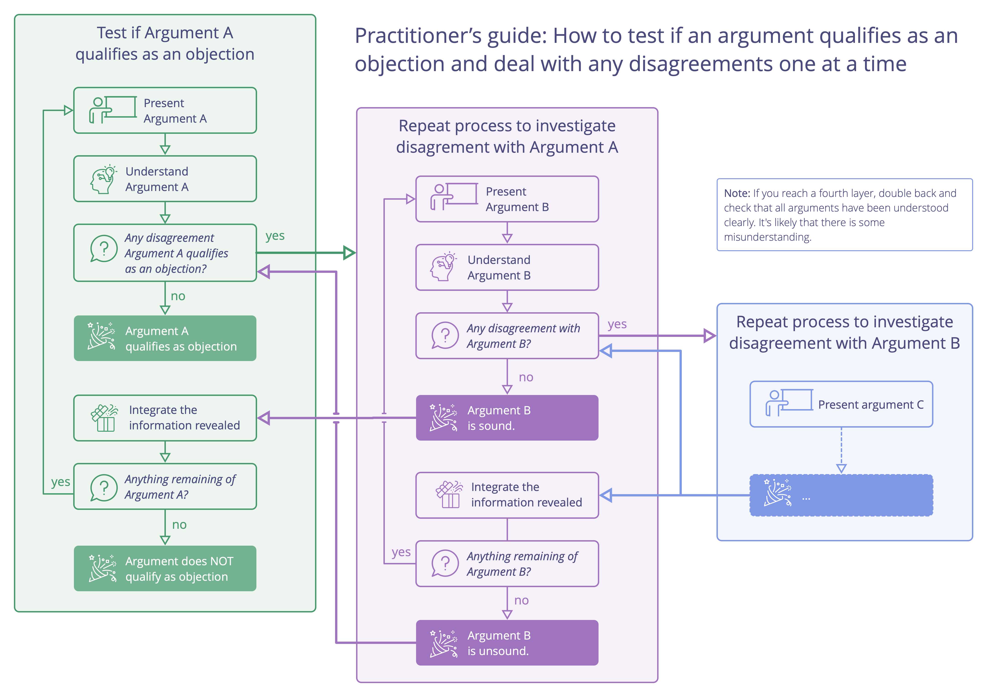

#### Resolver objeciones

Utiliza la información revelada por una objeción para identificar formas de evolucionar propuestas, acuerdos y acciones a un estado suficientemente bueno. 

Normalmente lo más efectivo es **tomar una <a href="glossary.html#entry-objection" class="glossary-tooltip" data-toggle="tooltip" title="Objeción: Un argumento, relacionado con una propuesta, acuerdo, actividad o el estado actual de las cosas, que revela consecuencias o riesgos que preferirías evitar, o muestra maneras valiosas de mejorar.">objeción</a> cada vez**, elaborar una propuesta de enmienda, resolver cualquier objeción a esa enmienda y luego continuar con la siguiente objeción a la propuesta principal.

Una propuesta se convierte en un acuerdo cuando se han resuelto todas las objeciones.

Las objeciones se resuelven modificando la propuesta. **Las modificaciones** pueden incluir:

- añadir, eliminar y/o cambiar algo en la propuesta.
- aplazar la resolución de una objeción particular para más adelante. (Recuerda aclarar quién se responsabilizará de esto, para cuándo queda y qué sucederá después de haber sido resuelta).
- una propuesta alternativa, o un acuerdo para (co)crear una nueva propuesta en el futuro (si se considera más eficaz que seguir trabajando en el desarrollo de la propuesta existente).
- delegar la tarea para revisar, investigar y/o proponer una enmienda para una, o incluso varias objeciones relacionadas, a un individuo o grupo.
- dejar la propuesta principal sin cambios y monitorear el resultado porque el esfuerzo, o el costo de cambiar las cosas para resolver la objeción, supera los beneficios o ganancias previstos.
- pedir a una persona delegadora retroalimentación o una aportación (por ejemplo, al acordar una estrategia para un subdominio).
- tómate un poco más de tiempo para reflexionar y luego regresa a la objeción más tarde.
- etc.

¡Siempre hay algún tipo de siguiente paso iterativo que puedes dar! Incluso si una propuesta no aborda completamente el <a href="glossary.html#entry-driver" class="glossary-tooltip" data-toggle="tooltip" title="Driver: El motivo de una persona o de un grupo para responder a una situación específica.">driver</a>, alcanzar un acuerdo sobre **uno o más pasos iterativos siguientes ** a menudo está suficientemente bien. También es útil a veces dividir las cosas en pequeños pasos, especialmente cuando se trata de situaciones complejas o complicadas.

Las objeciones pueden resolverse siguiendo el proceso descrito en _Toma de decisiones razonada_:

**Paso 1:** Presentar una propuesta de enmienda

**Paso 2:** Comprender la enmienda propuesta

**Paso 3:** Comprobar si hay alguna objeción posible a la enmienda propuesta, por ejemplo, usando señales de manos. Las posibles objeciones son presentadas en el paso 4.

Si no hay objeciones posibles, procede al paso 6 (Celebrar), de lo contrario toma una objeción por vez y:

**Paso 4:** Escucha el razonamiento para la posible objeción y _determina si el argumento presentado tiene alguna validez_.

**Paso 5:** Integra cualquier información revelada en el paso anterior para mejorar la enmienda propuesta, luego regresa al paso 3.

**Paso 3:** ¡Celébralo! ¡Se ha aceptado una enmienda que resuelve la objeción!

A continuación encontrarás más información sobre cómo realizar cada paso. Este proceso puede ser repetido hasta que se hayan resuelto todas las objeciones. Como en todos los patrones de S3, tu enfoque para resolver objeciones puede ser ajustado para encajar en tu contexto.

##### Paso 1: Presentar una propuesta de enmienda

*Elabora una sugerencia sobre cómo enmendar la propuesta para resolver la objeción basada en la información que revela la objeción.*

Hay muchas maneras de elaborar una enmienda. A continuación algunas típicas opciones que puedes utilizar. Te recomendamos que las utilices en el orden en el que están presentadas: si la primera opción no funciona, ves a la siguiente, y así sucesivamente. Una vez que te familiarices con el proceso podrás discernir en el momento que opción es más adecuada.

1. Pregunta a la persona que plantea la objeción: "*¿Tiene alguna sugerencia sobre cómo enmendar esta propuesta para resolver esta objeción?*"
2. Pregunta al grupo “*¿Alguien tiene alguna sugerencia sobre cómo enmendar esta propuesta para resolver esta objeción?*" y elige a una persona para presentar su sugerencia.
3. En caso de que sea difícil elaborar una enmienda de inmediato, invita a un diálogo de tiempo limitado para compartir ideas, con el propósito de elaborar una enmienda a partir de ahí.

Como en cualquier propuesta, una sugerencia de enmienda te da un punto de partida que luego se puede refinar invitando y resolviendo objeciones. (ver Paso 4: Prueba si un argumento califica como objeción)

A menudo es útil repetir o resumir la enmienda y escribirla para que todo el mundo la vea.

##### Paso 2: Entender la enmienda

*Asegúrate de que todos entiendan la enmienda que está siendo propuesta.*

**La persona facilitadora pregunta:** *¿Alguna pregunta para entender mejor la enmienda propuesta?*

Consejos para todos:

- Mantén tus preguntas y respuestas breves y concretas.
- Evita entrar en debates o expresar opiniones sobre la validez de la enmienda en este momento. El objetivo de este paso es simplemente garantizar que la enmienda sugerida esté clara.
- Añade aclaraciones relevantes a la enmienda escrita.

##### Paso 3: Comprobar posibles objeciones

*La gente considera la enmienda propuesta y luego indica si tienen posibles objeciones o preocupaciones.*

Este paso consiste simplemente en identificar quién tiene posibles objeciones o preocupaciones. Los argumentos son escuchados en el siguiente paso.

**La persona facilitadora pregunta:** *¿Hay alguna posible objeción o preocupación a esta enmienda?* (ten en cuenta que el tema aquí es la enmienda, ¡no toda la propuesta!)

Muchos grupos utilizan señales de manos como una forma de indicar rápida y claramente si alguien tiene alguna posible objeción.

- En caso de que haya posibles objeciones a la enmienda sugerida, ves al siguiente paso, Comprueba si un argumento califica como objeción (enlace).
- Si nadie indica tener alguna posible objeción, ve al **Paso 6: Celebrar**, porque se ha llegado a un acuerdo sobre la enmienda.

##### Paso 4: Comprueba si un argumento califica como objeción

Ver por favor _Comprobar si los argumentos califican como objeciones_

- Si el argumento califica como objeción, ves al **Paso 5** (Resolver una objeción)
- Si el argumento no califica como objeción, regresa al **Paso 3** para comprobar si hay más posibles objeciones a la enmienda propuesta.

##### Paso 5: Resolver una objeción

*Repetir el proceso: utiliza el patrón Resolver objeciones para resolver una objeción a la enmienda.*

¡Elabora una enmienda a la actual sugerencia de enmienda! Ten en cuenta que una enmienda propuesta puede incluir la sugerencia de sustituir totalmente la enmienda actual por otra diferente.

Como puedes ver, el patrón de Resolver objeciones puede utilizarse recursivamente. A continuación encontrarás una ilustración que muestra cómo funciona esto.

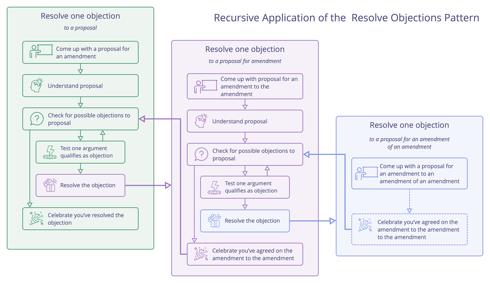

##### Paso 6: ¡Celebra!

¡Se ha acordado una enmienda que resuelve la objeción! Antes de continuar, recuerda actualizar tu propuesta original para integrar la enmienda que se ha acordado.

#### Evaluar y evolucionar acuerdos

Desarrolla constantemente el conjunto de acuerdos, y elimina desperdicios.

La revisión frecuente y regular de acuerdos es una práctica esencial para el aprendizaje de una organización:

-   adapta los acuerdos para que se ajusten a un contexto cambiante
-   integra el aprendizaje para hacer los acuerdos más eficientes

Asegúrate de que todos los <a href="glossary.html#entry-agreement" class="glossary-tooltip" data-toggle="tooltip" title="Acuerdo: Una pauta, proceso, protocolo o política que ha sido acordado y se ha diseñado para guiar el flujo de valor.">acuerdos</a> tienen una fecha de revisión apropiada

Evaluar los acuerdos puede ser algo tan simple como revisar si el acuerdo es aún relevante, y que no hay objeciones para que mantenerlo como está.

Los acuerdos a menudo se revisan en _Reuniones de gobernanza_, sin embargo, a veces es más efectivo programar una sesión específica.

Ajusta la frecuencia de la revisión según sea necesario, y haz la revisión antes si es preciso.

Los elementos de este patrón también pueden ser utilizados por individuos para evaluar las decisiones que toman.

##### Formato corto

-   _¿Cómo nos ha ayudado este acuerdo?_
-   _¿Hay alguna razón para abandonar este acuerdo?_
-   _¿Cómo se puede mejorar este acuerdo?_
-   Acordar una próxima fecha de revisión.

##### Formato largo

Preparación:

-   Programar la revisión.
-   Asegurar que toda la información necesaria está disponible.

Seguimiento:

-   Acordar una próxima fecha de revisión.
-   Documentar decisiones y tareas, y compartir con personas relevantes.
-   Considerar los efectos de otros acuerdos relacionados.

#### Cocrear propuestas

Reunir a las personas para crear propuestas en respuesta a los drivers organizacionales: aprovechar la inteligencia colectiva, crear sentido de pertenencia y aumentar el compromiso y la responsabilidad.

Hay muchas formas de cocrear propuestas. Normalmente siguen un patrón similar:

1. Llegar a un acuerdo acerca del <a href="glossary.html#entry-organizational-driver" class="glossary-tooltip" data-toggle="tooltip" title="Motivante de la organización: Un motivante es la razón de una persona o grupo para responder a una situación específica. Un motivante es considerado un **motivante organizacional** si responder a este ayudaría a la organización generar valor, eliminar desperdicio o evitar consecuencias no deseadas.">driver</a> (o problema / oportunidad / necesidad)
2. Explorar el tema y entender las restricciones
3. Generar ideas
4. Diseñar una propuesta (a menudo realizada por un grupo más pequeño)

Una forma de cocrear propuestas es usar el patrón de _Formulando propuestas_ de S3.

Para la inspiración en los pasos 2 y 3, busca técnicas clásicas de facilitación de grupos o actividades de pensamiento de diseño.

Además de en un taller presencial, puedes adaptar este proceso para reuniones en línea. Incluso puedes usarlo de forma asincrónica (y durante un período prolongado de tiempo) para incluir a muchas personas.

#### Formación de una propuesta

Un proceso grupal (facilitado) para cocrear una respuesta para un driver

-   se beneficia de la inteligencia colectiva y de la diversidad de perspectivas dentro de un grupo
-   involucra personas en la cocreación de acuerdos
-   fomenta la responsabilidad y el sentido de pertenencia

La _formación de propuestas_ también puede ser utilizada por un individuo.

##### Pasos para formar una propuesta

**Aprobar el driver** Presenta brevemente el <a href="glossary.html#entry-organizational-driver" class="glossary-tooltip" data-toggle="tooltip" title="Motivante de la organización: Un motivante es la razón de una persona o grupo para responder a una situación específica. Un motivante es considerado un **motivante organizacional** si responder a este ayudaría a la organización generar valor, eliminar desperdicio o evitar consecuencias no deseadas.">driver</a> _¿Es relevante que respondamos a este driver? ¿Ha habido alguna modificación esencial a lo que se ha presentado?_

**Profundizar el entendimiento compartido del driver**: invita preguntas esenciales para entender  el driver con mayor detalle

**Recoger observaciones** formuladas como preguntas relacionadas con posibles soluciones.  Las preguntas o bien revelan restricciones (preguntas recolectoras de información) o posibilidades (preguntas generativas).

**Responder** a cualquier pregunta de recogida de información si es posible.

**Priorizar** consideraciones.

**Recolectar ideas** como posibles ingredientes para una propuesta.

**Diseñar una propuesta** para abordar el driver considerando las ideas creativas y la información recolectada hasta ahora. Esto es generalmente hecho por un grupo más pequeño de "afinadores".

##### Seleccionando afinadores

Ten en cuenta:

-   ¿Quién debería estar ahí?
-   ¿Quién quiere estar ahí?
-   ¿Quién más podría hacer una contribución valiosa?
-   Ten en cuenta la experiencia, la visión externa y la inspiración

Entre dos y tres afinadores suele ser lo apropiado. Comprueba si hay objeciones a los afinadores propuestos.

#### Toma de decisiones razonada

Involúcrate en diálogo productivo investigando diferentes perspectivas y el conocimiento de los participantes, para llegar a un acuerdo sobre lo que se considera viable, relevante, válido o empíricamente verdad.

Hay muchos caminos que la gente puede seguir para llegar a una decisión con otras personas (mayoría, consenso, autoridad, etc.), pero para cualquier enfoque que utiliza la razón como base para ese acuerdo, normalmente sigue un patrón similar de _Toma de decisiones razonada_.

La toma de decisiones razonada detalla el proceso que los grupos hacen cuando aplican razones para comprobar si una propuesta, acuerdo o enmienda existente es suficientemente bueno, o si un argumento en particular es relevante, válido o empíricamente verdad.

##### Los pasos del proceso

**Paso 1: Presenta** el tema a ser investigado (esto podría ser un argumento o una propuesta sobre cómo continuar).

**Paso 2: Comprende** el tema (por ejemplo, a través de preguntas clarificadas).

**Paso 3: Comprueba** si alguien no está de acuerdo con el tema (lo que significa que cuestiona la viabilidad de la propuesta o la validez del argumento), p. ej., usando señales con las manos. Cualquier desacuerdo se explica en el paso 4. Si no hay desacuerdos, **ves al paso 6** (Celebrar), de lo contrario toma un desacuerdo por vez y:

**Paso 4: Disputa:** Escucha el razonamiento del desacuerdo y determina si el argumento presentado tiene alguna validez.

**Paso 5: Integra** cualquier información revelada en el paso anterior para mejorar el tema, luego vuelve al paso 3.

**Paso 6: Celebra** llegar a un acuerdo.

La forma en que las personas recorren cada uno de estos pasos varía y depende mucho de la cultura, el contexto, las preferencias, el número de personas implicadas, y si se comunican de forma asincrónica o se reúnen cara a cara.

##### Mapeando la toma de decisiones razonada a otros patrones en S3

La toma de decisiones razonada se refleja en todos los patrones de proceso de S3 que ayudan a los grupos a llegar a un acuerdo. Entender este meta-patrón ayuda a la gente a aplicarlos más eficazmente:

-   _Toma de decisiones por consentimiento_, para probar si una propuesta o acuerdo existente es lo suficientemente bueno y seguro. Y, dentro de esto, dos patrones anidados:
-   _Comprobar si los argumentos califican como objeciones_, para probar si los argumentos califican como objeciones y actuar únicamente sobre aquellos que sí lo hacen.
-   _Resolver las objeciones_, para usar la información revelada por las objeciones para hacer y evolucionar acuerdos.

Cada uno de los tres procesos se centra en la investigación de un tema diferente:

-    En _Toma de decisiones por consentimiento_ el tema es una **propuesta**.
-    En _Comprobar si el argumento califica como objeción_ el tema es un **argumento** que indica una posible objeción.
-    En _Resolver objeciones_ - el tema es una **enmienda propuesta**.

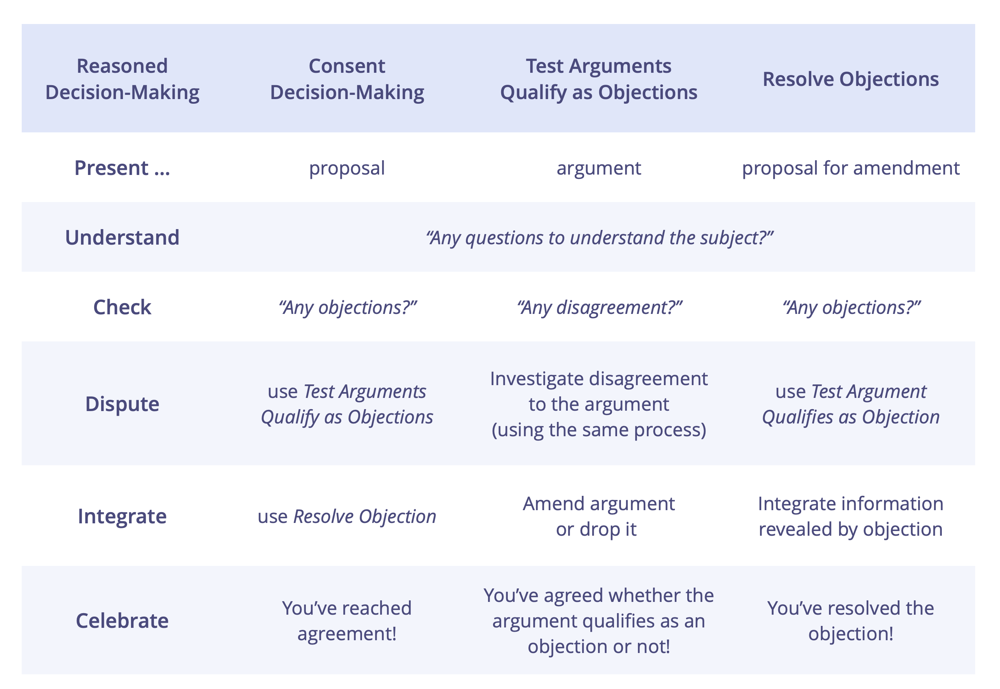

#### Selección de rol

Un proceso grupal para seleccionar a una persona para un rol con base en la fortaleza de la razón para hacerlo.

En lugar de asignar simplemente a personas para _roles_, o hacer una elección basada en la mayoría, usa el proceso de selección de roles para:

- aprovechar la inteligencia colectiva escuchando y deliberando sobre las razones de las nominaciones
- aumentar el grado en que la gente hace suya la decisión
- asegurar para la persona guardiana del rol el apoyo de las personas afectadas

Un requisito  para el proceso de selección es una _descripción clara_ del <a href="glossary.html#entry-domain" class="glossary-tooltip" data-toggle="tooltip" title="Dominio: Un área específica de influencia, actividad y toma de decisiones dentro de una organización.">dominio</a> del rol.

##### Selección de rol - Pasos

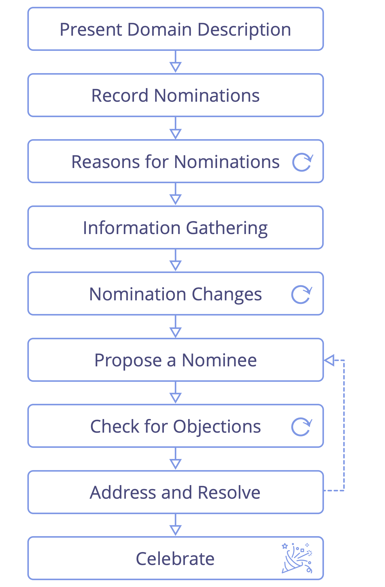

1. **Presentar la descripción del rol:** Si es posible, envía la descripción del dominio del rol con antelación.
2. **Registra las nominaciones:** Los participantes escriben su nominación en una hoja de papel. Las personas pueden nominarse a sí mismas, a otra persona, o pasar.
3. **Razones para las nominaciones:** Cada persona comparte a quién ha nominado y porqué.
4. **Recolección de información:** Los participantes comparten o solicitan cualquier información que pueda ayudar al grupo a hacer una selección apropiada.
5. **Cambios de nominación:** Comprueba si alguien quiere cambiar su nominación a la luz de las razones e informaciones compartidas hasta el momento y escucha los motivos de cada cambio.
6. **Propón un nominado** para el rol: La persona facilitadora guía el proceso de identificar un candidato adecuado basándose en la fuerza de las razones escuchadas, por ejemplo, por medio de:
    -   proponer a una persona nominada ella misma o preguntando a un miembro del grupo
    -   invitar a (algunas) personas nominadas a ponerse de acuerdo sobre quién debe ser propuesto
    -   invitar a un diálogo de grupo para ayudar a poner de manifiesta a la persona candidata más idónea
7. **Buscar posibles objeciones:** Pide a los participantes (incluida la persona nominada propuesta) que indiquen simultáneamente si tienen o no una <a href="glossary.html#entry-objection" class="glossary-tooltip" data-toggle="tooltip" title="Objeción: Un argumento, relacionado con una propuesta, acuerdo, actividad o el estado actual de las cosas, que revela consecuencias o riesgos que preferirías evitar, o muestra maneras valiosas de mejorar.">objeción</a>.
8. **Abordar y resolver objeciones,** comenzando por cualquiera proveniente de las personas candidatas propuestas. _Las objeciones pueden ser resueltas_ de muchas formas, incluyendo la modificación de la descripción del rol del dominio o nominando a otra persona. Cuando se resuelvan todas las objeciones, confirme con la persona candidata (final) de nuevo si acepta el rol.
9. **¡Celebrar!:** Reconoce haber llegado a un acuerdo y agradece a la persona que ahora será guardiana del rol.

Para evitar influenciar a los demás, abstente de expresar tu interés u opinión personales antes de que tenga lugar una selección.

A veces una selección de roles muestra una falta de capacidad, experiencia, cualidades o competencias. Un grupo tendrá entonces que considerar candidatos externos, reconsiderar las prioridades o encontrar una forma alternativa de dar cuenta del dominio.

Este patrón también se puede utilizar en cualquier situación en la que exista la necesidad de elegir entre una variedad de opciones.

### Evolucionando organizaciones

#### Clarificar y desarrollar dominios

Clarifica explícitamente, y luego evalúa y desarrolla con regularidad el diseño de un dominio sobre la base del aprendizaje, para permitir que quienes tienen la responsabilidad del dominio den cuenta de él de la forma más efectiva posible.

Una comprensión clara del área de responsabilidad y autonomía de las personas permite una mayor eficiencia, colaboraciones más eficaces y más agilidad en toda la organización.

Para aprovechar mejor su tiempo, energía y recursos limitados, las personas en las organizaciones se distribuyen el trabajo entre ellas mediante la creación roles o formando equipos, unidades o departamentos. En el proceso están explícita o implícitamente definiendo <a href="glossary.html#entry-domain" class="glossary-tooltip" data-toggle="tooltip" title="Dominio: Un área específica de influencia, actividad y toma de decisiones dentro de una organización.">dominios</a> - áreas diferenciadas de responsabilidad y autonomía.

El propósito de cualquier rol o equipo es contribuir al propósito general de la organización, encargándose de una necesidad específica de la organización. Los dominios mal definidos normalmente hacen que las partes interesadas hagan suposiciones distintas sobre las áreas de responsabilidad y autonomía. Como consecuencia, tanto la colaboración como la distribución del trabajo se ve afectada negativamente debido a dependencias desapercibidas, trabajo duplicado, o trabajo simplemente no realizado.

Clarificar dominios hace explícito el contrato entre la persona <a href="glossary.html#entry-delegator" class="glossary-tooltip" data-toggle="tooltip" title="Persona delegadora: Un individuo o grupo que delega la responsabilidad de un dominio a otro(s).">delegadora</a> y la(s) <a href="glossary.html#entry-delegatee" class="glossary-tooltip" data-toggle="tooltip" title="Persona(s) delegada(s): Un individuo o grupo que acepta la responsabilidad de un dominio que le ha sido delegado, convirtiéndose en un guardián de rol o un equipo.">delegada(s)</a>, permitiendo que todos aprendan sobre lo que funciona y lo que no, porque todos entienden quién es responsable de qué. Una descripción clara del dominio con una cantidad razonable de detalle es un requisito necesario para que las personas evalúen adecuadamente y mejoren continuamente su trabajo.

Una manera simple de ayudar a las partes interesadas en el desarrollo de una comprensión compartidas sobre los distintos aspectos de un dominio es creando una **descripción del dominio** que contenga información sobre:

-   El driver primario (y/o próposito)
-   Responsabilidades clave
-   Dependencias
-   Restricciones externas
-   Desafíos clave
-   Entregables clave
-   Competencias, cualidades y habilidades
-   Recursos clave
-   Responsabilidades de la persona delegadora
-   Métricas clave
-   Modalidad de evaluación

En el [micrositio Lienzo S3](http://s3canvas.sociocracy30.org/s3-delegation-canvas.html) puedes encontrar una variedad de plantillas que puedes utilizar para (co)crear y documentar descripciones de dominio.

Considera diseñar dominios con las mínimas restricciones necesarias y elegir siempre restricciones que permitan a la gente crear el valor máximo.

La(s) persona(s) delegada(s) puede hacer lo que considere que le pueda ayudar a lograr su propósito, a menos que esté fuera del dominio de la organización, explícitamente prohibido, viole el dominio (explícito) de otra persona, o impida la contribución de otras personas a la organización de alguna otra manera. Entre las cosas prohibidas pueden estar las restricciones explícitas establecidas en la descripción del dominio, cualquier otro acuerdo que la(s) persona(s) delegada(s) deba cumplir, y los requisitos legales y reglamentarios.

##### Cuándo clarificar dominios

Considera clarificar los dominios cada vez que identifiques que las partes interesadas tienen distintas suposiciones sobre el dominio de un  _rol_, posición, equipo, departamento o unidad  existentes o incluso acerca del dominio de la organización en su conjunto.

Como persona delegadora, clarifica cualquier nuevo dominio que tengas la intención de delegar.

Cuando se clarifican de modo retrospectivo los dominios que ya han sido delegados a personas, la persona delegadora puede obtener valiosas ideas y puntos de vista invitando a las personas delegadas a describir primero el dominio desde su perspectiva.

##### Evaluar y evolucionar los dominios con regularidad

La comprensión de la organización que tienen las personas es limitada y el entorno siempre está cambiando. Por lo tanto, es esencial que la persona delegadora, la persona delegada y otras partes interesadas relevantes se tomen con regularidad el tiempo para evaluar y evolucionar, tanto el diseño del dominio como la forma en que las personas dan cuenta de él a medida que su comprensión del dominio aumenta.

Las personas pueden hacer un gran trabajo dando cuenta de un dominio en el modo en que está diseñado, pero el diseño del dominio puede ser primitivo o tener errores. Por otro lado, incluso si el diseño de un dominio no es bueno en la primera iteración, a través de este proceso mejorará con el tiempo.

##### Clarifica el dominio de toda la organización

Todos los dominios de una organización están contenidos dentro del dominio general de la organización, que se puede diseñar deliberadamente en las primeras etapas de la organización, o clarificar retrospectivamente. El dominio de una organización debe permitir a los miembros de la organización cumplir eficazmente su propósito y normalmente necesita ir siendo evolucionado con el paso del tiempo.

Considera clarificar explícitamente el dominio general de la organización si te das cuenta de que las principales partes interesadas tienen diferentes comprensiones sobre él, o cuando hay que realizar cambios en ese dominio. Para hacerlo es necesario identificar a la principal persona delegadora de la organización.

El dominio de una organización debe diseñarse pensando en el cliente y el modelo de negocio, y debe tener en cuenta las restricciones ambientales (por ejemplo, jurídica, económica, mercado, competencia, etc.)

Evalúa regularmente el dominio de la organización para ayudar a los responsables de la organización a aprender y adaptarse rápidamente.

Una forma de clarificar un dominio es rellenando un [Lienzo de organización S3](http://s3canvas.sociocracy30.org/s3-organization-canvas.html).

##### Aspectos que es útil clarificar en una descripción de dominio

Todos los siguientes elementos son importantes a la hora de clarificar un dominio. Dependiendo de tu situación y donde estés en el ciclo de vida del dominio, puede que seas capaz de describir cada uno de ellos más o menos claramente. Realiza evaluaciones con regularidad, pon a prueba las suposiciones y ves haciéndolo todo más claro al ir aprendiendo.

###### Driver Primario

Explica como la(s) persona(s) delegada(s) contribuirá al propósito general de la organización, clarificando las necesidades organizacionales específicas de las que se encarga (o encargará).

Describe el driver organizacional principal al que responde(rá) la(s) persona(s) delegada(s), por ejemplo usando el patrón _Describe drivers organizacionales_.

Apunta una o dos frases para que la información sea fácil de recordar y procesar.

Además del resumen, se pueden anotar más detalles sobre el driver en la _bitácora_.

###### Responsabilidades clave

Haz una lista de todo trabajo y toma de decisiones esenciales que están siendo delegados, de una manera que permita medir el éxito.

Las responsabilidades clave son aquellas que las partes interesadas consideran esencial que sean abordadas para que la(s) persona(s) delegada(s) pueda dar cuenta satisfactoriamente del dominio.

Describe explícitamente por qué cada una de estas responsabilidades son importantes para la organización y el valor que ocuparse de ellas aporta a la organización.

Las responsabilidades deberían ser concretas y medibles, para que puedan ser revisadas y desarrolladas cuando sea necesario.

###### Dependencias

Indica explícitamente las dependencias esenciales entre este dominio y otras partes de la organización, para que la(s) persona(s) delegada(s) pueda colaborar en la gestión de esas dependencias con las demás partes interesadas.

Ten en cuenta:

-   clientes internos y externos (aquellos que consumen la producción del equipo)
-   proveedores de productos o servicios esenciales para el trabajo de la(s) persona(s) delegada(s).
-   recursos compartidos

###### Restricciones externas

Describe importantes restricciones a la autonomía e influencia de la(s) persona(s) delegada(s).

Las restricciones externas podrían ser fijas o negociables. Pueden referirse a los requisitos del cliente, al mundo exterior, a otros actores esenciales en la organización, a responsabilidades generales que la(s) persona(s) delegada(s) puede tener, o a la preferencia de la persona delegadora.

Algunos ejemplos:

-   Decisiones específicas que requieren autorización
-   Restricciones jurídicas, de tiempo o presupuesto
-   Auditorías y/o informes previstos
-   Estrategia de la persona delegadora y de toda la organización
-   Valores organizacionales

###### Desafíos clave

¿Cuáles son los desafíos conocidos o anticipados a los que la(s) persona(s) delegada(s) podrían tener que enfrentarse al dar cuenta de este dominio: relacionados con el mundo exterior, con el resto de la organización y a veces con una persona delegada concreta?

-   riesgos y vulnerabilidades
-   variables (por ejemplo, el tiempo)
-   incertidumbre y complejidad
-   falta de habilidades o recursos.

**Nota:** siempre hay algunos riesgos que necesitas gestionar. ¡Intenta listar al menos 3!

###### Entregables clave

¿Qué ofrece el equipo o el rol para responder a su driver principal, a las responsabilidades clave y a los retos clave a los que se enfrenta?

Como persona delegadora, examina cuidadosamente en qué medida dejarás el diseño de entregables en manos de la(s) persona(s) delegada(s), que podrá entonces definir los entregables y añadirlos a la descripción del dominio más adelante. Dejar que la(s) persona(s) delegada(s) lidere el diseño de los entregables a menudo le libera para aportar valor de acuerdo a sus fuerzas e intereses.

Describe cada entregable con una cantidad razonable de detalle y asegúrate de que los entregables son valiosos para las partes interesadas que los reciban. Puedes comenzar con una frase o dos sobre cada entregable, pero eventualmente quizás necesite _describirlos con más detalle_.

###### Competencias, cualidades y habilidades

¿Qué competencias, cualidades y habilidades se requieren –o al menos son preferibles– para dar cuenta con éxito de este dominio?

###### Recursos clave

Recursos esenciales que la(s) persona(s) delegada(s) puede utilizar para dar cuenta de su dominio, por ejemplo, la asignación de tiempo, presupuesto, privilegios, instalaciones, hardware, software, etc.

###### Responsabilidades de la persona delegadora

Al delegar un dominio a otros, la persona delegadora todavía conserva la responsabilidad general por el dominio y a menudo tiene una valiosa contribución que hacer para dar cuenta de ese dominio.

Haga una lista de las responsabilidades concretas que la persona delegadora asume en apoyo de la(s) persona(s) delegada(s) responsable de ese dominio.

Ten en cuenta:

-   oportunidades de aprendizaje y desarrollo y apoyo ofrecidas a la(s) persona(s) delegada(s).
-   cosas esenciales para dar cuenta con éxito del dominio que solo la persona delegadora puede hacer.
-   cosas que hacen la vida de la(s) persona(s) delegada(s) más fácil y que vale la pena incluir:

Describa las responsabilidades de la persona delegadora en términos específicos y medibles, para que puedan ser revisados y desarrollados según sea necesario.

###### Métricas clave

Las <a href="glossary.html#entry-metric" class="glossary-tooltip" data-toggle="tooltip" title="Métrica: Un indicador cuantificable utilizado para seguir y valorar el progreso, evaluar los resultados y determinar el éxito">métricas</a> clave son estadísticas que sirven como indicadores críticos del progreso, la salud del proyecto o el rendimiento. Están relacionadas con el driver primario (y/o propósito), responsabilidades clave, desafíos, entregables y responsabilidades de la persona delegadora definidas para este dominio.

Las métricas clave son supervisadas y evaluadas con frecuencia. Son criterios relevantes para evaluar los resultados y el éxito en las evaluaciones programadas (ver “Monitoreo y evaluación” a continuación).

Para cada métrica, considera las cifra reales que se monitorean, así como el significado de esas cifras en relación con el dominio (objetivos, rango aceptable o tolerancia).

Intenta definir métricas simples y específicas que se pueden tomar regularmente (preferiblemente a diario).

###### Monitoreo y evaluación

Evalúa con regularidad el resultado derivado de la actividad en este dominio y utiliza lo que aprendas para mejorar la creación de valor.

En la evaluación, asegúrate de tener en cuenta los siguientes aspectos:

-   El valor que la(s) persona(s) delegada(s) aportó a la organización al asumir el dominio.
-   Los procesos de trabajo de los delegados y su colaboración entre ellos, con la persona delegadora y con el resto de la organización.
-   Cómo de bien la persona delegadora se encarga de sus responsabilidades.
-   El diseño del dominio mismo (y potencialmente el diseño de otros dominios relacionados).
-   Las competencias y habilidades de las personas delegadas en relación con el dominio.
-   La <a href="glossary.html#entry-strategy" class="glossary-tooltip" data-toggle="tooltip" title="Estrategia: Un enfoque de alto nivel sobre cómo las personas crearán valor para dar cuenta de un dominio con éxito.">estrategia</a> que la(s) persona(s) delegada(s) sigue para dar cuenta de este dominio.

Define:

-   Un calendario o frecuencia para las evaluaciones.
-   Otros criterios de evaluación útiles además de las métricas clave.
-   Cualquier otro aspecto relevante a ser considerado en la evaluación.
-   Quién debería participar en la evaluación.
-   Un proceso de evaluación (por ejemplo, _Revisión de iguales_).
-   Considera incluir una descripción (para un rol).

Asegúrate de registrar y supervisar cuándo a un dominio le toca revisión y añada esas fechas a tu _bitácora_.

###### Información adicional

Considera también incluir la siguiente información en la descripción del dominio

-   Nombre del dominio
-   Persona delegadora (nombre del círculo o rol; p. ej., R&D, Director del proyecto, CEO, etc.)
-   Persona(s) delegada(s) (si se conocen en ese momento)
-   Fecha de la última actualización de la descripción del dominio
-   Nombre del autor
-   Plazo (para el rol)

#### Delegar influencia

Distribuye el poder de influir, para permitir que las personas decidan y actúen por sí mismas dentro de las restricciones definidas.

Una persona <a href="glossary.html#entry-delegator" class="glossary-tooltip" data-toggle="tooltip" title="Persona delegadora: Un individuo o grupo que delega la responsabilidad de un dominio a otro(s).">delegadora</a> puede dar apoyo a las personas <a href="glossary.html#entry-delegatee" class="glossary-tooltip" data-toggle="tooltip" title="Persona(s) delegada(s): Un individuo o grupo que acepta la responsabilidad de un dominio que le ha sido delegado, convirtiéndose en un guardián de rol o un equipo.">delegadas</a> para aportar valor de las siguientes formas:

-   definiendo claramente <a href="glossary.html#entry-domain" class="glossary-tooltip" data-toggle="tooltip" title="Dominio: Un área específica de influencia, actividad y toma de decisiones dentro de una organización.">dominios</a> de autonomía y responsabilidad
-   asegurando que haya oportunidades para el aprendizaje y el desarrollo
-   proporcionando apoyo si es requerido

Ajusta las restricciones incrementalmente, teniendo en cuenta las capacidades, la seguridad y los resultados.

Descentraliza tanto como sea posible, y retén tanta influencia como sea necesario.

#### Clarificar y desarrollar la estrategia

_Una **estrategia** es un enfoque de alto nivel sobre cómo las personas crearán valor para dar cuenta de un dominio con éxito._

Por lo general, es más efectivo si un equipo o una persona custodiadora de un rol dirigen la elaboración de su propia estrategia.

Una estrategia a menudo incluye una descripción del <a href="glossary.html#entry-intended-outcome" class="glossary-tooltip" data-toggle="tooltip" title="Resultado esperado: El resultado esperado de un acuerdo, acción, proyecto o estrategia.">resultado pretendido</a> de implementar esa estrategia.

Como la persona <a href="glossary.html#entry-delegator" class="glossary-tooltip" data-toggle="tooltip" title="Persona delegadora: Un individuo o grupo que delega la responsabilidad de un dominio a otro(s).">delegadora</a> comparte la coresponsabilidad por los <a href="glossary.html#entry-domain" class="glossary-tooltip" data-toggle="tooltip" title="Dominio: Un área específica de influencia, actividad y toma de decisiones dentro de una organización.">dominios</a> que delegan, es importante que revise la estrategia de la(s) persona(s) <a href="glossary.html#entry-delegatee" class="glossary-tooltip" data-toggle="tooltip" title="Persona(s) delegada(s): Un individuo o grupo que acepta la responsabilidad de un dominio que le ha sido delegado, convirtiéndose en un guardián de rol o un equipo.">delegada(s)</a>, para comprobar si hay posibles obstáculos y sugerir maneras de mejorarla.

Una estrategia es un acuerdo compartido entre la(s) persona(s) delegador(as) y la(s) delegads(s) que se revisa y actualiza con regularidad según sea necesario (*pivotea o persevera*)

Las estrategias se validan y perfeccionan a través de la experimentación y el aprendizaje.

#### Alinear el flujo

Para apoyar el flujo continuo de valor, acerca la toma de decisiones a donde se crea el valor y alinea el flujo de información correspondientemente.

**Flujo de valor:** Entregables viajando a través de una organización hacia clientes u otras partes interesadas.

Alcanza y mantiene la alineación del flujo a través de la continua evolución del conjunto de <a href="glossary.html#entry-agreement" class="glossary-tooltip" data-toggle="tooltip" title="Acuerdo: Una pauta, proceso, protocolo o política que ha sido acordado y se ha diseñado para guiar el flujo de valor.">acuerdos</a> de una organización:

-   asegúrate de que todas las decisiones que afectan al flujo de valor realmente apoyan el flujo de valor
-   permite a las personas con habilidades y conocimientos relevantes influir en las decisiones
-   pon a disposición cualquier información útil
-   intenta acortar los ciclos de retroalimentación para amplificar el aprendizaje.

Cuando la toma de decisiones se lleva a cabo cerca de donde se crea el valor, y el flujo de información apoya el flujo continuo y constante de valor, se reduce el potencial de acumulación de desperdicios.

#### Crea un sistema "pull" para el cambio organizacional

Crea un entorno que invite y permita a los miembros de la organización impulsar el cambio.

Cambia las cosas cuando hay valor en hacerlo:

-   introduce patrones que ayuden a resolver problemas actuales e importantes.
-   ¡no rompas lo que ya está funcionando!
-   Encuentra a cada uno donde esté…
-   … y apoya a todos para hacer los cambios necesarios a un ritmo manejable.

#### Mapeo de drivers

Un formato de taller para grupos grandes para cocrear y organizarse en respuesta a una situación compleja de alcance y escala significativos.

Durante el taller, las partes interesadas hacen suyo plenamente el proceso de principio a fin, al ir pasando del concepto a una colaboración completamente operativa.

Identifica las partes interesadas relevantes, determina los requisitos relacionados y utilízalos para identificar los elementos de trabajo y las decisiones que se deben tomar, distribuir el trabajo y definir una estructura inicial para la colaboración.

Puedes usar el mapeo de drivers para:

-   organizar start-ups,
-   iniciar proyectos,
-   abordar los principales obstáculos u oportunidades,
-   implementar la estrategia
-   desarrollar una estructura organizacional para permitir un mejor flujo de valor.

El resultado de un taller de mapeo de drivers es habitualmente:

-   una distribución del trabajo, clasificada en una serie de dominios, centrada en las necesidades de las partes interesadas.
-   una estructura organizacional hecha a medida que lo reúne todo, incluyendo la interconexión de dominios para gestionar dependencias.
-   un primer borrador de agenda de pendientes priorizados de gobernanza y operaciones para cada subdominio identificado.
-   la delegación de influencia y la distribución de personas a los subdominios por medio de la auto selección y nominación.

Aunque el mapeo de drivers se usa con frecuencia para identificar y definir nuevos dominios, también hay aplicaciones para identificar y distribuir drivers de gobernanza y operacionales entre los dominios existentes de una organización, por ejemplo, cuando una iniciativa va a ser abordada por equipos ya existentes en una organización, o si un grupo siente que está estancado en su estructura actual y busca inspiración sobre cómo adapatarla gradualmente. El grupo puede decidir si se mapean a los dominios existentes y averiguan cuáles nuevos necesitan crear, o incluso crear una nueva estructura de cero.

En un grupo pequeño o círculo (como máximo 6-8 personas), cuando no es una prioridad distribuir el trabajo, el equipo podría usar solo los pasos del 1 al 5, para entender el alcance y cubrir la agenda de pendientes de operaciones y gobernanza, y luego utilizar la formación de propuestas o algún otro enfoque para identificar la estrategia y/o los pasos siguientes.

Durante la preparación:

-   invita a personas que puedan hacer una contribución relevante a este proyecto. Envía el programa del taller con antelación.
-   envía con antelación el driver primario con el que trabajarás, y en caso de un dominio existente, la descripción del dominio para el proyecto/iniciativa para que la gente pueda familiarizarse con él. Intenta resolver cualquier objeción antes del taller.
-   los asistentes ya pueden prepararse pensando y registrando ideas de actores y necesidades relacionadas.
-   prepara un póster con la descripción del dominio para presentarlo en el primer paso. Para trabajar también necesitarás la A5 y las notas adhesivas, bolígrafos y una pared ancha.

##### El proceso de mapeo de drivers

Estos son los pasos a seguir:

###### 1. ¿Por qué estamos aquí?

_Presentación y consentimiento del driver primario_

-   Presentar el driver primario al grupo
-   Consentimiento al driver – _¿Es esta una descripción suficientemente clara del driver? ¿Es importante que respondamos a él_?
-   Aclara cualquier restricción existente por parte de la persona delegadora, por ejemplo, presupuesto, plazo previsto, expectativas, etc. En el caso de un dominio existente, presente la descripción del dominio. Invite más preguntas que ayuden a profundizar en la comprensión sobre lo que está sucediendo y lo que se necesita.
-   Haz explícito el nivel de compromiso que se espera de los participantes. P. ej. se espera que las personas estén aquí solo por la duración del taller, o durante toda la iniciativa, etc.
-   Registra cualquier información relevante que surja.

###### 2. . ¿Quién se verá afectado?

_¿Quién se verá afectado cuando respondamos al driver principal? Considere quién puede ayudar / interponerse en el camino / beneficiarse / perder o ser perjudicado._

-   Lista los actores en notas adhesivas y pégalas en un tablero
-   Enfócate en las personas reales que se verán afectadas por esta iniciativa (grupos o individuos), y evita hacer suposiciones sobre roles futuros (como _Gestor de proyectos_) u otros dominios (por ejemplo, _Marketing_) en esta etapa.

###### 3. ¿Qué se necesita?

_Considera los distintos actores y describe lo que se necesita: ¿qué necesitan en el contexto del  driver principal, y qué necesitamos de ellos?_

-   Escribe cada sugerencia en una nota adhesiva separada (tarjetas de necesidad)
-   Describe la necesidad así como el impacto previsto de responder a esa necesidad
-   Usa el formato _"Nosotros / ellos necesitamos … para que …"_
-   Añade el nombre del actor en la esquina superior izquierda de la tarjeta
-   Añade tu nombre en la esquina superior derecha de la tarjeta

###### 4. Identificar experiencias y conocimientos

_Identificar quién tiene experiencia o conocimientos sobre responder a estas necesidades, de modo que más tarde cuando las personas respondan a una necesidad específica, sepan quién puede tener información valiosa._

-   Tómate tu tiempo para familiarizarte con las diferentes _tarjetas de necesidades_.
-   Añade su nombre a esas _tarjetas de necesidades_ sobre las que tiene experiencia, o ideas sobre cómo abordarlas, para que más adelante en el proceso la gente pueda consultarte si le es de ayuda.
-   Considera añadir nombres de personas que no están presentes si crees que podrían hacer una contribución valiosa.
-   Escribe el(los) nombre(s) de esas personas en la parte inferior de la _tarjeta de necesidades_.
-   Añadir tu nombre a una tarjeta en este paso, no significa que estés asumiendo la responsabilidad de la necesidad, solo que eres capaz y estás dispuesto a contribuir a encontrar una solución si esto es útil más adelante.

###### 5. Identificar dominios

_Agrupa los actores y/o necesidades según su relevancia, en **dominios** coherentes como punto de partida para ordenar y priorizar las necesidades. Considera cómo optimizar la aportación de valor de principio a fin, a los diversos actores que identificó en el paso 2._

Modos de identificar dominios:

-   Agrupa a los actores similares (actorcéntrico)
-   Agrupa las necesidades similares (necesidadescéntrico)
-   Una combinación de ambas (de los anteriores) es común

Considera este paso finalizado, tan pronto como hayas acordado una primera iteración de una distribución significativa del trabajo. Recuerda, puedes hacer cambios en los dominios que definiste en cualquier momento (más adelante durante el taller o posteriormente), así que solo tienes que intentar lograr algo que sea lo suficientemente bueno como para empezar.

_Como facilitador, apoya con cuidado al grupo en la autoorganización y sé consciente de las personas que abandonan la conversación. Este proceso a menudo incluye una fase que parece caótica para algunos participantes, lo que puede hacer que se sientan incómodos. Para comprobar si un resultado es alcanzado, pide objeciones a que los dominios sean lo suficientemente buenos por ahora._

###### 6. Asigna personas y define dominios

_La gente se organiza en equipos más pequeños en torno a los diferentes dominios, luego define el dominio y dale un nombre._

-   Forma un pequeño equipo alrededor de los dominios conforme a la experiencia e interés
-   Añade primero al menos 1 o 2 personas con experiencia. Usa la información en las tarjetas,
-   Comprueba que se da cuenta de todos los dominios de modo suficiente
-   En cada grupo:
    -   acuerda un nombre para el dominio.
    -   define el driver primario para el dominio (y redacta una breve descripción del dominio si eso ayuda).
-   Por último, haz que cada grupo presente brevemente su dominio, y durante cada informe busca las dependencias y cualquier superposición de estos dominios.

En esta fase algunas personas podrían ir de un dominio a otro hasta que encuentren uno en el que sientan que pueden contribuir.

###### 7. Afina las agendas de pendientes

_Organiza el trabajo que hay por hacer en cada ámbito, asegúrate que las cosas se priorizan y describen con claridad._

-   Para cada dominio, copia la plantilla de abajo en un rotafolio
-   Ordena todas las necesidades restantes en los dos registros de asuntos pendientes del rotafolio:
    -   registro de operaciones pendientes: necesidades sobre las que se puede actuar
    -   registro de gobernanza pendiente: necesidades que se beneficiarían o necesitarían una decisión
-   Combina y reformula las tarjetas según sea necesario, de modo que la descripción en cada tarjeta sea clara. Consulta al autor de la tarjeta cuando hayan dudas.
-   Prioriza las cartas en cada tablón.
-   Archiva cualquier tarjeta de “necesidades” que parezca superflua.
-   Considera el dominio y describe y prioriza otras necesidades que puedan no haber sido identificadas.
-   Rechaza tarjetas que parecen ser la responsabilidad de otro dominio abordar.
-   Pon a un lado las cartas relativas a múltiples dominios. Puedes abordarlas en el paso 8.

_Como persona facilitadora del proceso de mapeo del driver, proporciona un espacio para recoger tarjetas relativas a múltiples dominios para que puedan ser abordadas más adelante._

Pausa con regularidad para compartir informes entre los distintos dominios. Nota: Algunos dominios podrían disolver, cambiar o fusionarse con otros.

###### 8. Conecta dominios

_Crea estructura para gestionar dependencias y tratar asuntos que se extienden más allá del alcance de un dominio o afectan a la organización más amplia_

-   Para una nueva organización o proyecto, considera _Círculos de personas delegadas_, _ Círculos de servicio_ o _Enlace doble entre dominios_.
-   Para una organización existente, también considera conectarte a dominios existentes en la organización.

###### 9. ¿Qué más?

_Tómate un momento para comprobar si falta algo._

¿Qué más debemos tener en cuenta…

-   …para funcionar de forma segura?
-   …para abordar el driver principal?

###### 10. ¡Celebra!

_¡Tómate un momento para celebrar tus logros en poner en marcha su organización o iniciativa!_
	

#### Sistemas Abiertos

Comunícate intencionalmente con otros fuera de tu sistema y aprende de ellos.

Individuos, grupos y organizaciones enteras pueden reconocer su interdependencia e invita intencionalmente a personas de fuera de su sistema para aportar **conocimiento, experiencia e influencia** que ayude con la toma de decisiones y apoya el aprendizaje colectivo.

-   **Expertos externos** pueden ofrecer una perspectiva externa y traer conocimiento, comprensión y habilidades
-   **Representantes de partes afectadas** pueden informar e influir en la toma de decisiones de formas que beneficien a los objetivos generales (véase _Involucra a las partes afectadas_)

### Desarrollo entre iguales

#### Solicitar ayuda

Un protocolo simple para el aprendizaje, el intercambio de habilidades y la creación de conexiones, con respeto por la voluntad de las personas.

Pregúntale a alguien, "*¿estarías dispuesto a ayudarme con …*? La persona solicitada acepta o rechaza con un simple "*sí*" o "*no*".

- si la solicitud es rechazada, la persona que solicita acepta la respuesta sin negociación o consulta
- si la solicitud no está clara, pide más información
- si aceptas una solicitud de ayuda, apoya a tu igual de la mejor manera posible

#### Retroalimentación entre iguales

Invita a cualquier miembro de tu organización a darte alguna retroalimentación constructiva sobre tu desempeño en un rol o en un equipo, sobre tu participación y contribución general, o sobre cualquier otra área que deseas desarrollar.

Antes de la invitación, considera quién tal vez puede y desea proporcionarte la retroalimentación que buscas, y decide cuál sería una duración adecuada – 15 o 30 minutos suele ser suficiente.

Programa la sesión con antelación, para que tu igual pueda prepararse para tu reunión, y programa algún tiempo para ti después de la sesión para decidir cómo actuarás a partir de la retroalimentación que has recibido.

En la invitación, clarifica el tema sobre el que quieres retroalimentación, y explica que estás buscando **agradecimientos** y **sugerencias de mejora viables**.

Durante la sesión misma, considera:

- tomar notas para asegurar que puedes recordar los detalles
- repetir la retroalimentación que recibas en tus propias palabras para comprobar la exactitud de tu comprensión
- hacer una pregunta aclaratoria para entender mejor la retroalimentación si el significado pretendido no está claro para ti 

Evita discutir o juzgar los comentarios que recibas y recuerda agradecer a tu igual por tomarse el tiempo para darte su opinión.

Después de la sesión, revisa tus notas y decide por ti misma qué harás con la retroalimentación que has recibido. Es tu elección si quieres compartir tu decisión con tu igual.

#### Revisión por pares

Apoyaros unos a los otros para aprender y crecer en los roles y equipos en los que sirves.

El responsable del rol (o equipo) dirige la revisión por pares configurando el proceso y hablando primero en cada paso.

Asegúrate de invitar a personas con perspectivas complementarias para que contribuyan a la revisión y a una persona _facilitadora_.

Tanto para apreciaciones como para sugerencias de mejora, asegúrate de tener en cuenta los siguientes aspectos:

- El **valor** que la persona delegada trajo a la organización al tomar cuenta del <a href="glossary.html#entry-domain" class="glossary-tooltip" data-toggle="tooltip" title="Dominio: Un área específica de influencia, actividad y toma de decisiones dentro de una organización.">dominio</a>.
- Los **procesos de trabajo** del guardián del rol o del equipo, y su **colaboración** con la <a href="glossary.html#entry-delegator" class="glossary-tooltip" data-toggle="tooltip" title="Persona delegadora: Un individuo o grupo que delega la responsabilidad de un dominio a otro(s).">persona delegadora</a> y con otras partes interesadas relevantes, y – en el caso de un equipo - unos con otros.
- Cómo de bien se encarga la **persona delegadora** de sus responsabilidades.
- El **diseño del dominio** mismo (y potencialmente el diseño de otros dominios relacionados).
- Las **competencias y habilidades** del guardián del rol o del equipo en relación con el dominio.
- La <a href="glossary.html#entry-strategy" class="glossary-tooltip" data-toggle="tooltip" title="Estrategia: Un enfoque de alto nivel sobre cómo las personas crearán valor para dar cuenta de un dominio con éxito.">estrategia</a> que la persona guardiana del rol o equipo sigue para dar cuenta de este dominio.

#### Plan de Desarrollo

Un plan para desarrollar formas más eficaces de dar cuenta de un dominio, acordado entre la persona delegadora y la persona delegada.

El plan de desarrollo puede ser creado para una persona en un rol o para un equipo (p.ej. un departamento, _círculo_ o _equipo abierto_).

El desarrollo puede suceder en forma de mejora de la _descripción del driver_ y del <a href="glossary.html#entry-domain" class="glossary-tooltip" data-toggle="tooltip" title="Dominio: Un área específica de influencia, actividad y toma de decisiones dentro de una organización.">dominio</a>, haciendo modificaciones a la<a href="glossary.html#entry-strategy" class="glossary-tooltip" data-toggle="tooltip" title="Estrategia: Un enfoque de alto nivel sobre cómo las personas crearán valor para dar cuenta de un dominio con éxito.">estrategia</a>, o acuerdos nuevos o actualizados y acciones específicas a llevar a cabo, ya sea dentro del dominio de la persona delegadora, o del dominio de la persona delegada.

Un plan de desarrollo (y cualquier recomendación acompañante para cambios en las descripciones del dominio y el <a href="glossary.html#entry-driver" class="glossary-tooltip" data-toggle="tooltip" title="Driver: El motivo de una persona o de un grupo para responder a una situación específica.">driver</a>) requiere el consentimiento tanto de la <a href="glossary.html#entry-delegatee" class="glossary-tooltip" data-toggle="tooltip" title="Persona(s) delegada(s): Un individuo o grupo que acepta la responsabilidad de un dominio que le ha sido delegado, convirtiéndose en un guardián de rol o un equipo.">persona delgada</a> como de la <a href="glossary.html#entry-delegator" class="glossary-tooltip" data-toggle="tooltip" title="Persona delegadora: Un individuo o grupo que delega la responsabilidad de un dominio a otro(s).">persona delegadora</a>.

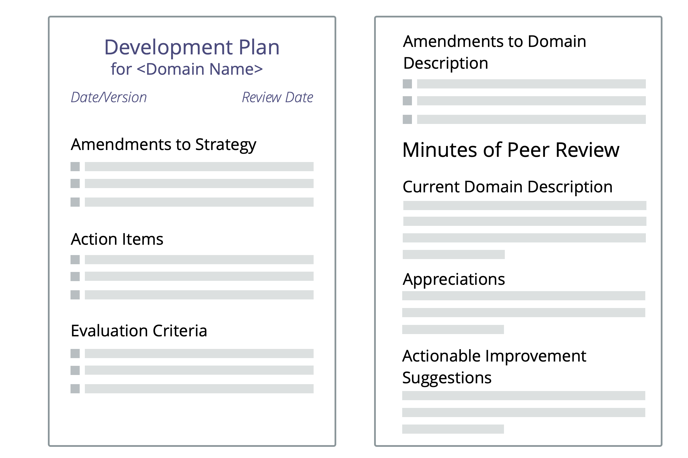

### Habilitadores de cocreación

#### Participación creativa

Comprométete a hacer todo lo posible para actuar e interactuar de modos que permitan una colaboración efectiva.

_"¿Es mi comportamiento en este momento la mayor contribución que puedo hacer en favor de la efectividad de esta colaboración?"_

Participar creativamente puede incluir interrumpir, hacer objeciones o romper <a href="glossary.html#entry-agreement" class="glossary-tooltip" data-toggle="tooltip" title="Acuerdo: Una pauta, proceso, protocolo o política que ha sido acordado y se ha diseñado para guiar el flujo de valor.">acuerdos</a>.

Una _participación creativa_ es un **compromiso individual** a:

-   **considerar y mantener activamente todos los acuerdos** alcanzados, de la mejor manera posible, dadas las circunstancias
-   **desarrollar la conciencia y la comprensión** de las necesidades individuales y colectivas
-   **cultivar las habilidades necesarias**
-   **apoyar a otros** para participar de forma creativa
-   llevar sugerencias de impedimentos y mejoras a la atención de otros si es necesario

##### Beneficios de la Participación Creativa

Participación creativa:

- permite la cocreación y evolución de acuerdos
- ayuda a desarrollar equipos más fuertes
- crea autoresponsabilidad, integridad y confianza
- genera una cultura de apoyo mutuo y estrecha colaboración
- es más poderosa cuando muchos lo adoptan

##### Participación Creativa: Autoevaluación

-   ¿Cómo puedo apoyarme a mí misma y a otras para participar de un modo más creativo?
-   ¿Dónde están siendo mis interacciones con otros de poco ayuda o inefectivas?
-   ¿Qué acuerdos encuentro difícil de mantener? ¿Qué puedo hacer para abordar eso?
-   ¿Qué habilidades puedo desarrollar, que me ayudarían a participar más creativamente?
-   ¿Cómo sería una participación creativa en relación con...
    -   mis actividades cotidianas?
    -   la colaboración e interacción con otros?
    -   la organización?
    -   nuestros usuarios o clientes?
    -   el entorno más amplio?

#### Adoptar los Siete Principios

Alinear la colaboración con los Siete Principios.

La adopción de los Siete Principios reduce el número de acuerdos explícitos requeridos, y guía la adaptación de los patrones de S3 para encajar con el contexto de la organización.

Los valores de una organización necesitan aceptar los Siete Principios.

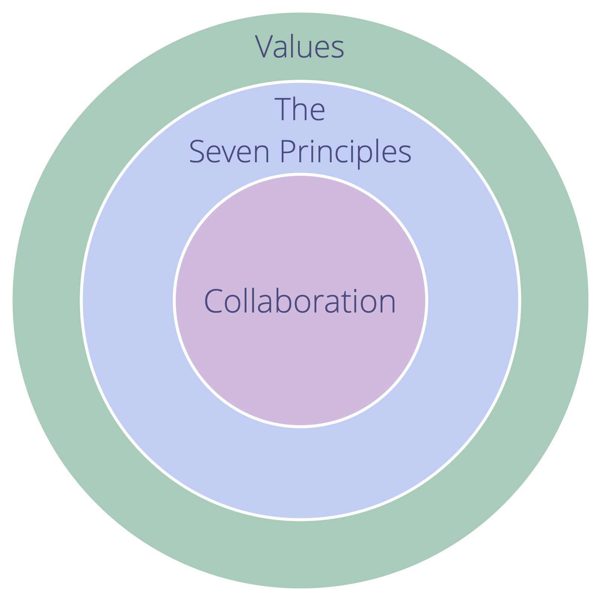

#### Acordar los valores

Evolucionar intencionalmente la cultura en la organización.

Los valores son principios valorados que guían el comportamiento. Los valores definen el margen de acción y las limitaciones éticas.

-   Cada miembro aporta sus propios valores a una organización con base en sus experiencias  y creencias personales
-   un equipo u organización puede **elegir adoptar colectivamente valores** para guiar su colaboración

Los valores ofrecen orientación para determinar la acción apropiada, incluso en ausencia de <a href="glossary.html#entry-agreement" class="glossary-tooltip" data-toggle="tooltip" title="Acuerdo: Una pauta, proceso, protocolo o política que ha sido acordado y se ha diseñado para guiar el flujo de valor.">acuerdos</a> explícitos.

Adoptar colectivamente un conjunto de valores apoya la efectividad de una organización:

-   reduce potenciales **malentendidos**
-   ayuda a **alinear** la toma de decisiones y la acción
-   **atrae nuevos miembros, socios y clientes** que están alineados con la organización

Los valores elegidos son un acuerdo que se beneficia de **revisiones regulares**.

#### Involucra a los afectados

Involucre a las personas en la toma de decisiones que les afectan, con el fin de mantener la equivalencia y corresponsabilidad, y para aumentar la información disponible sobre el tema.

Para grupos más grandes:

-   facilita un proceso en varias etapas y crea grupos más pequeños que escojan a personas delegadas
-   utiliza una herramienta en línea y lleve a cabo un proceso asincrónico, _con límites de tiempo_ y en etapas

Contempla también incluir a aquellos afectados en la revisión y evolución de las decisiones.

#### Rompiendo acuerdos

Rompe acuerdos cuando estás seguro de que el beneficio para la organización supera el coste de esperar a enmendar el acuerdo, y toma responsabilidad de cualquier consecuencia.

Romper <a href="glossary.html#entry-agreement" class="glossary-tooltip" data-toggle="tooltip" title="Acuerdo: Una pauta, proceso, protocolo o política que ha sido acordado y se ha diseñado para guiar el flujo de valor.">acuerdos</a> a veces es **necesario** pero puede suponer un **coste** para la comunidad.

Hazte responsable de:

-   **arregla** los desajustes
-   **haz un seguimiento** tan pronto como sea posible de las personas afectadas
-   **cambia el acuerdo** en lugar de romperlo repetidamente

#### Remuneración transparente

Crear una fórmula de salario justo y hacerla transparente.

El salario transparente (también denominado "salario abierto") es la práctica de determinar la compensación de cada empleado de acuerdo con un conjunto de reglas —la _fórmula salarial_ — en lugar de someter la compensación a una negociación individual entre el empleador y el empleado. La fórmula salarial —y a menudo también la compensación individual— es transparente para todos los miembros de una organización, y a veces para el público.

Una fórmula salarial transparente debe adaptarse al contexto de una organización y ser percibida como lo suficientemente justa por todas las partes interesadas.

La percepción de si es justa o no varía de una persona a otra y de acuerdo con el contexto, por lo que crear una fórmula salarial requiere desarrollar una comprensión compartida de lo que se considera justo.

Al decidir (o acordar) una fórmula salarial para una organización o departamento, considera:

- qué constituiría una garantía de una subsistencia fija adecuada
- cómo calcular la compensación en función de las necesidades, la inversión, la productividad o el mérito
- cómo distribuir las ganancias de la organización y cubrir las pérdidas de acuerdo con las expectativas y necesidades de las diversas partes interesadas

Decide cómo manejar la remuneración para cambios de roles y _desarrolla una estrategia_ para la transición hacia nuevos contratos y acuerdos de compensación.

#### Contrato para una colaboración exitosa

Fomente colaboraciones exitosas desde el primer momento y genere confianza entre las partes a través de la cocreación de contratos mutuamente beneficiosos y jurídicamente sólidos.

Un **contrato** es un conjunto de promesas que dos o más partes acuerdan hacer jurídicamente vinculante, por ejemplo, si se violan esas promesas, la parte perjudicada obtiene acceso a recursos jurídicos (o alternativos).

Desarrollar una comprensión conjunta sobre cuáles son las necesidades y expectativas es esencial para lograr una colaboración exitosa.

Mientras negocias y acuerdas un contrato, modela la cultura de colaboración que deseas conseguir, y construye una relación positiva con las demás partes implicadas.

Este patrón se refiere a los contratos relacionados con la colaboración en cualquier transacción comercial entre una organización y otras partes (p.ej., empleados, consultores, proveedores de servicios, accionistas o clientes). Es especialmente relevante para los contratos que tienen una influencia significativa en el futuro de una organización o de uno de sus socios, como por ejemplo:

- contratos de trabajo y contratos con contratistas o consultores externos en _roles de soporte_ (incluyendo cualquier acuerdo que tenga como resultado un cambio de sueldo o de horas de trabajo)
- contratos que rigen la colaboración con clientes, proveedores o proveedores de servicios
- acuerdos de accionistas

**Nota:** Muchos acuerdos sobre colaboración dentro de una organización no requieren contratos específicos, pues ya están regidos por o sujetos a contratos existentes..

##### Criterios de éxito para la negociación de contratos

Al negociar un contrato, asegúrate de que:

- hay una comprensión compartida del motivo de la colaboración, así como del resultado previsto y restricciones importantes
- todas las partes entienden lo que se espera de ellas
- todas las partes afectadas por un contrato están involucradas en la creación del contrato y lo suscriben voluntariamente
- las expectativas son realistas
- el acuerdo es beneficioso para todas las partes
- todos tiene la intención de cumplir el acuerdo alcanzado

Si por cualquier motivo uno o más de estos criterios no pueden cumplirse, probablemente sea prudente no ir adelante.

##### Cocreando el contrato

La forma en que se negocia un contrato puede contribuir significativamente a generar confianza entre las partes. Contempla la contratación desde el punto de vista de hacer un acuerdo entre socios, no adversarios: cocrea el contrato, adáptalo a su contexto específico, y asegúrate de que es jurídicamente sólido.

- El contrato debe incluir todas las expectativas de las partes involucradas, cada una explicada con suficiente detalle
- Utilice un lenguaje claro y sencillo que todas las partes puedan entender y sea inequívoco sobre las consecuencias legales.
- Si necesitas utilizar términos técnicos o legales específicos con los que una parte pueda no estar familiarizada explícalos en un glosario que sea parte del contrato
- Consulta a un abogado que apoya la cultura a la que aspira y es competente en el campo de negocios que está negociando

##### Cuando cocreas un contrato:

- Asegúrate de que todas las partes tengan una delegación que incluya la representación de todos los <a href="glossary.html#entry-domain" class="glossary-tooltip" data-toggle="tooltip" title="Dominio: Un área específica de influencia, actividad y toma de decisiones dentro de una organización.">dominios</a> afectados (por ejemplo, no solo ventas, sino también desarrollo / producción / soporte, etc.)
- Describe explícitamente la cultura que pretende desarrollar, tomando en cuenta el terreno común y cualquier diferencia cultural entre las partes
- Expón los motivos de la colaboración propuesta, y sé transparente sobre las expectativas y necesidades de todas las partes
- Revela toda la información pertinente (si es necesario bajo un acuerdo de confidencialidad)
- Alcanza primero un acuerdo con todas las partes sobre los términos de la relación y las expectativas, y luego plantéate cómo puedes hacerlos jurídicamente sólidos
- Compila una lista de leyes y reglamentos específicos a los que el contrato debe atenerse
- Negocia en varias iteraciones, dando tiempo para considerar implicaciones y proponer enmiendas
- Conserva minutas de cada reunión para reducir el potencial de malentendidos

##### Apoyar el ciclo de vida completo de la colaboración:

Cualquier contrato puede ser modificado en cualquier momento, siempre y cuando todos los firmantes estén de acuerdo. Sin embargo, el potencial de que aparezca un conflicto más adelante se reduce en gran medida si contemplas el ciclo de vida completo de la colaboración en el contrato:

- toma medidas previas para asegurar un buen comienzo definiendo procedimientos de precontratación
- dispón de un período de prueba, donde todas las partes puedan probar la colaboración, y un protocolo claro sobre cómo cada parte puede terminar el contrato durante el período de prueba
- define e incluye en el contrato reuniones regulares de revisión donde los contratantes se reúnen para compartir el aprendizaje y decidir cómo se podría modificar el contrato para adaptarse al contexto cambiante
- Incluye procedimientos para incumplimientos de contrato
- considera poner a disposición medios alternativos para la resolución de conflictos, por ejemplo, mediación, conciliación o arbitraje
- considera limitar el contrato a un plazo fijo tras el cual el contrato expira y puede ser renovado si es necesario

##### Cultura

Cada contrato influye en la cultura de la colaboración que gobierna, incluso cuando parece que solo describe *lo que* necesita ser entregado:

- crea intencionalmente la cultura de colaboración que quieras ver incluyendo expectativas sobre *cómo* se deben hacer las cosas
- alinea el contrato a la cultura organizativa (de todas las partes) y a los requisitos legales
- crea contratos que permitan y fomenten la responsabilidad

Si ves que los contratos estándar en tu industria están mal alineados con la cultura que quieras crear, crea tu propio repositorio de plantillas para contratos y cláusulas y considera compartirlo con otros, para que puedas aprovechar la experiencia pasada cuando estés creando nuevos contratos.

#### Rol de apoyo

Aplicar el patrón de rol a los contratistas externos.

-   Clarifica y describe al driver  para el rol __
-   Crea una _descripción del dominio_
-   Si es útil, implementa un proceso de selección
-   Considera limitar el plazo del contrato, después del cual puede ser revisado y renovado si es necesario
-   Incluye _revisiones por iguales_ regulares

Los contratistas externos consienten asumir su rol.

**Ver también:** _Contrato para una colaboración exitosa_

#### Reglamentos

Asegura los principios y patrones de S3 en tus estatutos según sea necesario para proteger la <strong>integridad legal</strong> y la <strong>cultura organizativa</strong>

Ten en cuenta:

-   consentimiento y equivalencia en la toma de decisiones
-   proceso de selección para roles de liderazgo
-   estructura organizacional, <a href="glossary.html#entry-values" class="glossary-tooltip" data-toggle="tooltip" title="Valores: Principios valorados que guían el comportamiento. No confundir con &quot;valor&quot; (singular) en el contexto de un driver.">valores</a> y <a href="glossary.html#entry-principle" class="glossary-tooltip" data-toggle="tooltip" title="Principio: Una idea básica o regla que guía el comportamiento, o explica o controla cómo algo sucede o funciona.">principios</a>
-   influencia de los propietarios o accionistas
-   modo de compartir ganancias y costos

### Construyendo Organizaciones

#### Círculo

_Un **círculo** es un equipo autogobernado y semiautónomo de personas equivalentes que colaboran para dar cuenta de un dominio._

Un círculo:

- puede ser permanente o temporal
- puede <a href="glossary.html#entry-self-organization" class="glossary-tooltip" data-toggle="tooltip" title="Auto-Organización: Cualquier actividad o proceso mediante el cual las personas organizan el trabajo. La auto-organización ocurre dentro de las limitaciones de un dominio, pero sin la influencia directa de los agentes externos. En cualquier organización o equipo, la auto-organización coexiste con influencia externa (por ejemplo, objeciones externas o decisiones de gobernanza que afectan al dominio).">autoorganizarse</a>
- es responsable de su propio desarrollo y de su conjunto de <a href="glossary.html#entry-agreement" class="glossary-tooltip" data-toggle="tooltip" title="Acuerdo: Una pauta, proceso, protocolo o política que ha sido acordado y se ha diseñado para guiar el flujo de valor.">acuerdos</a>

- **Semiautónomo:**
    
    - Los miembros de un círculo actúan dentro de las restricciones de su <a href="glossary.html#entry-domain" class="glossary-tooltip" data-toggle="tooltip" title="Dominio: Un área específica de influencia, actividad y toma de decisiones dentro de una organización.">dominio</a>.
    - Cada círculo puede crear <a href="glossary.html#entry-value" class="glossary-tooltip" data-toggle="tooltip" title="Valor: La importancia, el valor o la utilidad de algo en relación con un driver. También &quot;un principio de cierta importancia que guía el comportamiento&quot; (se utiliza principalmente como plural, &quot;valores&quot;, o &quot;valores organizacionales&quot;).">valor</a> de modo autónomo. 
- **Autogobernado:** 
    - Los miembros de un círculo deciden juntos continuamente qué hacer para dar cuenta de su dominio, y establecen restricciones sobre cómo y cuándo se harán las cosas.
- **Equivalencia de los miembros del círculo:** 
    - Todos los miembros de un círculo son igualmente responsables de la <a href="glossary.html#entry-governance" class="glossary-tooltip" data-toggle="tooltip" title="Gobernanza: El proceso de establecer objetivos y tomar y evolucionar decisiones que orientan a las personas hacia la consecución de dichos objetivos.">gobernanza</a> del dominio del círculo.

#### Rol

Delega la responsabilidad de un dominio a individuos.

Un rol es un área de responsabilidad (un <a href="glossary.html#entry-domain" class="glossary-tooltip" data-toggle="tooltip" title="Dominio: Un área específica de influencia, actividad y toma de decisiones dentro de una organización.">dominio</a>) que es <a href="glossary.html#entry-delegation" class="glossary-tooltip" data-toggle="tooltip" title="Delegación: La concesión de autoridad de una parte (la persona delegadora) a otra parte (la persona delegada) para dar cuenta de un dominio (es decir, hacer ciertas cosas y/o tomar ciertas decisiones), sobre el cual la persona delegadora mantiene la responsabilidad general..">delegado</a> a un individuo (la **persona guardiana del rol**), el cual tiene autonomía para decidir y actuar dentro de las restricciones de su dominio.

La persona guardiana del rol lidera la creación de una <a href="glossary.html#entry-strategy" class="glossary-tooltip" data-toggle="tooltip" title="Estrategia: Un enfoque de alto nivel sobre cómo las personas crearán valor para dar cuenta de un dominio con éxito.">estrategia</a> sobre cómo van a dar cuenta de su dominio. Evolucionan su estrategia en colaboración con la persona <a href="glossary.html#entry-delegator" class="glossary-tooltip" data-toggle="tooltip" title="Persona delegadora: Un individuo o grupo que delega la responsabilidad de un dominio a otro(s).">delegadora</a>.

Un rol es una manera sencilla de que una organización (o ) delegue tareas recurrentes o un área específica de trabajo y toma de decisiones a uno de sus miembros.

- las personas pueden tomar responsabilidad de más de un rol
- en lugar de crear formalmente un nuevo equipo, a veces es más sencillo simplemente compartir un rol entre varias personas
- los guardianes de un rol son seleccionados por consentimiento y por un tiempo límitado
- los iguales se apoyan unos a otros para desarrollarse en los roles que custodian

La persona custodiadora del rol puede mantener una <a href="glossary.html#entry-backlog" class="glossary-tooltip" data-toggle="tooltip" title="Agenda pendiente: Una lista (a menudo priorizada) de elementos de trabajo (entregables) o drivers incompletos que necesitan ser abordados.">agenda de pendientes</a>, y una <a href="glossary.html#entry-logbook" class="glossary-tooltip" data-toggle="tooltip" title="Bitácora: Un sistema (digital) para almacenar toda la información relevante en la administración de una organización.">bitácora</a> para registrar y ayudarles a evolucionar su enfoque hacia la aportación de <a href="glossary.html#entry-value" class="glossary-tooltip" data-toggle="tooltip" title="Valor: La importancia, el valor o la utilidad de algo en relación con un driver. También &quot;un principio de cierta importancia que guía el comportamiento&quot; (se utiliza principalmente como plural, &quot;valores&quot;, o &quot;valores organizacionales&quot;).">valor</a>.

**Nota:** En S3, las orientaciones, procesos o protocolos creados por individuos que ocupan roles son tratados como acuerdos.

#### Vinculación

Facilita el flujo de información e influencia entre dos círculos (o equipos).

Un equipo elige a uno de sus miembros para representar sus intereses en las decisiones de <a href="glossary.html#entry-governance" class="glossary-tooltip" data-toggle="tooltip" title="Gobernanza: El proceso de establecer objetivos y tomar y evolucionar decisiones que orientan a las personas hacia la consecución de dichos objetivos.">gobernanza</a> de otro equipo.

#### Doble Enlace

Facilita el flujo <em>bidireccional</em> de información e influencia entre dos grupos.

Dos equipos interdependientes seleccionan cada uno a uno de sus miembros para que represente sus intereses en las decisiones de <a href="glossary.html#entry-governance" class="glossary-tooltip" data-toggle="tooltip" title="Gobernanza: El proceso de establecer objetivos y tomar y evolucionar decisiones que orientan a las personas hacia la consecución de dichos objetivos.">gobernanza</a> del otro equipo.

El doble enlace permite la equivalencia entre dos equipos y puede ser utilizada para extraer información valiosa en estructuras jerárquicas.

#### Representantes

Seleccionar a un miembro del grupo para participar en la toma de decisiones de gobernanza de otro grupo, para permitir el flujo de información e influencia.

Los representantes (también llamados, enlaces):

- defienden los intereses de un  en otro equipo
- se eligen por un período limitado
- participan en la **toma de decisiones de gobernanza** del equipo con el que se enlazan, y pueden: 
    - plantear temas para la agenda
    - participar en la formulación de propuestas
    - plantear <a href="glossary.html#entry-objection" class="glossary-tooltip" data-toggle="tooltip" title="Objeción: Un argumento, relacionado con una propuesta, acuerdo, actividad o el estado actual de las cosas, que revela consecuencias o riesgos que preferirías evitar, o muestra maneras valiosas de mejorar.">objeciones</a> a las propuestas y <a href="glossary.html#entry-agreement" class="glossary-tooltip" data-toggle="tooltip" title="Acuerdo: Una pauta, proceso, protocolo o política que ha sido acordado y se ha diseñado para guiar el flujo de valor.">acuerdos</a> existentes

#### Equipo abierto

Abrir intencionalmente un dominio por invitación, en lugar de asignación, y pedir a los que son invitados a que contribuyan cuando puedan.

_Un **equipo abierto** es un grupo de personas que son invitadas a contribuir al trabajo y a la gobernanza realizada en un dominio cuando pueden._

La <a href="glossary.html#entry-delegator" class="glossary-tooltip" data-toggle="tooltip" title="Persona delegadora: Un individuo o grupo que delega la responsabilidad de un dominio a otro(s)."> persona delegadora</a> del dominio abierto crea una invitación que clarifica:

- el <a href="glossary.html#entry-primary-driver" class="glossary-tooltip" data-toggle="tooltip" title="Driver principal: El motivante principal de un dominio es el principal motivante al que responden las personas que tienen agencia en ese dominio.">driver principal</a>, las responsabilidades clave y las restricciones del dominio del equipo abierto
- quien está invitado a contribuir (los miembros del equipo abierto)
- restricciones relativas a la participación de la persona delegadora en la <a href="glossary.html#entry-governance" class="glossary-tooltip" data-toggle="tooltip" title="Gobernanza: El proceso de establecer objetivos y tomar y evolucionar decisiones que orientan a las personas hacia la consecución de dichos objetivos.">gobernanza</a> del equipo abierto

Dependiendo de las restricciones establecidas por la persona delegadora, las personas colaboradoras pueden limitarse a <a href="glossary.html#entry-operations" class="glossary-tooltip" data-toggle="tooltip" title="Operaciones: Hacer el trabajo y organizar actividades diarias dentro de las limitaciones definidas a través de la gobernanza.">organizar y realizar trabajo</a>, o también participar en la gobernanza.

La persona delegadora es responsable de realizar revisiones regulares para asegurar la efectividad del trabajo y apoyar cualquier toma de decisión que se realice en el equipo abierto.

#### Equipo de ayuda

Reúne un equipo de personas equivalentes con el mandato de cumplir con un conjunto específico de requisitos definidos por una persona delegadora.

Un equipo de ayuda:

- es una manera de que la persona <a href="glossary.html#entry-delegator" class="glossary-tooltip" data-toggle="tooltip" title="Persona delegadora: Un individuo o grupo que delega la responsabilidad de un dominio a otro(s).">delegadora</a> amplíe su capacidad
- puede autoorganizarse, o ser guiado por una persona _coordinadora_ elegida por la persona delegadora
- está gobernado por la persona delegadora
- se beneficia de un <a href="glossary.html#entry-domain" class="glossary-tooltip" data-toggle="tooltip" title="Dominio: Un área específica de influencia, actividad y toma de decisiones dentro de una organización.">dominio</a> claramente definido

Los miembros de un equipo de apoyo:

- pueden objetar sobre las decisiones del delegador que les afectan
- pueden añadir elementos a la <a href="glossary.html#entry-governance-backlog" class="glossary-tooltip" data-toggle="tooltip" title="Agenda pendiente de gobernanza: Una lista visible y priorizada de elementos (drivers) que están relacionados con gobernar un dominio y requieren atención.">agenda de pendientes de gobernanza</a> de la persona delegadora
- pueden ser invitados a escoger a un/a _representante_ para participar en la toma de decisiones de gobernanza de la persona delegadora

### Integrar la S3

#### Adaptar los patrones al contexto

Adapta y evoluciona los patrones S3 para que se ajusten a tu contexto específico.

Asegúrate que todos los afectados:

- entienden por qué cambiar el patrón es necesario (o útil)
- están presentes o representados cuando se decide cómo cambiarlo
- usan los principios de S3 como guía para la adaptación.

Haz experimentos con adaptaciones el tiempo suficiente para aprender cuáles son los beneficios y cualquier posible dificultad.

Comparte las adaptaciones útiles con la comunidad de S3.

#### Sé el cambio

Lidera con el ejemplo.

Comportate y actúa de acuerdo a como a ti te gustaría que otros actuaran y se comportaran.

#### Invita al cambio

Clarifica la razón del cambio e invita a las personas a participar. 

Invitar al cambio en lugar de imponerlo ayuda a reducir la resistencia y permite a las personas elegir por sí mismas.

Al hacer la invitación:

- Sé transparente sobre la razón para el cambio
- Clarifica las expectativas y restricciones.
- Evita la coerción o la manipulación
- Reconoce cualquier escepticismo y dudas

Incluye a las personas involucradas y afectadas en revisiones regulares de los resultados.

#### "Espacio abierto" para el cambio

Invita a todos a crear y llevar a cabo experimentos para evolucionar la organización.

- Clarifica el <a href="glossary.html#entry-organizational-driver" class="glossary-tooltip" data-toggle="tooltip" title="Motivante de la organización: Un motivante es la razón de una persona o grupo para responder a una situación específica. Un motivante es considerado un **motivante organizacional** si responder a este ayudaría a la organización generar valor, eliminar desperdicio o evitar consecuencias no deseadas.">driver</a> para el cambio
- Programa eventos "Espacio Abierto" de forma regular: 
    - Invita a todos los miembros a crear y llevar a cabo experimentos
    - Define restricciones para los experimentos que permitan el desarrollo de una mentalidad <a href="glossary.html#entry-sociocracy" class="glossary-tooltip" data-toggle="tooltip" title="Sociocracia: Un enfoque para organizar juntos donde las personas afectadas por las decisiones pueden influir en las mismas a partir de la base de razones para hacerlo.">sociocrática</a> y agile (p.ej., los principios S3)
    - Revisa y aprende de la experimentación en el siguiente "Espacio Abierto"

#### Mejora continua del proceso de trabajo

Desvela los drivers y establece un sistema "pull" basado en métricas para el cambio organizacional por medio de la mejora y el perfeccionamiento continuos del proceso de trabajo.

- introduce el principio de consentimiento y _Navegar a través de la tensión_ para evolucionar el proceso de trabajo en un equipo
- considera seleccionar a un facilitador para guiar los procesos del grupo, y la elección de valores para guiar el comportamiento
- inicia un proceso de mejora continua, por ejemplo a través de _retrospectivas_ Kanban o regulares
- los miembros del equipo hacen uso de los patrones S3 según sea necesario
- si es valioso, expandir iterativamente el alcance del experimento a otros equipos
- buscar impedimentos de forma intencionada

##### Desperdicio y mejora continua

_**Desperdicio** es cualquier cosa innecesaria - o que obstaculiza el camino - para responder de forma (más) efectiva a un driver._

Los desperdicios existen en diversas formas y en diferentes niveles de abstracción (tareas, procesos, estructuras organizativas, modelos mentales etc.)

Establecer un proceso para la eliminación del desperdicio que ya se está generando, permite la evolución natural de una organización hacia una mayor efectividad y adaptación a un contexto cambiante.

### Definiendo acuerdos

La S3 promueve un enfoque de la toma de decisiones basado en hipótesis.

#### Registrar los acuerdos

Anota los detalles de los acuerdos que realizas, para que puedas recordarlos después, evalúa el resultado y evoluciona el acuerdo con el paso del tiempo.

_Un **acuerdo** es acordado según pautas, procesos, protocolos o políticas diseñadas para guiar el flujo de valor._

**Nota:** En S3, las orientaciones, procesos y protocolos creados por individuos en roles, también son tratados como acuerdos.

Mantén actualizadas los registros de los acuerdos, por ejemplo, en una <a href="glossary.html#entry-logbook" class="glossary-tooltip" data-toggle="tooltip" title="Bitácora: Un sistema (digital) para almacenar toda la información relevante en la administración de una organización.">bitácora</a>.

##### ¿Qué registrar?

Registra acuerdos con suficiente detalle para que la información importante pueda ser recordada después.

Como mínimo, incluye un resumen del driver, una descripción de lo que se ha acordado, quién es responsable de qué, los criterios de evaluación y una fecha de revisión.

Dependiendo del alcance e importancia del acuerdo, considera incluir lo siguiente:

-   Un título para el acuerdo
-   _Descripción del driver_
-   Fecha de creación (y/o versión)
-   Fecha de caducidad o fecha de vencimiento (si es pertinente)
-   Fecha de revisión (o frecuencia)
-   ¿Quién es responsable de qué?
-   Una descripción del acuerdo, incluyendo:
    -   Cualquier requisito y expectativa relevantes
    -   Elementos de acción
    -   Recursos
    -   Restricciones
    -   _Resultados pretendidos_
    -   _Entregables_
    -   Razonamiento
-   _Criterios de evaluación_ (y potencialmente <a href="glossary.html#entry-concern" class="glossary-tooltip" data-toggle="tooltip" title="Preocupación: Una suposición que no puede (al menos por ahora) ser respaldada por el razonamiento o la evidencia suficiente para demostrar su relevancia o validez a quienes la están considerando.">preocupaciones</a>)
-   Anexos (si es útil)
    -   Antecedentes
    -   Versiones anteriores del acuerdo
    -   Referencias

#### Clarificar el resultado pretendido

Sé explícito acerca de los resultados previstos de los acuerdos, actividades, proyectos y estrategias.

Acordar y registrar una descripción concisa del resultado deseado.

Se puede utilizar el resultado deseado para definir el _Criterio de evaluación_ y las mediciones para revisar el resultado real.

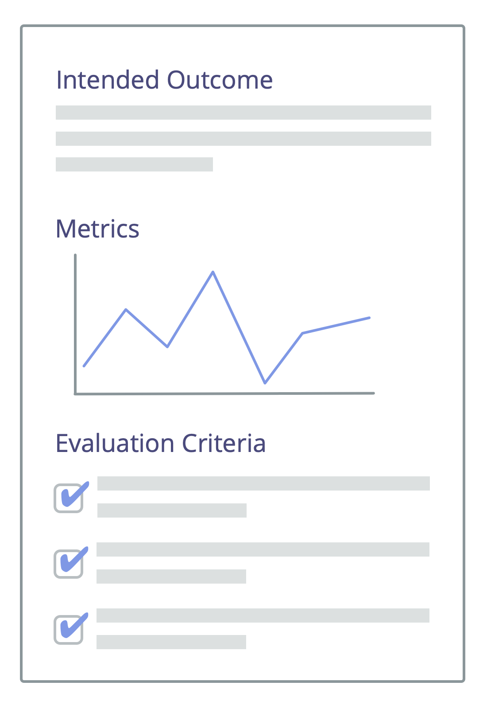

#### Describe los entregables

Describe claramente cualquier entregable relacionado con un acuerdo para fomentar la comprensión compartida de las expectativas.

_Un **entregable** es un producto, servicio, componente o material proporcionado en respuesta a un driver organizacional._

A la hora de describir los entregables:

- incluir la cantidad necesaria de detalle
- referenciar otros documentos cuando sea útil o necesario

La descripción explícita de los entregables puede ser útil para mejorar la comunicación y la colaboración dentro de la organización, con clientes y con socios externos.

**Ejemplo:** Una forma popular de describir los entregables en ingeniería de software son las llamadas **historias de usuario**, que se centran en la necesidad de los usuarios con relación a un sistema de software. Las historias de los usuarios se desarrollan en un diálogo entre un cliente (o su representante, el gestor de productos o el "dueño del producto"), y el equipo de desarrollo del software. Lo que está escrito es normalmente una frase para recordar al equipo las necesidades del usuario. y criterios de aceptación, una lista de requisitos para la nueva funcionalidad, que el cliente utilizará en una reunión de revisión para decidir si acepta o no la nueva funcionalidad tal y como ha sido entregada.

#### Criterios de evaluación

Desarrollar criterios de evaluación bien definidos para determinar si el actuar sobre un acuerdo tuvo el efecto deseado.

- Busca **criterios simples y no ambiguos** y documéntalos (para evitar la discusión o el diálogo innecesario al revisar tus <a href="glossary.html#entry-agreement" class="glossary-tooltip" data-toggle="tooltip" title="Acuerdo: Una pauta, proceso, protocolo o política que ha sido acordado y se ha diseñado para guiar el flujo de valor.">acuerdos</a>)
- Define **métricas <a href="glossary.html#entry-metric" class="glossary-tooltip" data-toggle="tooltip" title="Métrica: Un indicador cuantificable utilizado para seguir y valorar el progreso, evaluar los resultados y determinar el éxito">viables</a>** para rastrear continuamente los efectos y detectar desviaciones del <a href="glossary.html#entry-intended-outcome" class="glossary-tooltip" data-toggle="tooltip" title="Resultado esperado: El resultado esperado de un acuerdo, acción, proyecto o estrategia.">resultado pretendido</a>
- Considera añadir criterios que hagan explícito cuando el resultado de un acuerdo sea considerado **fallido**
- Al revisar un acuerdo, considera **evolucionar los criterios de evaluación** basándote en lo que has aprendido

#### Bitácora

Mantén un sistema coherente y accesible que almacene toda la información requerida para la colaboración.

Una bitácora es un sistema (digital) para almacenar toda la información relevante para la gestión de una organización y sus equipos. La bitácora es accesible para todos los miembros de una organización, y la información se mantiene confidencial solo cuando hay una buena razón para hacerlo.

Las plataformas comunes para las bitácoras son Wikis (por ejemplo, [Dokuwiki](https://www.dokuwiki.org/), [MediaWiki](https://www.mediawiki.org/), [Confluence](https://www.atlassian.com/software/confluence)), Content Management Systems (por ejemplo, [Wordpress](https://wordpress.org/)), [G Suite](https://gsuite.google.com), [Evernote](https://evernote.com/business) o incluso [Trello](https://trello.com/).

##### Contenido de la bitácora

Contenido relacionado con toda la organización:

- <a href="glossary.html#entry-primary-driver" class="glossary-tooltip" data-toggle="tooltip" title="Driver principal: El motivante principal de un dominio es el principal motivante al que responden las personas que tienen agencia en ese dominio.">driver principal</a>, <a href="glossary.html#entry-strategy" class="glossary-tooltip" data-toggle="tooltip" title="Estrategia: Un enfoque de alto nivel sobre cómo las personas crearán valor para dar cuenta de un dominio con éxito.">estrategia</a> y <a href="glossary.html#entry-values" class="glossary-tooltip" data-toggle="tooltip" title="Valores: Principios valorados que guían el comportamiento. No confundir con &quot;valor&quot; (singular) en el contexto de un driver.">valores</a> organizacionales
- estructura organizacional (<a href="glossary.html#entry-domain" class="glossary-tooltip" data-toggle="tooltip" title="Dominio: Un área específica de influencia, actividad y toma de decisiones dentro de una organización.">dominios</a> y las conexiones entre ellos)
- <a href="glossary.html#entry-agreement" class="glossary-tooltip" data-toggle="tooltip" title="Acuerdo: Una pauta, proceso, protocolo o política que ha sido acordado y se ha diseñado para guiar el flujo de valor.">acuerdos</a>

Contenido relacionado con un equipo específico o <a href="glossary.html#entry-role" class="glossary-tooltip" data-toggle="tooltip" title="Rol: Un dominio que se delega a un individuo, quien luego se convierte en el encargado de roles.">rol</a>:

- la descripción del dominio y la estrategia
- acuerdos (incluyendo, descripciones de dominio, estrategias y <a href="glossary.html#entry-delegatee" class="glossary-tooltip" data-toggle="tooltip" title="Persona(s) delegada(s): Un individuo o grupo que acepta la responsabilidad de un dominio que le ha sido delegado, convirtiéndose en un guardián de rol o un equipo.">planes de desarrollo</a> _de la persona delegada_)
- <a href="glossary.html#entry-backlog" class="glossary-tooltip" data-toggle="tooltip" title="Agenda pendiente: Una lista (a menudo priorizada) de elementos de trabajo (entregables) o drivers incompletos que necesitan ser abordados.">agenda de pendientes</a> y otras informaciones relacionadas con el trabajo y la <a href="glossary.html#entry-governance" class="glossary-tooltip" data-toggle="tooltip" title="Gobernanza: El proceso de establecer objetivos y tomar y evolucionar decisiones que orientan a las personas hacia la consecución de dichos objetivos.">gobernanza</a>

#### Guardián de la bitácora

Escoge a un miembro de tu equipo para que se haga cargo específicamente de mantener actualizados los registros de toda la información que el equipo necesita.

El guardián de la bitácora es responsable de mantener la <a href="glossary.html#entry-logbook" class="glossary-tooltip" data-toggle="tooltip" title="Bitácora: Un sistema (digital) para almacenar toda la información relevante en la administración de una organización.">bitácora</a> de un equipo, haciéndose cargo de:

- registrar los detalles de los <a href="glossary.html#entry-agreement" class="glossary-tooltip" data-toggle="tooltip" title="Acuerdo: Una pauta, proceso, protocolo o política que ha sido acordado y se ha diseñado para guiar el flujo de valor.">acuerdos</a>, descripciones de <a href="glossary.html#entry-domain" class="glossary-tooltip" data-toggle="tooltip" title="Dominio: Un área específica de influencia, actividad y toma de decisiones dentro de una organización.">dominios</a>, _selecciones_, fechas de evaluación, minutas de reuniones, etc.
- organizar la información relevante y mejorar el sistema cuando sea oportuno
- mantener los registros actualizados
- asegurar el acceso a todo el equipo (y a la organización más amplia según se haya acordado)
- atender todos los aspectos técnicos relacionados a la gestión de la bitácora

### Formatos de reunión

#### Retrospectiva

Dedicar tiempo para reflexionar sobre experiencias anteriores, aprender y decidir cómo mejorar el proceso de trabajo.

-   Salida: cambios en el proceso de trabajo, nuevas tareas, <a href="glossary.html#entry-agreement" class="glossary-tooltip" data-toggle="tooltip" title="Acuerdo: Una pauta, proceso, protocolo o política que ha sido acordado y se ha diseñado para guiar el flujo de valor.">acuerdos</a> sobre la marcha y <a href="glossary.html#entry-organizational-driver" class="glossary-tooltip" data-toggle="tooltip" title="Motivante de la organización: Un motivante es la razón de una persona o grupo para responder a una situación específica. Un motivante es considerado un **motivante organizacional** si responder a este ayudaría a la organización generar valor, eliminar desperdicio o evitar consecuencias no deseadas.">drivers</a> que requieren un acuerdo
-   Reunión facilitada (~1hr)
-   Intervalos regulares (1-4 semanas)
-   Adaptarse a la situación y contexto

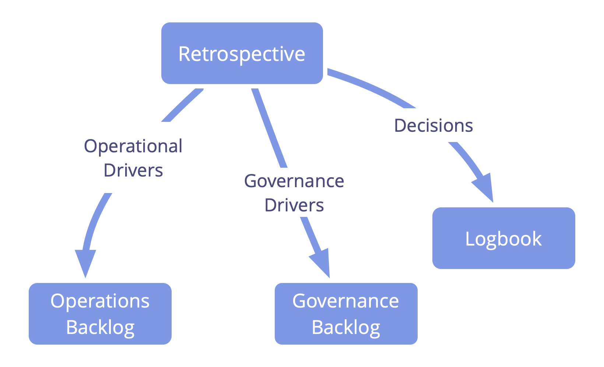

##### 5 fases de una reunión retrospectiva

1. Preparar el escenario
2. Recopilar datos
3. Generar comprensiones
4. Decidir qué hacer
5. Finalizar la retrospectiva

Pueden encontrarse muchas actividades distintas para cada fase en [plans-for-retrospectives.com](http://www.plans-for-retrospectives.com/)

#### Reunión de gobernanza

Los equipos se reúnen a intervalos regulares para decidir qué hacer para lograr los objetivos, y establecer restricciones sobre cómo y cuándo se harán las cosas.

Una reunión de gobernanza está usualmente:

-   facilitada
-   preparada con antelación
-   con un _límite de tiempo asignado_ de entre 90 y 120 minutos
-   programada cada 2 a 4 semanas

Una típica reunión de gobernanza incluye:

-   apertura: _check in_ de unos con otros y ajuste al objetivo de la reunión
-   asuntos administrativos
    -   comprobar si hay consentimiento a las minutas de la última reunión
    -   acordar una fecha para la próxima reunión
    -   comprobar si hay algún punto del orden del día de última hora y  consentimiento al orden del día
-   elementos del orden del día
-   _evaluación de la reunión_: reflexiona sobre tus interacciones, celebra éxitos y comparte sugerencias para la mejora
-   cierre: check in de unos con otros antes de abandonar la reunión

Elementos típicos de la orden del día incluyen:

-   cualquier reporte breve
-   evaluación de los <a href="glossary.html#entry-agreement" class="glossary-tooltip" data-toggle="tooltip" title="Acuerdo: Una pauta, proceso, protocolo o política que ha sido acordado y se ha diseñado para guiar el flujo de valor.">acuerdos</a> existentes debido a revisión
-   selección de personas para roles
-   nuevos drivers que requieren tomar decisiones, como por ejemplo:
    -   _formular propuestas_
    -   _hacer acuerdos_
    -   _diseñar dominios_ y decidir cómo dar cuenta de ellos (p. ej. nuevos roles __, _círculos_, equipos o _dominios abiertos_)

#### Reunión diaria

Reúnete diariamente para organizar el trabajo, facilitar el aprendizaje y mejorar tu productividad y efectividad.

-   Con <a href="glossary.html#entry-timebox" class="glossary-tooltip" data-toggle="tooltip" title="Tiempo asignado: Un período fijo de tiempo dedicado a una actividad específica (que no necesariamente termina al final del tiempo asignado).">límite de tiempo asignado</a> (normalmente 15 minutos)
-   Celebrada todos los días a la misma hora
-   El equipo se reúne en torno a un tablón/herramienta visible de gestión de proyectos para:
    -   organizar el trabajo diario
    -   abordar impedimentos/bloqueos
    -   adaptar los <a href="glossary.html#entry-agreement" class="glossary-tooltip" data-toggle="tooltip" title="Acuerdo: Una pauta, proceso, protocolo o política que ha sido acordado y se ha diseñado para guiar el flujo de valor.">acuerdos existentes</a> o crear nuevos acuerdos en el momento

#### Reuniones de planificación y revisión

Las personas se reúnen en intervalos regulares (de 1-4 semanas) en reuniones con límite de tiempo asignado para planificar y revisar el trabajo.

**Reunión de planificación:** seleccionar y estimar elementos de trabajo para la siguiente iteración.

**Reunión de revisión:** revisar los elementos de trabajo completados y decidir si hay que repetir alguno y los cambios para la siguiente iteración.

#### Reunión de coordinación

Reúnete regularmente (normalmente una vez por semana) para informar sobre los dominios y coordinar el trabajo entre ellos.

-   facilita la reunión (<a href="glossary.html#entry-timebox" class="glossary-tooltip" data-toggle="tooltip" title="Tiempo asignado: Un período fijo de tiempo dedicado a una actividad específica (que no necesariamente termina al final del tiempo asignado).">asigna un límite de tiempo</a> al diálogo y usa rondas cuando aporten valor)
-   cuando sea útil, prepara una orden del día antes de la reunión y compártela con los asistentes con antelación
    -   incluye detalles de cualquier prerrequisito que pueda ayudar a los asistentes a prepararse
    -   pueden aparecer más elementos para la orden del día tras la escucha de los informes de estado

Puntos para la orden del día:

- sincronización y alineamiento entre dominios
- priorización y distribución del trabajo
- responder a impedimentos

### Prácticas de reunión

#### Rondas

En una reunión de grupo, recorrer el círculo dando a todo el mundo la oportunidad de hablar en su turno.

Las rondas son una técnica de facilitación de grupo para mantener la equivalencia y apoyar el diálogo efectivo.

Ser claro sobre el propósito y el resultado pretendido de cada ronda.

Sentarse en círculo, comenzar cada ronda con una persona diferente, y cambiar de dirección (en sentido de las agujas del reloj o en sentido contrario) para ir cambiando quién habla primero y quién último, y el orden de las contribuciones.

#### Facilitar reuniones

Escoger a alguien para facilitar una reunión que ayude al grupo a mantener el foco, mantener el rumbo de la reunión y fomentar la creatividad y la sabiduría de los participantes.

Antes de cada reunión, preparar una agenda de temas, y seleccionar un facilitador para:

- mantener el espacio, controlar el tiempo y recorrer la agenda durante la reunión
- facilitar una actividad adecuada para cada tema
- facilita una _evaluación_ al final de la reunión

Considera seleccionar a un facilitador para un plazo específico. Incluso un facilitador inexperto puede tener una influencia positiva.

**Ver también:** _Prepararse para las reuniones_, _Selección de roles_

#### Preparación para reuniones

Prepararse por adelantado para que las reuniones sean más eficaces

Algunas consideraciones para preparar adecuadamente una reunión:

- clarificar y comunicar el <a href="glossary.html#entry-driver" class="glossary-tooltip" data-toggle="tooltip" title="Driver: El motivo de una persona o de un grupo para responder a una situación específica.">driver</a> para la reunión y <a href="glossary.html#entry-intended-outcome" class="glossary-tooltip" data-toggle="tooltip" title="Resultado esperado: El resultado esperado de un acuerdo, acción, proyecto o estrategia.">el resultado pretendido</a> de la misma
- decidir a quién invitar
- crear una agenda
- programar la reunión con suficiente antelación, para que la gente tenga tiempo de prepararse
- elegir una duración adecuada para la reunión
- ser claro sobre quién _facilitará la reunión_, quién levantará acta y quién se encargará de llevar a cabo cualquier posible seguimiento

##### Preparar una agenda

Involucrar a la gente en la preparación y priorización de una agenda y enviársela a todos con antelación

Para cada elemento de la agenda llegar a un acuerdo sobre:

- el driver
- el resultado pretendido
- el proceso
- el tiempo que quieres emplear en él
- qué necesitan hacer las personas para prepararse

##### Apoyar la preparación de los participantes

- pensar en lo que se puede hacer de antemano para preparar la reunión
- notificar a la gente acerca de cualquier expectativa y requisitos
- poner a disposición cualquier recurso que las personas puedan necesitar para la preparación

##### Como participante

- considerar el patrón _Participación Creativa_
- revisar la agenda y considerar cómo puedes contribuir a cada elemento
- plantear objeciones a una agenda, y si es posible resolverlas antes de la reunión
- revisar sugerencias de mejora de la evaluación de la última reunión y considerar como **tú** puedes integrarlas

#### Check in

Ayuda a la gente a ser consciente de sí misma y de los demás, y a enfocarse, estar presente y participar.

Para el check in, expresa brevemente algo que está presente para ti y cómo te encuentras, revelando pensamientos, sentimientos, distracciones o necesidades.

El check in puede tomar la forma de una ronda de apertura o de cierre en una reunión de grupo, o ser simplemente un breve intercambio en una reunión individual.

También puedes invitar un check in de grupo durante una reunión, o incluso escoger hacer un check in individual en cualquier momento en que creas que esto puede ser valioso para el grupo.

En un check in de grupo, permite que las personas pasen el turno si así lo desean.

Al hacer un check in en un lugar nuevo las personas también pueden decir su nombre y de dónde vienen, como una forma de presentarse. (Consejo: Evita hablar de función, rango, etc. a menos que haya una razón para hacerlo.)

#### Evaluar reuniones

Dedicar un tiempo para el aprendizaje al final de cada reunión o taller.

Reflexionar sobre interacciones, celebrar éxitos y compartir sugerencias para mejorar antes de concluir la reunión.

- Reservar 5 minutos por 1 hora y 15 minutos para un taller de día completo
- Registrar los aprendizajes y revisarlos antes de la siguiente reunión

Formatos cortos que puedes usar:

- más de/menos de/empezar a/dejar de/mantener
- mejoras positivas/cruciales/sugeridas

##### Evaluar reuniones: Formato largo

Pedir a todos en una _ronda_ que reflexionen sobre cualquiera de los siguientes temas o de todos en un breve intercambio, y registra puntos clave que le gustaría recordar para la próxima vez:

- efectividad y formato
- facilitación y participación
- tono emocional
- reconocimientos y logros (me ha gustado …)
- áreas para el crecimiento y sugerencias de mejora (me gustaría...)
- ideas descabelladas y sugerencias radicales (Qué pasa si …)

#### Organizador de reuniones

Seleccionar a alguien que se responsabilice de la preparación y seguimiento de las reuniones, talleres u otros eventos.

Una persona puede asumir el rol de organizador de la reunión para un evento específico o para varios eventos durante un período de tiempo.

##### Responsabilidades de un organizador de reuniones

Preparación:

- identificar objetivos y entregables
- preparar y distribuir la agenda
- identificar e invitar a los participantes
- calcular el tiempo necesario y programar la reunión/taller
- reservar el local (y el transporte si es necesario)
- preparar el espacio y proporcionar los materiales e información necesarios
- llevar a cabo la selección de un facilitador y un tomador de notas para levantar actas, si corresponde

**Después de la reunión:** limpiar el local, devolver las llaves, ata todos los cabos sueltos y asegúrate de que se distribuyan las actas.

**Vea también:** _Facilitar reuniones_, _Preparación para reuniones_

#### Persona facilitadora de gobernanza

Seleccionar a alguien para facilitar reuniones de gobernanza.

Una persona facilitadora de <a href="glossary.html#entry-governance" class="glossary-tooltip" data-toggle="tooltip" title="Gobernanza: El proceso de establecer objetivos y tomar y evolucionar decisiones que orientan a las personas hacia la consecución de dichos objetivos.">gobernanza</a>:

-   se asegura de que las _reuniones de gobernanza_ mantienen el rumbo y son evaluadas
-   es (normalmente) seleccionada por un  de entre sus miembros (y por un plazo de tiempo específico)
-   se familiariza con la  _Agenda pendiente de gobernanza_
-   a menudo invita a otros a facilitar algunos puntos de la agenda

Como persona facilitadora de gobernanza, considera aprender y utilizar los siguientes patrones de S3 para manejar la gobernanza de manera efectiva:

-   _Rondas_
-   _Formación de una propuesta_
-   _Toma de decisiones por consentimiento_
-   _Selección de rol_
-   _Evaluación de reuniones_
-   _Resolver objeciones_
-   _Revisión de iguales_

#### Agenda de pendientes de gobernanza 

_Una **agenda pendiente de gobernanza** es una lista visible y priorizada de elementos (drivers) que están relacionados con gobernar un dominio y requieren atención._

Una agenda de pendientes de gobernanza contiene:

- asuntos que requieren una decisión
- propuestas para crear y considerar
- seleccionar personas para roles

**Nota:** Los próximos informes y acuerdos de revisión deben ser añadidos directamente a la agenda (en lugar de a la agenda de pendientes).

### Organización del trabajo

#### Agenda de asuntos pendientes

_Una **agenda pendiente** (lista de tareas pendientes) es una lista (a menudo priorizada) de elementos de trabajo (entregables) o drivers incompletos que necesitan ser abordados._

Considera hacer visibles las tareas pendientes, no solo para otros miembros de un equipo, sino también para la organización en general.

Los tipos de agendas de asuntos pendientes incluyen:

- temas de <a href="glossary.html#entry-governance" class="glossary-tooltip" data-toggle="tooltip" title="Gobernanza: El proceso de establecer objetivos y tomar y evolucionar decisiones que orientan a las personas hacia la consecución de dichos objetivos.">gobernanza</a> pendientes
- <a href="glossary.html#entry-operations" class="glossary-tooltip" data-toggle="tooltip" title="Operaciones: Hacer el trabajo y organizar actividades diarias dentro de las limitaciones definidas a través de la gobernanza.">operaciones</a> pendientes
- _sprint_ pendientes
- productos pendientes
- impedimentos pendientes

**Implementación:**

- **agenda analógica de asuntos pendientes:** notas pegadas en una pared o tarjetas índices, imanes y pizarra blanca
- **agenda digital de asuntos pendientes:** p.ej. [Google Sheets](https://www.google.com/sheets/about/), [Trello](https://trello.com/), [Kanban Flow](https://kanbanflow.com/), [Jira](https://www.atlassian.com/software/jira), [Asana](https://asana.com/)

Cada elemento de una agenda de asuntos pendientes (priorizados) normalmente contiene:

- una **descripción corta** de un <a href="glossary.html#entry-deliverable" class="glossary-tooltip" data-toggle="tooltip" title="Entregable: Un producto, servicio, componente o material proporcionado en respuesta a un conductor organizacional.">entregable</a> o un <a href="glossary.html#entry-organizational-driver" class="glossary-tooltip" data-toggle="tooltip" title="Motivante de la organización: Un motivante es la razón de una persona o grupo para responder a una situación específica. Un motivante es considerado un **motivante organizacional** si responder a este ayudaría a la organización generar valor, eliminar desperdicio o evitar consecuencias no deseadas.">driver</a>
- un **número de referencia único** (o enlace) para cada elemento de trabajo
- (el **orden de los elementos de trabajo**)
- **dependencias** a otros elementos de trabajo o proyectos
- **fecha límite** (si es necesario)
- (opcional) una medida para el valor ****
- (opcional) una medida para la **inversión** (a menudo una estimación de tiempo o complejidad)

#### Priorizar la agenda de asuntos pendientes

Ordenar todos los elementos de trabajo incompletos con los elementos más importantes primero, luego tomar los elementos de trabajo que estén más arriba en la lista cada vez que haya nueva capacidad.

No puede haber dos elementos de igual importancia, lo que significa que es necesario estar de acuerdo con las prioridades y tomar decisiones difíciles.

Una <a href="glossary.html#entry-backlog" class="glossary-tooltip" data-toggle="tooltip" title="Agenda pendiente: Una lista (a menudo priorizada) de elementos de trabajo (entregables) o drivers incompletos que necesitan ser abordados.">agenda de asuntos pendientes</a> priorizada ayuda a **mantener el foco** en los elementos más importantes.

#### Visualizar el trabajo

Mantener un sistema que permita a todas las partes interesadas revisar el estado de todos los elementos de trabajo actualmente pendientes, en progreso o completados.

- valioso para la <a href="glossary.html#entry-self-organization" class="glossary-tooltip" data-toggle="tooltip" title="Auto-Organización: Cualquier actividad o proceso mediante el cual las personas organizan el trabajo. La auto-organización ocurre dentro de las limitaciones de un dominio, pero sin la influencia directa de los agentes externos. En cualquier organización o equipo, la auto-organización coexiste con influencia externa (por ejemplo, objeciones externas o decisiones de gobernanza que afectan al dominio).">autoorganización</a> y los sistemas "pull"
- el sistema debe ser accesible para todos los afectados
- notas adhesivas **analógicas** pegadas en una pared o tarjetas índice, imanes y pizarra blanca
- **digital:** [Trello](https://trello.com/), [Kanbanize](https://kanbanize.com/), [Leankit](https://leankit.com/), [Miro](https://miro.com), [Jira](https://www.atlassian.com/software/jira), [Google Sheets](https://www.google.com/sheets/about/), etc.

##### Cosas a las que estar atentos:

- **tipos de elementos de trabajo** (p. ej., solicitud de cliente, tareas de proyecto, elaboración de informes, repetición de trabajos)
- **fecha de inicio** (y **fecha límite** si es necesario)
- **prioridades**
- **etapas** de trabajo (por ejemplo, "por hacer", "en progreso", "revisión" y "hecho")
- impedimentos/bloqueos
- quién está trabajando en qué elementos
- <a href="glossary.html#entry-agreement" class="glossary-tooltip" data-toggle="tooltip" title="Acuerdo: Una pauta, proceso, protocolo o política que ha sido acordado y se ha diseñado para guiar el flujo de valor.">acuerdos</a> y expectativas orientando el flujo de trabajo (por ejemplo, definición de trabajo hecho, políticas, normas de calidad)
- usar colores, símbolos, resaltados, etc.

#### Sistema de trabajo pull

La gente toma nuevo elementos de trabajo cuando tienen capacidad (en lugar de que les sea dado o asignado nuevo trabajo).

Priorizar los elementos de trabajo pendientes para asegurar que los elementos importantes se trabajen primero.

Tomar el trabajo evita sobrecargar el sistema, especialmente cuando _el trabajo en curso (WIP, por su sigla en inglés) por persona o equipo está limitado_.

#### Limitar el trabajo en curso

Limitar el número de elementos de trabajo en cualquier etapa de tu proceso de trabajo.

El trabajo en curso incluye:

- el número de elementos en una <a href="glossary.html#entry-backlog" class="glossary-tooltip" data-toggle="tooltip" title="Agenda pendiente: Una lista (a menudo priorizada) de elementos de trabajo (entregables) o drivers incompletos que necesitan ser abordados.">agenda de asuntos pendientes</a>
- proyectos o tareas simultáneas para equipos o individuos
- productos en un portafolio

Cuando una acción sobrepase un límite de elementos de trabajo en curso, esto debe ser comunicado ante el equipo antes de continuar.

#### Timebox Activities

Pon un límite de tiempo para permanecer enfocado,  estando atento al tiempo del que dispones y a cómo lo utilizas.

_Un **tiempo asignado** es un período fijo de tiempo dedicado a una actividad específica (que no necesariamente termina al final del tiempo asignado)._

- para obtener valor a partir del tiempo asignado, sé claro sobre lo que deseas conseguir
- llega a un acuerdo sobre la duración del tiempo asignado y visualiza el tiempo
- negocia y acepta extender el límite de tiempo asignado antes de que se acabe el tiempo
- desmenuza las actividades más largas en límites de tiempo manejables
- considera revisar con frecuencia el progreso
- considera escoger a alguien (el "guardián del tiempo") para ayudar a otros a permanecer conscientes del tiempo

Podrías asignar un límite de tiempo a:

- reuniones, llamadas, diálogo
- tareas
- experimentos
- un intento de resolver un problema
- comprobar el correo electrónico
- pausas
- un periodo de tiempo de trabajo más largo (un sprint)

#### Coordinador

Una persona que cumple el rol de un coordinador es responsable de <strong>coordinar las operaciones de un dominio</strong> y es **seleccionada por un plazo limitado.

El coordinator puede ser seleccionado por el propio equipo, o por la <a href="glossary.html#entry-delegator" class="glossary-tooltip" data-toggle="tooltip" title="Persona delegadora: Un individuo o grupo que delega la responsabilidad de un dominio a otro(s).">persona delegadora</a>.

Varios coordinadores pueden colaborar para sincronizar el trabajo a través de múltiples <a href="glossary.html#entry-domain" class="glossary-tooltip" data-toggle="tooltip" title="Dominio: Un área específica de influencia, actividad y toma de decisiones dentro de una organización.">dominios</a>.

En lugar de seleccionar un coordinador, un equipo puede elegir autoorganizarse.

### Estructura organizacional

La estructura organizacional es la disposición real de <a href="glossary.html#entry-domain" class="glossary-tooltip" data-toggle="tooltip" title="Dominio: Un área específica de influencia, actividad y toma de decisiones dentro de una organización.">dominios</a> y sus conexiones. Refleja dónde se encuentra el poder para influir, y los canales a través de los cuales fluye la información y la influencia.

Evoluciona continuamente la estructura de tu organización para:

- apoyar el <a href="glossary.html#entry-flow-of-value" class="glossary-tooltip" data-toggle="tooltip" title="Flujo de Valor: Entregables viajando a través de una organización hacia clientes u otras partes interesadas.">flujo de valor</a> continuo 
- posibilitar la colaboración efectiva en torno a las dependencias
- asegurar que la información esté disponible para aquellos que la necesitan
- distribuir recursos y poder para influir según sea necesario

The basic building blocks for organizational structure are interdependent, connected domains.

Los dominios pueden ser enlazados para formar una jerarquía o una **heterarquía** (también conocida como sistema adaptativo complejo, o red, donde pueden coexistir múltiples estructuras funcionales).

La Sociocracia 3.0 describe una variedad de **patrones estructurales** para desarrollar estructura organizacional.

- Los patrones estructurales de S3 se aplican a diferentes capas de abstracción
- Diferentes patrones estructurales sirven a diferentes <a href="glossary.html#entry-driver" class="glossary-tooltip" data-toggle="tooltip" title="Driver: El motivo de una persona o de un grupo para responder a una situación específica.">drivers</a>
- Los patrones estructurales pueden ser adaptados y combinados según sea necesario
- Hay más patrones allí afuera y serán descubiertos

#### Círculo de delegados

Delegar la toma de decisiones de gobernanza que afectan múltiples dominios a los representantes seleccionados por esos dominios.

Para tomar <a href="glossary.html#entry-governance" class="glossary-tooltip" data-toggle="tooltip" title="Gobernanza: El proceso de establecer objetivos y tomar y evolucionar decisiones que orientan a las personas hacia la consecución de dichos objetivos.">decisiones de gobernanza</a> en su nombre, las partes interesadas envían _representantes_ para formar un círculo de delegados.

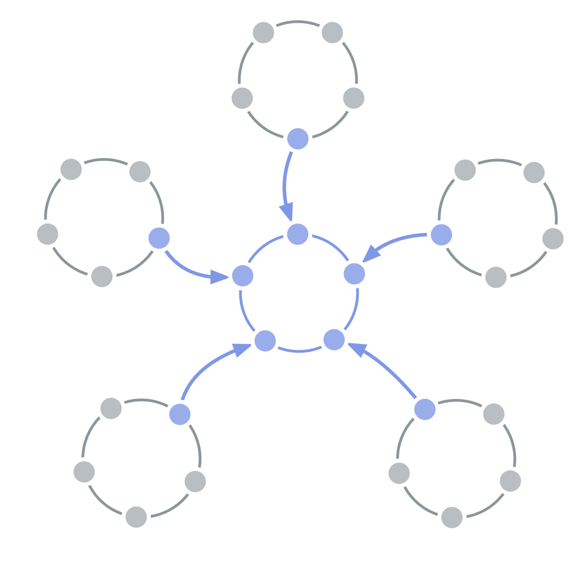

Las decisiones de gobernanza tomadas en un círculo de delegados son ejecutadas en los diversos <a href="glossary.html#entry-domain" class="glossary-tooltip" data-toggle="tooltip" title="Dominio: Un área específica de influencia, actividad y toma de decisiones dentro de una organización.">dominios</a> a los que sirve.

Los círculos de delegados proporcionan una forma de dirigir organizaciones alineada con el <a href="glossary.html#entry-flow-of-value" class="glossary-tooltip" data-toggle="tooltip" title="Flujo de Valor: Entregables viajando a través de una organización hacia clientes u otras partes interesadas.">flujo de valor</a>, y aportan una diversidad de perspectivas a la toma de decisiones sobre gobernanza.

Un círculo de delegados puede introducir a otras personas (por ejemplo, expertos externos) para ayudar con decisiones específicas, o incluso para ser miembros del círculo.

#### Círculo de servicio

Externaliza servicios requeridos por dos o más dominios.

Un círculo de servicio puede estar constituido por miembros de los <a href="glossary.html#entry-domain" class="glossary-tooltip" data-toggle="tooltip" title="Dominio: Un área específica de influencia, actividad y toma de decisiones dentro de una organización.">dominios</a> a los que sirve, y/o también por otras personas.

#### Organización Peach

Entrega valor en entornos complejos y competitivos a través de la <em>descentralización</em> (de recursos e influencia) e <em>interacción directa</em> entre aquellos que crean valor y los clientes a los que sirven.

Los equipos en la periferia:

- entregan valor en intercambio directo con el mundo exterior (clientes, socios, comunidades, municipios, etc.)
- administran los recursos monetarios y dirigen la organización

El centro proporciona servicios internos para apoyar a la organización.

Los <a href="glossary.html#entry-domain" class="glossary-tooltip" data-toggle="tooltip" title="Dominio: Un área específica de influencia, actividad y toma de decisiones dentro de una organización.">dominios</a> están enlazados del modo necesario para que la información y la influencia puedan fluir, y para apoyar la colaboración alrededor de las dependencias.

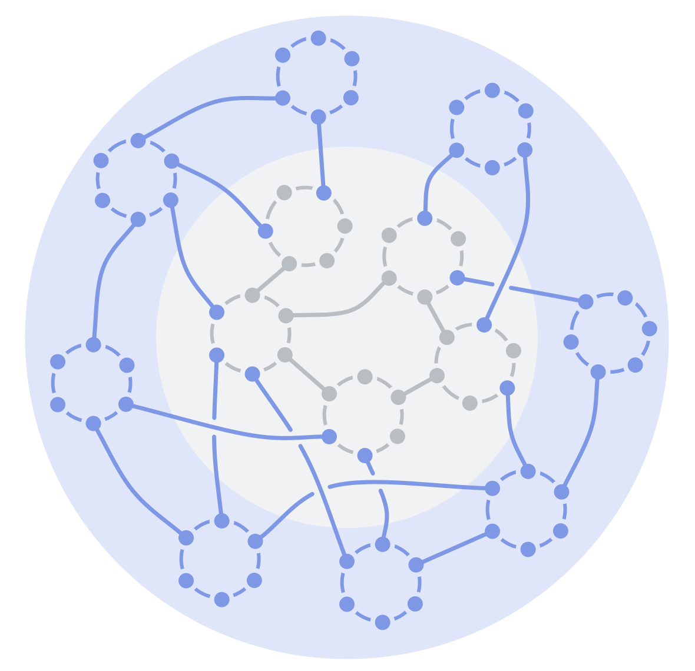

#### Jerarquía de doble enlace

Delegar toda la autoridad para tomar decisiones de gobiernanza a los círculos de autogobierno, con doble enlace en todos los niveles de la jerarquía, para transitar de una jerarquía tradicional a una estructura más adecuada para aprovechar la inteligencia colectiva, garantizando la equivalencia y participación en la construcción.

1. Pasar la toma de decisiones sobre gobernanza de individuos a equipos mediante la formación de   en todos los niveles de tu organización.
2. Los miembros de cada círculo seleccionan a uno de sus grupos para representar sus intereses y participar en la toma de decisiones de <a href="glossary.html#entry-governance" class="glossary-tooltip" data-toggle="tooltip" title="Gobernanza: El proceso de establecer objetivos y tomar y evolucionar decisiones que orientan a las personas hacia la consecución de dichos objetivos.">gobernanza</a> del siguiente círculo superior, y viceversa.

Una jerarquía de doble enlace:

- aporta equivalencia a la gobernanza
- mantiene el potencial de una jerarquía funcional (si permite el flujo de valor).

**Ver también:** _Círculo_, _Doble Enlace_, _Representante_

#### Organización de servicios

La colaboración  y alineamiento de múltiples partes interesadas por un driver (u objetivo) compartido,

- aumenta el potencial de equivalencia entre varias entidades
- mejora el alineamiento de distintos departamentos/organizaciones
- apoya la colaboración de varias agencias, entre departamentos u organizaciones con diferentes motivos principales, o que están en conflicto
- es apropiada para proyectos puntuales, o para la colaboración continua

**Nota:** una organización de servicios a veces es conocida como una **organización columna**.

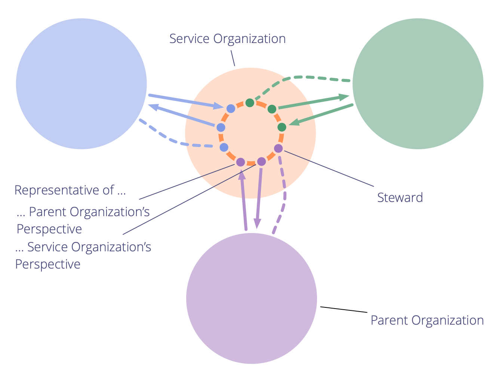

#### Organización Fractal

Múltiples constituyentes (organizaciones o proyectos) con el mismo (o similar) driver primario y estructura pueden compartir el aprendizaje a través de dominios funcionales, alinear la acción y tomar decisiones de gobernanza de alto nivel (p. ej., estrategia general).

Crear una organización fractal puede permitir que una red grande responda rápidamente a contextos cambiantes.

Si es necesario, el patrón se puede repetir para conectar múltiples organizaciones fractales en una.

##### Requisitos

Una organización fractal puede ser formada por múltiples organizaciones in(ter)dependientes que comparten el mismo <a href="glossary.html#entry-driver" class="glossary-tooltip" data-toggle="tooltip" title="Driver: El motivo de una persona o de un grupo para responder a una situación específica.">driver</a> (primario), o por múltiples sucursales, departamentos o proyectos dentro de una organización más grande.

Estos <a href="glossary.html#entry-constituent" class="glossary-tooltip" data-toggle="tooltip" title="Constituyente: Un equipo (p. ej. un círculo, grupo, departamento, sucursal, proyecto u organización) que delega autoridad a un representante para que actúe en su nombre en otro equipo u organizaciones.">constituyentes</a> (es decir, organizaciones, sucursales, departamentos o proyectos) deben compartir al menos algunos — y normalmente la mayoría — de los dominios <a href="glossary.html#entry-domain" class="glossary-tooltip" data-toggle="tooltip" title="Dominio: Un área específica de influencia, actividad y toma de decisiones dentro de una organización.">funcionales</a> (por ejemplo, contabilidad, gestión de productos o desarrollo).

##### Niveles

Una organización fractal tiene al menos tres niveles:

- primer nivel: los **constituyentes** (es decir, organizaciones, sucursales, departamentos o proyectos)
- segundo nivel: **específico de la función _círculos de delegados_** para compartir aprendizajes y hacer y evolucionar acuerdos en nombre de dominios específicos de la función
- tercer nivel: un **círculo interfuncional de delegados** para hacer y evolucionar acuerdos en respuesta a los drivers que afectan al conjunto general de constituyentes

##### Formando una organización fractal

1. Formando el **segundo nivel:** en cada constituyente, los miembros de cada dominio funcional común (y significativo) deciden quién de ellos los representará en un **círculo de delegados de función específica**, donde comparten conocimiento y aprendizajes, y contribuyen a la creación y evolución de acuerdos. Los representantes son seleccionados por un plazo limitado (después de lo cual se hace una nueva selección).
2. Formando el **tercer nivel:** cada círculo de delegados del segundo nivel selecciona un delegado para formar el **círculo delegado interfuncional**.

##### Impacto en la(s) organización(es)

Cada constituyente:

- obtiene acceso a una amplia gama de experiencias, sabiduría y habilidades para aumentar la eficacia y la innovación.
- puede compartir recursos, infraestructura y experiencia con otros constituyentes en función de su capacidad y necesidad

El segundo y tercer nivel:

- puede poner a prueba decisiones simultáneamente a través de múltiples instancias de un dominio de función específica, proporcionando muchos comentarios y aprendizaje rápido
- organizar, alinear y mover todo el sistema preservando la autonomía y la agencia de cada uno de los constituyentes individuales

## Un marco de sentido común para organizaciones y equipos

Estamos observando un sentido común emergente que está transformando organizaciones en todo el mundo, inspirando y permitiendo a la gente construir organizaciones de éxito donde TANTO la gente COMO la organización crecen y se desarrollan.

Hemos destilado la esencia de este _sentido común_ en un marco conciso para equipos y organizaciones: El **Marco de Sentido Común (MSC)** es una herramienta para la creación de sentido, diseñada para ayudar a las personas a abordar los retos y oportunidades a los que se enfrentan. Ayuda en la construcción de una comprensión compartida del panorama general, identificando y priorizando áreas de necesidad dentro de un equipo y a través de una organización, y entendiendo en qué enfocarse a continuación.

Hemos mapeado los 10 principios que componen el marco de los patrones de S3, para que puedas utilizar el MSC como guía para identificar los patrones que ayudan a satisfacer tus necesidades específicas.

El MSC se puede aplicar en el contexto del desarrollo de equipos individuales y de la organización en su conjunto. 

### Una organización donde TANTO las personas COMO la organización puedan tener éxito

**Ver el panorama general – identificar lo que se necesita – priorizar por dónde empezar.**

La gente se enfrenta a muchos desafíos y oportunidades en las organizaciones y reconoce el potencial para mejorar el estado actual de las cosas, sin embargo, no están seguros o son incapaces de ponerse de acuerdo sobre cómo y dónde empezar y qué hacer para avanzar.

Necesitan una forma sencilla de generar un entendimiento compartido sobre lo que está sucediendo en su organización, y lo que debe ser hecho, para que puedan responder de forma efectiva y sostenible a los impedimentos y oportunidades a los que se enfrentan.

El **Marco de Sentido Común** (MSC) presenta el panorama general de lo que debe ser tenido en cuenta para producir y mantener organizaciones donde TANTO las personas COMO la organización pueden prosperar y progresar, y sugiere prácticas y herramientas específicas que pueden ayudarte a llegar allí.

**A través de 10 principios esenciales** que se aplican tanto a equipos individuales, como a la organización en su conjunto, evoluciona organizaciones que están o son:

-   **enfocadas en el valor** – los esfuerzos de la gente están dirigidos a crear valor para la organización, sus miembros, clientes y otras partes interesadas.
-   **productivas** - la organización es eficiente en la identificación, desarrollo y entrega de los productos y servicios necesarios para lograr su propósito.
-   **adaptativas** – las personas son capaces de identificar y responder efectivamente a las necesidades organizativas y contextos cambiantes (tanto a corto como a largo plazo).
-   **resilientes** – la organización y sus miembros son capaces de soportar la adversidad y la incertidumbre, si es necesario.
-   **recíprocas** – la organización y sus miembros comparten una relación de reciprocidad mutua donde la organización está comprometida con el desarrollo, bienestar y éxito de sus miembros, y viceversa.

### Diez principios para equipos y organizaciones en evolución

**Principio 1 – Clarificar el propósito:** _Asegúrate de que todos entiendan a quién está sirviendo la organización o equipo, por qué y con qué fin, para que todo el mundo pueda enfocarse y unir sus esfuerzos para lograr ese propósito._

**Principio 2 – Desarrollar la estrategia:** _Desarrolla una estrategia para guiar la creación de valor, para que todos compartan una dirección común, y la estrategia se adapte según sea necesario para lograr el propósito._

**Principio 3 – Foco en el valor:** _Enfoca tu trabajo diario en la aportación de valor, a fin de que se hagan las cosas que deben ser hechas para lograr tu propósito._

**Principio 4 – Siente y responde:** _Identifica, prioriza y responde a impedimentos y oportunidades, para poderte adaptar o cambiar de dirección cuando sea necesario y mejorar donde puedas hacerlo._

**Principio 5 – Realiza experimentos:** _Realiza experimentos para abordar desafíos complejos, a fin de aprender como dar pasos hacia donde quieres estar._

**Principio 6 – Habilita la autonomía:** _Libera a los individuos y equipos para crear valor de la manera más autónoma posible, para que así puedas aportar valor rápidamente y evitar dependencias innecesarias._

**Principio 7 – Colabora en dependencias:** _Cocrea y evoluciona un sistema coherente para abordar todas las dependencias, para así entregar valor rápidamente cuando las dependencias no se pueden evitar._

**Principio 8 – Invertir en aprendizaje:** _Apoya a todos en el desarrollo de sus competencias y habilidades, para que su contribución continúe siendo valiosa y la organización pueda evolucionar._

**Principio 9 – Desarrollar intencionadamente la cultura** _Colabora en el fomento de una cultura cooperativa en la que todos puedan alcanzar su máximo potencial, para crear y mantener un ambiente de trabajo motivador y productivo._

**Principio 10 – Crear modelos mentales compartidos:** _Invierte en la creación de modelos mentales compartidos, para que todos puedan participar en un diálogo significativo sobre lo que está sucediendo y lo que debe hacerse, y en el proceso profundizar su comprensión sobre cómo funciona la organización, qué hace y por qué._

### Dos principios para la orientación

#### Principio 1 – Clarificar el propósito

**_Asegúrate de que todos entiendan a quién está sirviendo la organización o equipo, por qué y con qué fin, para que todos puedan enfocarse y unir sus esfuerzos para lograr ese propósito._**

Patrones esenciales para ayudarte a conseguirlo:

-   _Describir drivers organizacionales_ - Entender el motivo para actuar en respuesta a una situación específica es un componente esencial para entender, definir y comunicar el propósito de una organización, un equipo o departamento.

#### Principio 2 – Desarrollar la estrategia

**_Desarrolla una estrategia para guiar la creación de valor, para que todos compartan una dirección común, y la estrategia se adapte según sea necesario para lograr el propósito._**

Patrones esenciales para ayudarte a conseguirlo:

-   _Clarificar y desarrollar dominios_ – Un área de influencia, actividad y toma de decisiones claramente definidas es un requisito previo para definir una estrategia efectiva para una organización, un equipo o un rol.
-   _Clarificar el resultado pretendido_ - Definir el resultado pretendido de una estrategia es un componente esencial para monitorear y evaluar su efectividad, y adaptar cosas cuando sea necesario.
-   _Describir drivers organizacionales_ - Entender el motivo para actuar en respuesta a una situación específica es un componente esencial para diseñar una estrategia efectiva para responder a ella.
-   _Clarificar y desarrollar la estrategia_ – La colaboración de las partes interesadas en la creación y evolución de la estrategia para una organización, equipo o rol, ayuda a apoyar la creación de una estrategia relevante y eficaz.
-   _Evaluar y evolucionar acuerdos_ - Ir revisando la estrategia y hacerla evolucionar con el tiempo cuando sea necesario asegura que siga siendo útil y relevante para la organización, equipo o rol.
-   _Criterio de evaluación_ – Es necesario definir criterios de éxito o fracaso para averiguar si la estrategia es efectiva o no.

### Tres principios para la navegación

#### Principio 3 – Foco en el valor

**_Enfoca tu trabajo diario en la aportación de valor, a fin de que se hagan las cosas que deben ser hechas para lograr tu propósito._**

Patrones esenciales para ayudarte a conseguirlo:

-   _Clarificar y desarrollar dominios_  – Clarificar el área de influencia, actividad y toma de decisión del que es responsable un equipo o persona en un rol, les permite comprender el valor que se espera que entreguen.
-   _Responder a los drivers organizacionales_ –Comprender a qué es necesario responder y por qué, y garantizar que se lidia con esos temas, maximiza el potencial de la creación de valor.
-   _Priorizar la agenda de pendientes_ –  Cuando priorizas tu lista de elementos de trabajo por su valor, se vuelve obvio cuáles necesitan ser trabajados primero.
-   _Limitar los trabajos en marcha_ –  Limitar el número de elementos de trabajo concurrentes para personas y equipos, ayuda a mantener un flujo constante de valor y fomenta la colaboración cuando el trabajo está bloqueado.
-   _Reuniones diarias_ – Una reunión diaria proporciona el espacio para que un equipo organice cómo crearán valor durante el resto del día.
-   _Examinar los argumentos para ver si califican como objeciones_ – Cuando examinas cada argumento presentado contra una decisión para determinar si revela o no mejoras valiosas o consecuencias no deseadas, mantienes tu trabajo enfocado en el valor y evitas ser descarrilado por opiniones sin fundamento o preferencias personales.

#### Principio 4 – Siente y responde

**_Identifica, prioriza y responde a impedimentos y oportunidades, para poderte adaptar o cambiar de dirección cuando sea necesario y mejorar donde puedas hacerlo._**

Patrones esenciales para ayudarte a conseguirlo:

-   _Mejora continua del proceso de trabajo_ – Adquirir la costumbre de buscar continuamente mejorar el proceso de trabajo apoya la capacidad de las personas de identificar y aprovechar oportunidades de mejora.
-   _Describir drivers organizacionales_ – Antes de responder a la percepción de un impedimento u oportunidad, es esencial entender la situación actual y por qué tiene sentido que la organización responda
-   _Agenda de pendientes de gobernanza_ – Mantener una lista priorizada de todos los impedimentos y oportunidades que requieren que se tome una decisión de gobernanza, mantiene visibles los asuntos desatacados y clarifica a qué es lo más importante responder primero.
-   _Navegar a través de la tensión_ – Cuando todos los miembros de la organización prestan atención a situaciones que parecen diferentes a lo que se esperaba o deseaba, y llevan esa información a la atención de los responsables, se maximiza el potencial de la organización para identificar impedimentos y oportunidades.
-   _Responder al driver organizacional_ – Responder solo a desafíos y oportunidades que son valiosos para la organización, maximiza la rentabilidad de la inversión de tiempo limitado, energía y recursos.

#### Principio 5 – Realizar Experimentos

**_Realiza experimentos para abordar desafíos complejos, para así aprender cómo acercarte a donde quieres estar._**

Patrones esenciales para ayudarte a conseguirlo:

-   _Describe drivers organizacionales_ – Crear un modelo mental compartido de lo que quieres abordar, es fundamental para diseñar, ejecutar y más adelante, evaluar experimentos.
-   _Clarifica el resultado pretendido_ – Una descripción clara del resultado pretendido de un experimento es esencial para entender si un experimento produjo o no el resultado pretendido.
-   _Criterio de evaluación_ – La definición de criterios claros para determinar el éxito antes del comienzo de un experimento ayuda a revelar defectos en su diseño y a realizar una evaluación efectiva de los resultados.
-   _Toma de decisiones por consentimiento_ – Un proceso de grupo efectivo para ver una propuesta desde una diversidad de perspectivas y probar si un experimento es o no lo suficientemente bueno y seguro como para ser ejecutado.
-   _Evaluar y evolucionar acuerdos_ – Es necesario revisar regularmente un experimento para determinar qué resultados alcanza, y como consecuencia, para potencialmente adaptarlo o incluso detenerlo.
-   _Límite de trabajos en marcha_ – Limita el número de experimentos simultáneos para evitar ser sobrepasada y mantén un flujo constante de valor.
-   _Crear un sistema "pull" para el cambio organizacional_ – Invitar y permitir que la gente realice experimentos cuando descubre necesidades organizacionales permite una adaptación efectiva y descentralizada de la organización. 

### Dos principios para la estructura

#### Principio 6 – Habilitar la autonomía

**_Libera a los individuos y equipos a crear valor de la manera más autónoma posible, para que así puedas entregar valor rápidamente y evitar dependencias innecesarias._**

Patrones esenciales para ayudarte a conseguirlo:

-   _Clarificar y desarrollar dominios_ – Cuando la gente entiende sus propias áreas de responsabilidad y también las de otros, saben que se espera de ellos y en qué aspectos son dependientes de otros.
-   _Sistema "pull" para el trabajo_ – Que la gente pueda tomar nuevos elementos de trabajo cuando tiene capacidad, elimina la sobrecarga y mejora la productividad.
-   _Delegar influencia_ – Delegar trabajo, junto con autoridad para tomar decisiones relacionadas con ese trabajo, libera a la gente para crear valor y elimina dependencias innecesarias.
-   _Rol_ – Delegar autonomía a un individuo para decidir y actuar dentro de límites claramente definidos, libera a los individuos para crear valor y permite a quienes delegan conservar tanta influencia como sea necesaria.
-   _Círculo_ – Delegar autonomía a un equipo para organizarse y gobernarse a sí mismo dentro de límites claramente definidos, libera al equipo para crear valor y permite a aquellos que delegan esa autoridad conservar tanta influencia como sea necesario.
-   _Clarificar y desarrollar la estrategia_ – Una estrategia para crear valor, desarrollada por el individuo o equipo y acordado por todas las partes interesadas pertinentes, crea confianza y favorece la autonomía.
-   _Plan de desarrollo_; Colaborar con las partes interesadas pertinentes en el desarrollo de un plan sobre cómo mejorar, ayuda a un equipo o individuo en un rol a desarrollar su habilidad y competencia, y genera confianza entre todos los involucrados.
-   _Alinear el flujo_ – Acercar la toma de decisiones a donde se crea valor, conservando la influencia de las partes interesadas pertinentes, apoya el flujo de valor y elimina las dependencias y demoras innecesarias.

#### Principio 7 – Colaboración en dependencias

**_Cocrea y evoluciona un sistema coherente para lidiar con todas las dependencias, para poder así aportar valor rápidamente cuando las dependencias no se pueden evitar._**

Patrones esenciales para ayudarte a conseguirlo:

-   _Navegar a través de las tensiones_ – Todos los miembros de la organización prestando atención a las dependencias maximiza el potencial de que se identifiquen y respondan las dependencias no gestionadas.
-   _Clarificar y desarrollar dominios_ – Cuando la gente entiende sus propias áreas de responsabilidad y también las de otros,  entienden también dónde será necesaria la colaboración en las dependencias.
-   _Visualizar el trabajo_ – Visualizar los elementos de trabajo y las dependencias entre ellos, facilita la gestión de las dependencias en cooperación con las partes interesadas pertinentes.
-   _Respondes a drivers organizacionales_ Entendiendo por qué existe ya de entrada una dependencia, y asegurar que se lidie con ella, es esencial para colaborar en la gestión o resolución de dependencias.
-   _Involucrar a los afectados_ – Para abordar las dependencias de una manera eficaz, a menudo ayuda reunir las perspectivas de todas las partes interesadas (pertinentes) e implicarlas en el proceso de toma de decisiones.
-   _Vinculación_ – Las dependencias entre dos equipos a menudo pueden ser abordadas de forma efectiva enviando un _representante_ a la toma de decisiones del otro equipo. para asegurar que se tengan en cuenta todas las perspectivas relevantes y que se comparta la responsabilidad de las decisiones.
-   _Círculo delegado_ – Delegando el poder de establecer y evolucionar acuerdos sobre cómo lidiar con dependencias específicas entre equipos, a un círculo de representantes, reúne las perspectivas relevantes y genera sentido de pertenencia entre las partes interesadas.
-   _Alinear el flujo_ – Acercar la toma de decisiones a donde se crea el valor, reúne a las personas necesarias para tomar decisiones en respuesta a dependencias específicas y elimina cuellos de botella innecesarios en la toma de decisiones.
-   _Crear un sistema "pull" para el cambio organizacional_ – Invitar y permitir a la gente hacer cambios en la estructura organizacional, cuando hacerlo proporciona una forma eficaz de tratar las dependencias de las que comparten responsabilidad, facilita la evolución continua de una organización coherente y eficaz.

### Tres principios para la transformación

#### Principio 8 – Invertir en aprendizaje

**_Apoya a todos en el desarrollo de sus competencias y habilidades, para que su contribución continúe siendo valiosa y la organización pueda evolucionar._**

Patrones esenciales para ayudarte a conseguirlo:

-   _Navegar a través de la tensión_ – Que todos los miembros de la organización estén atentos a situaciones en las que una mayor competencia y habilidad puedan ser valiosas, enfoca el esfuerzo de aprendizaje y facilita la mejora continua.
-   _Evaluar las reuniones_ – Una breve evaluación al final de cada reunión o taller ayuda a las personas a identificar sus fortalezas, áreas de crecimiento y formas de mejorar su contribución en el futuro.
-   _Revisión de iguales_ – Un equipo o persona en un rol invitando regularmente a las partes interesadas pertinentes para una revisión de su efectividad, ayuda en la identificación de sus fortalezas, las áreas de crecimiento y las formas en que pueden mejorar su contribución en el futuro.
-   _Plan de Desarrollo_ – Colaborar con las partes interesadas pertinentes en un plan sobre la manera de desarrollar las habilidades y competencias necesarias, es una forma eficaz de enfocar los esfuerzos de aprendizaje de una persona en un rol, o para un equipo.
-   _Retroalimentación de iguales_ – Invitar a la retroalimentación de iguales, ayuda a las personas en la comprensión de sus fortalezas y áreas de crecimiento, para que puedan invertir en aprendizajes que puedan ser útiles.

#### Principio 9 – Desarrollar intencionadamente la cultura

**_Colabore en el fomento de una cultura cooperativa en la que todos puedan alcanzar su máximo potencial, para crear y mantener un ambiente de trabajo motivador y productivo._**

Patrones esenciales para ayudarte a conseguirlo:

-   _Participación creativa_ – Introducir el concepto de Participación creativa, invita a las personas a prestar atención consciente a cómo están contribuyendo y a hacer cambios cuando perciban que su enfoque actual puede mejorarse.
-   _Adoptar los siete principios_ – Los siete principios proporcionan pautas de comportamiento que permiten una cultura productiva, motivadora y cooperativa.
-   _Acuerdo sobre valores_ – Llegar a un acuerdo sobre pautas fundamentales para el comportamiento en la organización, definir parámetros éticos para la acción y facilitar la coherencia.
-   _Evaluar y evolucionar acuerdos_ – Realizar con regularidad una revisión y evolución intencionada de los acuerdos relacionados con la cultura, ayuda a mantenerlos vivos en la conciencia de las personas e identifica cuándo y cómo pueden ser mejorados.
-   _Contrato para la colaboración exitosa_ – Cocrear desde el comienzo acuerdos mutuamente beneficiosos para la colaboración, apoya el establecimiento y mantenimiento de un entorno de trabajo motivador y productivo y una cultura de confianza entre las partes interesadas.
-   _Crear un sistema "pull" para el cambio organizacional_ – Distribuir la responsabilidad del desarrollo de la cultura a todas las personas, invita a la proactividad a la hora de abordar los retos y oportunidades tal y como van surgiendo.

#### Principio 10 – Crear modelos mentales compartidos

**_Invertir en la creación de modelos mentales compartidos, para que todos puedan participar en un diálogo significativo sobre lo que está sucediendo y lo que debe hacerse, y en el proceso profundizar su entendimiento sobre cómo funciona la organización, qué hace y por qué._**

Patrones esenciales para ayudarte a conseguirlo:

-   _Navegar a través de la tensión_ – Estar atentos y hacer frente a situaciones que podrían beneficiarse de crear o afinar un modelo mental compartido, ayuda a las personas a ponerse en sintonía y fomenta el diálogo productivo.
-   _Clarifica y desarrolla dominios_ – Clarificar y documentar de forma explícita las áreas de responsabilidad asegura un modelo mental compartido con respecto a las expectativas y responsabilidades.
-   _Clarifica el resultado pretendido_ – Al ponerse primero de acuerdo sobre el resultado pretendido de una actividad, proyecto o acuerdo propuesto. la gente desarrolla una comprensión compartida de hacia dónde deberían estar yendo las cosas y luego puede participar en un diálogo productivo sobre cómo llegar allí.

### ¿Por dónde empezar?

Cada principio apoya un resultado específico. Para determinar por dónde empezar en tu organización o equipo, **examina los resultados de cada principio** (el texto posterior a “_para que_”) y reflexiona sobre dónde se encuentra tu mayor necesidad en este momento. En cualquier caso, **asegúrate de que tienes suficientemente claro el propósito y la estrategia de tu organización o equipo antes de proceder**.

En la siguiente ilustración puedes ver que algunos de los principios están más estrechamente relacionados entre sí que otros, lo que puede proporcionarte información sobre por dónde empezar.

Para cada principio hemos incluido una lista de sugerencias de cosas que puedes probar. Estas sugerencias están tomadas del  [menú de patrones contenidos en Sociocracia 3.0](http://patterns.sociocracy30.org). Por ahora solo hemos añadido los patrones más esenciales que apoyan cada principio, en versiones futuras de este marco incluiremos aún más patrones. 

## Apéndice

### 

#### Changes 2022-04-26

- added detailed description and new illustrations to _Test Arguments Qualify as Objections_ 

#### Changes 2022-04-05

- added detailed description and new illustrations to _Resolve Objections_ 

#### Changes 2022-02-04

- added detailed description of the _Consent Decision-Making_ process
- revised text of _Reasoned Decision-Making_
- updated 20 illustration to align with style of new illustration for Consent Decision-Making 

#### Changes 2022-01-27

- added _Reasoned Decision-Making_
- updated pattern categories: 
    - new category *Evolving Organizations*
    - renamed *Co-Creation and Evolution* to *Sense-Making and Decision-Making*
    - renamed *Focused Interactions* to *Meeting Formats*
    - renamed *Enablers of Collaboration* to *Enablers of Co-Creation*
    - and moved some patterns around
- Aligned spelling of decision-making throughout the guide
- revised summary of _Resolve Objections_
- revised text of _Driver Mapping_ (step 7)

#### Changes 2021-09-22

- fixed a link on the pattern map and added links to the principles
- fixed some typos, minor revisions to the text 

#### Changes 2021-09-03

- revised text about _Objections_ as well as the definitions of <a href="glossary.html#entry-objection" class="glossary-tooltip" data-toggle="tooltip" title="Objeción: Un argumento, relacionado con una propuesta, acuerdo, actividad o el estado actual de las cosas, que revela consecuencias o riesgos que preferirías evitar, o muestra maneras valiosas de mejorar.">Objection</a> and <a href="glossary.html#entry-concern" class="glossary-tooltip" data-toggle="tooltip" title="Preocupación: Una suposición que no puede (al menos por ahora) ser respaldada por el razonamiento o la evidencia suficiente para demostrar su relevancia o validez a quienes la están considerando.">Concern</a>

#### Changes 2021-08-15

- renamed *Open Domain* to _Open Team_

#### Changes 2021-06-18

- added a dedicated chapter for each of the Seven Principles
- revised the ten principles of the Common Sense Framework
- updated section about governance in the introduction 
    - added more text to explain how governance can be distributed throughout the organization
    - more examples for governance decisions
- corrected a few typos
- several small revisions

#### Changes 2021-05-15

- _Navigate via Tension_: added more explanation about passing on drivers to another domain
- _Clarify and Develop Domains_: more explanation about refining the elements of a domain description, more information about metrics, monitoring and evaluation, added template illustration, 

#### Changes 2021-03-15

- updated the Seven Principles

#### Changes 2021-02-19

- fixed several broken links on the online version
- corrected a few typos

#### Changes 2021-02-11

- _Driver Mapping_: added explanation about applications of the pattern, and detailed instructions for each step of the format

#### Changes 2021-02-06

- Revised glossary definitions for <a href="glossary.html#entry-semi-autonomy" class="glossary-tooltip" data-toggle="tooltip" title="Semiautonomía: La autonomía de las personas para decidir por sí mismas cómo crear valor, dentro de las limitaciones de su dominio, y por objeciones presentadas por el delegado, los representantes u otros.">Semi-Autonomy</a>, <a href="glossary.html#entry-self-organization" class="glossary-tooltip" data-toggle="tooltip" title="Auto-Organización: Cualquier actividad o proceso mediante el cual las personas organizan el trabajo. La auto-organización ocurre dentro de las limitaciones de un dominio, pero sin la influencia directa de los agentes externos. En cualquier organización o equipo, la auto-organización coexiste con influencia externa (por ejemplo, objeciones externas o decisiones de gobernanza que afectan al dominio).">Self-Organization</a> and <a href="glossary.html#entry-sociocracy" class="glossary-tooltip" data-toggle="tooltip" title="Sociocracia: Un enfoque para organizar juntos donde las personas afectadas por las decisiones pueden influir en las mismas a partir de la base de razones para hacerlo.">Sociocracy</a>
- Renamed Pattern: *Those Affected Decide* to *Involve Those Affected*
- Several small corrections and revisions

#### Changes 2021-02-03

- Added the **_Common Sense Framework_** to the Practical Guide
- A new structure of the Practical Guide that makes that the relevant parts easier to find: 
    - __
    - __
    - __
    - __
    - __
    - __
- Redesigned the website for better usability: 
    - A new responsive menu that provides direct access to all patterns and other sections of the guide
    - A new homepage that explains what is where
    - A new layout for a cleaner experience on desktop and mobile devices

#### Changes 2021-01-12

- **Renamed Patterns:** 
    - renamed *Clarify Domains* to *Clarify and Develop Domains*
    - renamed *Develop Strategy* to *Clarify and Develop Strategy*
- _Clarify and Develop Domains_: revised text, added more details and explanations about domain descriptions
- _Peer Review_: added more details about what should be reviewed
- _Peer Feedback_: revised the text and added more details
- _Breaking Agreements_: added summary
- added glossary entry for "metric"
- revised glossary entry for "governance"
- _Describe Organizational Drivers_: revised text
- Introduction: 
    - added more details to the section about Domains and delegation
    - removed illustration in the section about patterns and listed the pattern groups in the text 
- Appendix: 
    - added a disclaimer 
    - added more information about the authors

#### Changes 2020-05-08

- revised all illustrations for a more consistent style and increased readability
- revised introduction: more explanation about patterns and core concepts
- updated glossary: revised explanation of <a href="glossary.html#entry-delegator" class="glossary-tooltip" data-toggle="tooltip" title="Persona delegadora: Un individuo o grupo que delega la responsabilidad de un dominio a otro(s).">Delegator</a>, <a href="glossary.html#entry-delegatee" class="glossary-tooltip" data-toggle="tooltip" title="Persona(s) delegada(s): Un individuo o grupo que acepta la responsabilidad de un dominio que le ha sido delegado, convirtiéndose en un guardián de rol o un equipo.">Delegatee</a>, <a href="glossary.html#entry-role" class="glossary-tooltip" data-toggle="tooltip" title="Rol: Un dominio que se delega a un individuo, quien luego se convierte en el encargado de roles.">Role</a> and <a href="glossary.html#entry-pattern" class="glossary-tooltip" data-toggle="tooltip" title="Patrón: Un proceso, práctica o pauta que sirve como una plantilla para responder con éxito a un tipo específico de desafío u oportunidad.">Pattern</a>, added <a href="glossary.html#entry-role-keeper" class="glossary-tooltip" data-toggle="tooltip" title="Encargado de Roles: Un individuo que asume la responsabilidad de un rol.">Role Keeper</a>

#### Changes 2020-04-29

- Introduction: Added *Objection* and *Agreement* to concepts
- renamed pattern *Objection* to _Test Arguments Qualify as Objections_
- renamed pattern *Agreement* to _Record Agreements_
- _Test Arguments Qualify as Objections_: revised text and updated illustration
- _Record Agreements_: revised text, added more details of agreements that might be recorded, updated illustration

#### Changes 2019-12-22

- added new introduction text
- added "social technology" to glossary
- website now has separate pages for "Introduction" and "Concepts and Principles"
- ePub now looks much better

#### Changes 2019-11-29

- Principle of Transparency: revised description to clarify that valuable information needs to be recorded, and then shared with everyone in the organization
- Principle of Empiricism: clarified that only those assumptions one relies on need to be tested

#### Changes 2019-06-27

- *Objection*: further refined definition of objection, and updated the glossary term for <a href="glossary.html#entry-objection" class="glossary-tooltip" data-toggle="tooltip" title="Objeción: Un argumento, relacionado con una propuesta, acuerdo, actividad o el estado actual de las cosas, que revela consecuencias o riesgos que preferirías evitar, o muestra maneras valiosas de mejorar.">objection</a> accordingly
- replaced "action" with activity in a few places where it made more sense
- fixed a few typos

#### Changes 2019-05-03

- refined glossary terms for <a href="glossary.html#entry-agreement" class="glossary-tooltip" data-toggle="tooltip" title="Acuerdo: Una pauta, proceso, protocolo o política que ha sido acordado y se ha diseñado para guiar el flujo de valor.">agreement</a>,  and , added glossary term for <a href="glossary.html#entry-objective" class="glossary-tooltip" data-toggle="tooltip" title="Objetivo: Un resultado (específico) que una persona o equipo u organización quiere alcanzar; un objetivo o una meta.">objective</a>
- Principle of Accountability: clarified individual accountability for work as well as for collaboration
- _Contract For Successful Collaboration_: revised text
- _Describe Deliverables_: added User Stories as an example for describing deliverables
- _Double-Linked Hierarchy_: revised summary
- _Delegate Circle_: refined summary
- *Objection*: refined definition of objection and concern, added illustration for a process to qualify an objection
- _Proposal Forming_: added missing process illustration
- _Role Selection_: small amendment to illustration
- _Transparent Salary_: explained what a salary formula is

#### Changes 2019-03-08

****

- expanded the introduction with more information about S3 and the history of sociocracy that was previously only available on the main S3 website
- updated section about governance in the introduction
- added captions to all illustrations
- renamed pattern group "Enablers of Co-Creation" to "Enablers of Collaboration"
- removed slide deck version and improved layout and formatting of pdf and ePub version
- website version: added clickable pattern map for simpler navigation, added glossary overlays to many patterns

****

- added  to glossary (and replaced group with team throughout the practical guide where applicable)
- updated definition for <a href="glossary.html#entry-deliverable" class="glossary-tooltip" data-toggle="tooltip" title="Entregable: Un producto, servicio, componente o material proporcionado en respuesta a un conductor organizacional.">deliverable</a>
- removed **driver statement** from text and glossary
- updated definitions for <a href="glossary.html#entry-governance" class="glossary-tooltip" data-toggle="tooltip" title="Gobernanza: El proceso de establecer objetivos y tomar y evolucionar decisiones que orientan a las personas hacia la consecución de dichos objetivos.">governance</a>, <a href="glossary.html#entry-operations" class="glossary-tooltip" data-toggle="tooltip" title="Operaciones: Hacer el trabajo y organizar actividades diarias dentro de las limitaciones definidas a través de la gobernanza.">operations</a>, and <a href="glossary.html#entry-self-organization" class="glossary-tooltip" data-toggle="tooltip" title="Auto-Organización: Cualquier actividad o proceso mediante el cual las personas organizan el trabajo. La auto-organización ocurre dentro de las limitaciones de un dominio, pero sin la influencia directa de los agentes externos. En cualquier organización o equipo, la auto-organización coexiste con influencia externa (por ejemplo, objeciones externas o decisiones de gobernanza que afectan al dominio).">self-organization</a>

**Illustrations:**

- updated templates for domain description and role description
- updated illustrations for _Linking_ and _Double-Linking_

**Changes to Patterns:**

- _Agreement_: description now mentions that any expectations should be recorded
- _Describe Deliverables_: updated summary
- _Describe Organizational Drivers_: more information on summarizing drivers
- _Resolve Objections_: added summary and description

#### Changes 2018-08-17

****

- added and revised the brief summary for many of the patterns
- removed bullet points in favor of full sentences in many patterns
- lots of small improvements to grammar and language
- included the URL to the web version of the practical guide

****

- **updated:** account for (v.), concern, deliverable, governance, objection, operations, primary driver, principle, role, self-organization, semi-autonomy, subdriver, values
- **added:** constituent, coordination, delegation, driver statement, evolve (v.), flow of value, helping team and open domain
- **removed:** peer driver

**Changes to Introduction**

- added the driver for creating Sociocracy 3.0
- The Seven Principles: 
    - *The Principle of Empiricism*: removed reference to "falsification"
    - *The Principle of Consent* is now explained more clearly as "Raise, seek-out and resolve objections to decisions and actions"
- *Governance, Semi-Autonomy and Self-Organization*: we refined the definitions of Governance, Operations, and Self-Organization, removed any reference to "coordination", and clarified the distinction between governance and operations
- *Drivers and Domains*: we clarified how domains can be understood in relation to organizational drivers

**Changes to Patterns:**

- _Agree on Values_: improved description
- _Align Flow_: improved description and illustration
- _Adapt Patterns To Context_: improved description
- _Agreement_: improved description, updated template
- _Artful Participation_: improved summary
- _Clarify Intended Outcome_ (renamed from *Intended Outcome*): improved description
- _Consent Decision-Making_: improved description, updated illustration
- _Continuous Improvement Of Work Process_: improved description
- _Contract For Successful Collaboration_: renamed the pattern to a more descriptive name, and explained process of creating contracts, and what needs to be in them
- _Coordination Meeting_: clarified agenda items, updated illustration
- _Delegate Circle_: improved description
- _Delegate Influence_: improved description
- _Describe Deliverables_: improved description
- _Describe Organizational Drivers_: made explicit that a driver statement is typically only 1-2 sentences, revised section about explaining the need, moved the section about reviewing driver statements from *Respond to Organizational Drivers* to this pattern, and added a new illustration that explains *how* to describe organizational drivers
- _Double Linking_: aligned description to *Link*
- _Double-Linked Hierarchy_: explained in more detail what a double-linked hierarchy is, and how it is created
- _Evaluate and Evolve Agreements_: rearranged the text so it's clear there is a long and a short format
- _Evaluation Criteria_: suggested clarifying a threshold for success, and we explained about also evolving evaluation criteria when evolving agreements
- _Facilitate Meetings_: improved description
- _Fractal Organization_: extended and improved description
- _Governance Backlog_: improved description
- _Governance Meeting_: improved description, clarified agenda items
- _Invite Change_: description now focuses on *how* to invite change
- _Linking_: aligned description to _Double Linking_
- _Logbook_: clarified that there is no difference between logbooks for groups and logbooks for roles
- _Navigate via Tension_: improved description, added a new illustration to clarify the distinction between *Navigate via Tension*, *Describe Organizational Drivers* and *Respond to Organizational Drivers*
- *Objection*: clarified the difference between objection and concern, clarified what qualifies as an objection, and how to qualify objections in a group context
- _Open Domain_: improved description and updated illustration
- _Open Systems_: improved description
- _Open Space for Change_: renamed from *Open S3 Adoption*, improved description
- _Peach Organization_: clarified relationship between periphery and center
- _Proposal Forming_: revised text and illustration to make process of choosing tuners more clear, updated template for proposal to align with template for agreement
- _Representative_: improved description
- _Resolve Objections_: updated both illustrations
- _Respond to Organizational Drivers_: improved description, simplified qualification of organizational drivers
- _Role_: improved description
- _Role Selection_: improved description, added description of each step
- _Rounds_: improved description
- _Transparent Salary_: added more details about fairness, and on how to develop a salary formula

**Renamed Patterns:**

- *Evaluate Agreements* to *Evaluate and Evolve Agreements*
- *Intended Outcome* to *Clarify Intended Outcome*
- *Open S3 Adoption* to *Open Space for Change*
- *Contracting and Accountability* to *Contract For Successful Collaboration*

**Added Patterns:**

- __
- _Co-create Proposals_
- _Prepare for Meetings_
- _Timebox Activities_

#### Changes 2018-03-21

- renamed pattern *Describe Drivers* to *Describe Organizational Drivers*
- _Describe Organizational Drivers_: explained four aspects of a driver: current situation, effect of the situation on the organization, need of the organization in relation to this situation, and impact of attending to need
- added *need* to glossary

#### Changes 2017-11-16

- small corrections
- aligned glossary entries for *Circle* and *Role* to pattern text
- *Development Plan*: clarification of responsibilities
- *Role*: clarified evolution of strategy

#### Changes 2017-11-10

- various small clarifications and corrections
- *Circle*: clarified relationship between circle and domain
- *Role*: improved description
- *Rounds*: improved description
- moved *Open Domain*, *Helping Team* and *Open Systems* to category "Building Organizations"
- added several terms to the glossary

#### Changes 2017-10-21

- added Liliana David to authors
- dropped the term "framework" (replaced with "practical guide")
- updated order of patterns
- added an index of all the patterns
- added a glossary
- added acknowledgments
- various small clarifications and corrections to text and illustrations
- updated templates for agreement and development plan

**Changes to Introduction**

- added "what's in it for me?"
- added definitions for governance, self-organization, semi-autonomy, operations to introduction
- clarified domains and their relationship to drivers
- fleshed out core concepts
- made all principles actionable

**Changes to Patterns:**

- *Artful Participation*: improved description
- *Agreement*: clarified that the concept of agreements is applicable to people in roles
- *Clarify Domains*: improved description
- *Circle*: updated definition of "circle", improved description
- *Driver*: updated definition of "driver"
- *Development Plan*: improved description, updated template
- *Develop Strategy*: updated definition of "strategy", improved description
- *Double-Linked Hierarchy*: new illustration
- *Evaluate Agreements*: aligned questions to peer review
- *Governance Backlog*: improved description
- *Logbook*: added details about governance to personal logbook
- *Objections*: clarified qualifying objections
- *Peer Review*: improved description
- *Respond to Organizational Driver*: integrated information about qualifying drivers
- *Role*: clarified role keeper may maintain a governance backlog, introduced the term "role keeper" for a person in a role
- *Proposal Forming*: added criteria for selecting tuners, added step for prioritizing considerations, small clarifications
- *Resolve Objections*: updated illustration to better reflect the process

**Renamed Patterns:**

- *Backbone Organization* to *Service Organization*
- *Effectiveness Review* to *Peer Review*
- *Strategy* to *Develop Strategy*
- *Domain Description* to *Clarify Domains*
- *Describing Deliverables* to *Describe Deliverables*

**Added Patterns:**

- **
- *Describe Drivers*
- **

**Removed Patterns**

- *Coordination Circle*
- *Nested Domains*
- *Qualify Driver*

### Orden alfabético de todos los patrones

<dl>

  <dt><a href="open-space-for-change.html">"Espacio abierto" para el cambio</a></dt>
  <dd>
Invita a todos a crear y llevar a cabo experimentos para evolucionar la organización.
</dd>

  <dt><a href="agree-on-values.html">Acordar los valores</a></dt>
  <dd>
Evolucionar intencionalmente la cultura en la organización.
</dd>

  <dt><a href="adapt-patterns-to-context.html">Adaptar los patrones al contexto</a></dt>
  <dd>
Adapta y evoluciona los patrones S3 para que se ajusten a tu contexto específico.
</dd>

  <dt><a href="adopt-the-seven-principles.html">Adoptar los Siete Principios</a></dt>
  <dd>
Alinear la colaboración con los Siete Principios.
</dd>

  <dt><a href="backlog.html">Agenda de asuntos pendientes</a></dt>
  <dd>
<em>Una <strong>agenda pendiente</strong> (lista de tareas pendientes) es una lista (a menudo priorizada) de elementos de trabajo (entregables) o drivers incompletos que necesitan ser abordados.</em>
</dd>

  <dt><a href="governance-backlog.html">Agenda de pendientes de gobernanza </a></dt>
  <dd>
<em>Una <strong>agenda pendiente de gobernanza</strong> es una lista visible y priorizada de elementos (drivers) que están relacionados con gobernar un dominio y requieren atención.</em>
</dd>

  <dt><a href="align-flow.html">Alinear el flujo</a></dt>
  <dd>
Para apoyar el flujo continuo de valor, acerca la toma de decisiones a donde se crea el valor y alinea el flujo de información correspondientemente.
</dd>

  <dt><a href="logbook.html">Bitácora</a></dt>
  <dd>
Mantén un sistema coherente y accesible que almacene toda la información requerida para la colaboración.
</dd>

  <dt><a href="check-in.html">Check in</a></dt>
  <dd>
Ayuda a la gente a ser consciente de sí misma y de los demás, y a enfocarse, estar presente y participar.
</dd>

  <dt><a href="clarify-intended-outcome.html">Clarificar el resultado pretendido</a></dt>
  <dd>
Sé explícito acerca de los resultados previstos de los acuerdos, actividades, proyectos y estrategias.
</dd>

  <dt><a href="clarify-and-develop-domains.html">Clarificar y desarrollar dominios</a></dt>
  <dd>
Clarifica explícitamente, y luego evalúa y desarrolla con regularidad el diseño de un dominio sobre la base del aprendizaje, para permitir que quienes tienen la responsabilidad del dominio den cuenta de él de la forma más efectiva posible.
</dd>

  <dt><a href="clarify-and-develop-strategy.html">Clarificar y desarrollar la estrategia</a></dt>
  <dd>
<em>Una <strong>estrategia</strong> es un enfoque de alto nivel sobre cómo las personas crearán valor para dar cuenta de un dominio con éxito.</em>
</dd>

  <dt><a href="co-create-proposals.html">Cocrear propuestas</a></dt>
  <dd>
Reunir a las personas para crear propuestas en respuesta a los drivers organizacionales: aprovechar la inteligencia colectiva, crear sentido de pertenencia y aumentar el compromiso y la responsabilidad.
</dd>

  <dt><a href="test-arguments-qualify-as-objections.html">Comprobar si los argumentos califican como objeciones</a></dt>
  <dd>
Usa sabiamente tu tiempo y recursos limitados comprobando si los argumentos califican como objeciones y actuando únicamente sobre aquellos que sí lo hacen.
</dd>

  <dt><a href="contract-for-successful-collaboration.html">Contrato para una colaboración exitosa</a></dt>
  <dd>
Fomente colaboraciones exitosas desde el primer momento y genere confianza entre las partes a través de la cocreación de contratos mutuamente beneficiosos y jurídicamente sólidos.
</dd>

  <dt><a href="coordinator.html">Coordinador</a></dt>
  <dd>
Una persona que cumple el rol de un coordinador es responsable de <strong>coordinar las operaciones de un dominio</strong> y es **seleccionada por un plazo limitado.
</dd>

  <dt><a href="create-a-pull-system-for-organizational-change.html">Crea un sistema "pull" para el cambio organizacional</a></dt>
  <dd>
Crea un entorno que invite y permita a los miembros de la organización impulsar el cambio.
</dd>

  <dt><a href="evaluation-criteria.html">Criterios de evaluación</a></dt>
  <dd>
Desarrollar criterios de evaluación bien definidos para determinar si el actuar sobre un acuerdo tuvo el efecto deseado.
</dd>

  <dt><a href="circle.html">Círculo</a></dt>
  <dd>
<em>Un <strong>círculo</strong> es un equipo autogobernado y semiautónomo de personas equivalentes que colaboran para dar cuenta de un dominio.</em>
</dd>

  <dt><a href="delegate-circle.html">Círculo de delegados</a></dt>
  <dd>
Delegar la toma de decisiones de gobernanza que afectan múltiples dominios a los representantes seleccionados por esos dominios.
</dd>

  <dt><a href="service-circle.html">Círculo de servicio</a></dt>
  <dd>
Externaliza servicios requeridos por dos o más dominios.
</dd>

  <dt><a href="delegate-influence.html">Delegar influencia</a></dt>
  <dd>
Distribuye el poder de influir, para permitir que las personas decidan y actúen por sí mismas dentro de las restricciones definidas.
</dd>

  <dt><a href="describe-organizational-drivers.html">Describe los Drivers Organizacionales</a></dt>
  <dd>
Describe los drivers (motivadores) organizacionales para entenderlos, comunicarlos y recordarlos.
</dd>

  <dt><a href="describe-deliverables.html">Describe los entregables</a></dt>
  <dd>
Describe claramente cualquier entregable relacionado con un acuerdo para fomentar la comprensión compartida de las expectativas.
</dd>

  <dt><a href="double-linking.html">Doble Enlace</a></dt>
  <dd>
Facilita el flujo <em>bidireccional</em> de información e influencia entre dos grupos.
</dd>

  <dt><a href="open-team.html">Equipo abierto</a></dt>
  <dd>
Abrir intencionalmente un dominio por invitación, en lugar de asignación, y pedir a los que son invitados a que contribuyan cuando puedan.
</dd>

  <dt><a href="helping-team.html">Equipo de ayuda</a></dt>
  <dd>
Reúne un equipo de personas equivalentes con el mandato de cumplir con un conjunto específico de requisitos definidos por una persona delegadora.
</dd>

  <dt><a href="evaluate-meetings.html">Evaluar reuniones</a></dt>
  <dd>
Dedicar un tiempo para el aprendizaje al final de cada reunión o taller.
</dd>

  <dt><a href="evaluate-and-evolve-agreements.html">Evaluar y evolucionar acuerdos</a></dt>
  <dd>
Desarrolla constantemente el conjunto de acuerdos, y elimina desperdicios.
</dd>

  <dt><a href="facilitate-meetings.html">Facilitar reuniones</a></dt>
  <dd>
Escoger a alguien para facilitar una reunión que ayude al grupo a mantener el foco, mantener el rumbo de la reunión y fomentar la creatividad y la sabiduría de los participantes.
</dd>

  <dt><a href="proposal-forming.html">Formación de una propuesta</a></dt>
  <dd>
Un proceso grupal (facilitado) para cocrear una respuesta para un driver
</dd>

  <dt><a href="logbook-keeper.html">Guardián de la bitácora</a></dt>
  <dd>
Escoge a un miembro de tu equipo para que se haga cargo específicamente de mantener actualizados los registros de toda la información que el equipo necesita.
</dd>

  <dt><a href="invite-change.html">Invita al cambio</a></dt>
  <dd>
Clarifica la razón del cambio e invita a las personas a participar.
</dd>

  <dt><a href="involve-those-affected.html">Involucra a los afectados</a></dt>
  <dd>
Involucre a las personas en la toma de decisiones que les afectan, con el fin de mantener la equivalencia y corresponsabilidad, y para aumentar la información disponible sobre el tema.
</dd>

  <dt><a href="double-linked-hierarchy.html">Jerarquía de doble enlace</a></dt>
  <dd>
Delegar toda la autoridad para tomar decisiones de gobiernanza a los círculos de autogobierno, con doble enlace en todos los niveles de la jerarquía, para transitar de una jerarquía tradicional a una estructura más adecuada para aprovechar la inteligencia colectiva, garantizando la equivalencia y participación en la construcción.
</dd>

  <dt><a href="limit-work-in-progress.html">Limitar el trabajo en curso</a></dt>
  <dd>
Limitar el número de elementos de trabajo en cualquier etapa de tu proceso de trabajo.
</dd>

  <dt><a href="driver-mapping.html">Mapeo de drivers</a></dt>
  <dd>
Un formato de taller para grupos grandes para cocrear y organizarse en respuesta a una situación compleja de alcance y escala significativos.
</dd>

  <dt><a href="continuous-improvement-of-work-process.html">Mejora continua del proceso de trabajo</a></dt>
  <dd>
Desvela los drivers y establece un sistema "pull" basado en métricas para el cambio organizacional por medio de la mejora y el perfeccionamiento continuos del proceso de trabajo.
</dd>

  <dt><a href="navigate-via-tension.html">Navegar a través de la tensión</a></dt>
  <dd>
Presta atención a la tensión que experimentas en relación con la organización, investiga la causa y pasa los drivers organizacionales que descubras a las personas responsables del dominio apropiado.
</dd>

  <dt><a href="fractal-organization.html">Organización Fractal</a></dt>
  <dd>
Múltiples constituyentes (organizaciones o proyectos) con el mismo (o similar) driver primario y estructura pueden compartir el aprendizaje a través de dominios funcionales, alinear la acción y tomar decisiones de gobernanza de alto nivel (p. ej., estrategia general).
</dd>

  <dt><a href="peach-organization.html">Organización Peach</a></dt>
  <dd>
Entrega valor en entornos complejos y competitivos a través de la <em>descentralización</em> (de recursos e influencia) e <em>interacción directa</em> entre aquellos que crean valor y los clientes a los que sirven.
</dd>

  <dt><a href="service-organization.html">Organización de servicios</a></dt>
  <dd>
La colaboración  y alineamiento de múltiples partes interesadas por un driver (u objetivo) compartido,
</dd>

  <dt><a href="meeting-host.html">Organizador de reuniones</a></dt>
  <dd>
Seleccionar a alguien que se responsabilice de la preparación y seguimiento de las reuniones, talleres u otros eventos.
</dd>

  <dt><a href="artful-participation.html">Participación creativa</a></dt>
  <dd>
Comprométete a hacer todo lo posible para actuar e interactuar de modos que permitan una colaboración efectiva.
</dd>

  <dt><a href="governance-facilitator.html">Persona facilitadora de gobernanza</a></dt>
  <dd>
Seleccionar a alguien para facilitar reuniones de gobernanza.
</dd>

  <dt><a href="development-plan.html">Plan de Desarrollo</a></dt>
  <dd>
Un plan para desarrollar formas más eficaces de dar cuenta de un dominio, acordado entre la persona delegadora y la persona delegada.
</dd>

  <dt><a href="prepare-for-meetings.html">Preparación para reuniones</a></dt>
  <dd>
Prepararse por adelantado para que las reuniones sean más eficaces
</dd>

  <dt><a href="prioritize-backlogs.html">Priorizar la agenda de asuntos pendientes</a></dt>
  <dd>
Ordenar todos los elementos de trabajo incompletos con los elementos más importantes primero, luego tomar los elementos de trabajo que estén más arriba en la lista cada vez que haya nueva capacidad.
</dd>

  <dt><a href="record-agreements.html">Registrar los acuerdos</a></dt>
  <dd>
Anota los detalles de los acuerdos que realizas, para que puedas recordarlos después, evalúa el resultado y evoluciona el acuerdo con el paso del tiempo.
</dd>

  <dt><a href="bylaws.html">Reglamentos</a></dt>
  <dd>
Asegura los principios y patrones de S3 en tus estatutos según sea necesario para proteger la <strong>integridad legal</strong> y la <strong>cultura organizativa</strong>
</dd>

  <dt><a href="transparent-salary.html">Remuneración transparente</a></dt>
  <dd>
Crear una fórmula de salario justo y hacerla transparente.
</dd>

  <dt><a href="representative.html">Representantes</a></dt>
  <dd>
Seleccionar a un miembro del grupo para participar en la toma de decisiones de gobernanza de otro grupo, para permitir el flujo de información e influencia.
</dd>

  <dt><a href="resolve-objections.html">Resolver objeciones</a></dt>
  <dd>
Utiliza la información revelada por una objeción para identificar formas de evolucionar propuestas, acuerdos y acciones a un estado suficientemente bueno.
</dd>

  <dt><a href="respond-to-organizational-drivers.html">Responder a drivers organizacionales</a></dt>
  <dd>
Clarificar los drivers organizacionales (p. ej. qué está pasando y qué se necesita en relación con la organización) y responder tal y como sea necesario.
</dd>

  <dt><a href="peer-feedback.html">Retroalimentación entre iguales</a></dt>
  <dd>
Invita a cualquier miembro de tu organización a darte alguna retroalimentación constructiva sobre tu desempeño en un rol o en un equipo, sobre tu participación y contribución general, o sobre cualquier otra área que deseas desarrollar.
</dd>

  <dt><a href="retrospective.html">Retrospectiva</a></dt>
  <dd>
Dedicar tiempo para reflexionar sobre experiencias anteriores, aprender y decidir cómo mejorar el proceso de trabajo.
</dd>

  <dt><a href="planning-and-review-meetings.html">Reuniones de planificación y revisión</a></dt>
  <dd>
Las personas se reúnen en intervalos regulares (de 1-4 semanas) en reuniones con límite de tiempo asignado para planificar y revisar el trabajo.
</dd>

  <dt><a href="coordination-meeting.html">Reunión de coordinación</a></dt>
  <dd>
Reúnete regularmente (normalmente una vez por semana) para informar sobre los dominios y coordinar el trabajo entre ellos.
</dd>

  <dt><a href="governance-meeting.html">Reunión de gobernanza</a></dt>
  <dd>
Los equipos se reúnen a intervalos regulares para decidir qué hacer para lograr los objetivos, y establecer restricciones sobre cómo y cuándo se harán las cosas.
</dd>

  <dt><a href="daily-standup.html">Reunión diaria</a></dt>
  <dd>
Reúnete diariamente para organizar el trabajo, facilitar el aprendizaje y mejorar tu productividad y efectividad.
</dd>

  <dt><a href="peer-review.html">Revisión por pares</a></dt>
  <dd>
Apoyaros unos a los otros para aprender y crecer en los roles y equipos en los que sirves.
</dd>

  <dt><a href="role.html">Rol</a></dt>
  <dd>
Delega la responsabilidad de un dominio a individuos.
</dd>

  <dt><a href="support-role.html">Rol de apoyo</a></dt>
  <dd>
Aplicar el patrón de rol a los contratistas externos.
</dd>

  <dt><a href="breaking-agreements.html">Rompiendo acuerdos</a></dt>
  <dd>
Rompe acuerdos cuando estás seguro de que el beneficio para la organización supera el coste de esperar a enmendar el acuerdo, y toma responsabilidad de cualquier consecuencia.
</dd>

  <dt><a href="rounds.html">Rondas</a></dt>
  <dd>
En una reunión de grupo, recorrer el círculo dando a todo el mundo la oportunidad de hablar en su turno.
</dd>

  <dt><a href="role-selection.html">Selección de rol</a></dt>
  <dd>
Un proceso grupal para seleccionar a una persona para un rol con base en la fortaleza de la razón para hacerlo.
</dd>

  <dt><a href="pull-system-for-work.html">Sistema de trabajo pull</a></dt>
  <dd>
La gente toma nuevo elementos de trabajo cuando tienen capacidad (en lugar de que les sea dado o asignado nuevo trabajo).
</dd>

  <dt><a href="open-systems.html">Sistemas Abiertos</a></dt>
  <dd>
Comunícate intencionalmente con otros fuera de tu sistema y aprende de ellos.
</dd>

  <dt><a href="ask-for-help.html">Solicitar ayuda</a></dt>
  <dd>
Un protocolo simple para el aprendizaje, el intercambio de habilidades y la creación de conexiones, con respeto por la voluntad de las personas.
</dd>

  <dt><a href="be-the-change.html">Sé el cambio</a></dt>
  <dd>
Lidera con el ejemplo.
</dd>

  <dt><a href="timebox-activities.html">Timebox Activities</a></dt>
  <dd>
Pon un límite de tiempo para permanecer enfocado,  estando atento al tiempo del que dispones y a cómo lo utilizas.
</dd>

  <dt><a href="consent-decision-making.html">Toma de decisiones por consentimiento</a></dt>
  <dd>
Un proceso de grupo (facilitado) para la toma de decisiones: invitar objeciones, y considerar la información y el conocimiento revelados para evolucionar más las propuestas o acuerdos existentes.
</dd>

  <dt><a href="reasoned-decision-making.html">Toma de decisiones razonada</a></dt>
  <dd>
Involúcrate en diálogo productivo investigando diferentes perspectivas y el conocimiento de los participantes, para llegar a un acuerdo sobre lo que se considera viable, relevante, válido o empíricamente verdad.
</dd>

  <dt><a href="linking.html">Vinculación</a></dt>
  <dd>
Facilita el flujo de información e influencia entre dos círculos (o equipos).
</dd>

  <dt><a href="visualize-work.html">Visualizar el trabajo</a></dt>
  <dd>
Mantener un sistema que permita a todas las partes interesadas revisar el estado de todos los elementos de trabajo actualmente pendientes, en progreso o completados.
</dd>
</dl>

### Enlaces

La **última versión en línea** de la Guía Práctica en <http://patterns.sociocracy30.org> puede ser anotada mediante hypothes.is y viene con un índice alfabético y un mapa de patrones para facilitar la navegación. 

Se pueden encontrar formatos e idiomas distintos de la guía práctica en <http://sociocracy30.org/guide/>

**Más recursos S3** <http://sociocracy30.org/resources/>

**Sitio web principal de S3:** <http://sociocracy30.org>

**Síguenos en twitter:** *@sociocracy30*

### Licencia

"*Una Guía Práctica para Evolucionar Organizaciones Agile y Resilientes con Sociocracia 3.0*" por Bernhard Bockelbrink, James Priest y Liliana David tiene una licencia ** Creative Commons Reconocimiento-CompartirIgual 4.0 Internacional**, que es una **licencia de cultura libre**.

Básicamente esta licencia te concede:

1. Libertad para utilizar el trabajo en sí mismo.
2. Libertad para utilizar la información del trabajo con cualquier propósito, incluso comercialmente.
3. Libertad para compartir copias del trabajo con cualquier propósito, incluso comercialmente.
4. Libertad para hacer y compartir mezclas y otros derivados del trabajo con cualquier propósito.

Debes **atribuir al creador original de los materiales**, y **todos los materiales derivados tienen que ser compartidos bajo la misma licencia**.

Para ver el texto completo de esta licencia, visita <https://creativecommons.org/licenses/by-sa/4.0/legalcode>

Hay más sobre el tema de la cultura libre en el [sitio web de Creative Commons](https://creativecommons.org/freeworks).

#### Atribución de trabajos derivados

Si creas un trabajo derivado, debes dar el crédito adecuado, e indicar que cambios has realizado. Una buena atribución incluye el título, autor, fuente y licencia, del modo siguiente:

> Este trabajo, "[nombre del trabajo]", es un derivado de "Una Guía Práctica para Organizaciones Agile y Resilientes con Sociocracia 3.0" por James Priest, Bernhard Bockelbrink y Liliana David utilizado bajo CC BY SA. "[nombre del trabajo]" tienen licencia bajo CC BY SA by [tu nombre].

Puedes descubrir más sobre la atribución en la [página de Creative Commons sobre mejores prácticas para la atribución](https://wiki.creativecommons.org/wiki/best_practices_for_attribution).

### Aviso legal

La información disponible en esta guía puede ser utilizada por cualquier entidad/organización. En consecuencia, cualquier entidad/organización puede utilizar, de entre la información y sugerencias ofrecidas, aquellas que encuentre útil, dependiendo de las características de la actividad realizada por esa entidad/organización. Para evitar cualquier duda, los autores de dicha información no ser considerados responsables, en ningún tipo de forma, en relación a la consecución de ciertos objetivos y/o logro de ciertos resultados por tales entidades/organizaciones ni al uso de la información o cualquiera de las sugerencias puestas a disposición en esta guía.

### El Compromiso intencional para practicantes y maestros de Sociocracia 3.0 (CIPM)

Este compromiso busca apoyar:

A **practicantes y maestros,** aportando orientaciones claras sobre cómo desarrollar continuamente su experiencia y habilidades para compartir y aplicar los patrones de S3, y mejorar su conocimiento y comprensión de S3 a medida que evoluciona.

A **clientes y estudiantes** en la selección de personas con las que quieren trabajar o de las que quieren aprender, de acuerdo a su nivel de experiencia y la calidad e integridad de su trabajo.

Si cumples con el Compromiso voluntario, puedes añadir nuestros banners a tu sitio web o a otros materiales que te promuevan como practicante o maestro de Sociocracia 3.0. Por favor considera suscribirte al compromiso para que podamos notificarte sobre cambios propuestos al CIPM y recibir cualquier objeción o consideración que puedas tener. Gracias

Puedes saber más sobre el CIPM en <https://sociocracy30.org/s3-intentional-commitment/>

#### Texto completo del CIPM

**Compromiso Intecional para Practicantes y Maestros de Sociocracia 3.0**

Me comprometo a desarrollar una mentalidad sociocrática y agile, y asumo la responsabilidad de practicar y enseñar la Sociocracia 3.0 con integridad, siguiendo estas pautas:

Procuro seguir los siete principios en mi vida diaria. Me comprometo a participar creativamente en mi colaboración con otros.

Practico y facilito patrones de S3.

Mantengo una debida confidencialidad sobre cuestiones relacionadas con mis clientes.

Trabajaré de acuerdo con mi nivel de competencia y las necesidades del cliente, y comunicaré si algo está más allá de mis capacidades.

Me mantendré actualizado sobre los continuos desarrollos de la S3 y la forma en que se presenta. (por ejemplo, siguiendo el registro de cambios en la versión más reciente de la guía práctica).

Continuaré aprendiendo sobre S3, profundizando mi entendimiento y explorando temas relacionados.

Soy transparente sobre mi nivel de experiencia, mi entendimiento de S3, la retroalimentación que recibo y mi plan de desarrollo.

Realizo con regularidad revisiones de iguales, e integro la retroalimentación de clientes e iguales para evolucionar lo que estoy haciendo.

Daré a todos los clientes/iguales la oportunidad de compartir retroalimentación públicamente.

Soy parte de un grupo de intervisión organizado (de al menos 3 personas, por ejemplo, una tríada o un círculo) de aprendizaje colaborativo para apoyar mi desarrollo, donde comparto sobre mi práctica y ofrezco y recibo ayuda de mis iguales, incluso en relación a recursos que cualquiera de nosotros pueda crear.

Dedico algún tiempo a apoyar activamente a otros en la comunidad de S3 para que aprendan y crezcan.

Me aseguraré que cualquier recurso de S3 adaptado o creado por mí esté disponible bajo una licencia Creative Commons Reconocimiento-CompartirIgual 4.0 Internacional.

Discutiré posibles objeciones relacionadas con los patrones de S3 en mi grupo de intervisión, y se las comunicaré a los desarrolladores de S3 si considero que cumplen los requisitos.

### Agradecimientos

El contenido de Sociocracia 3.0 refleja la experiencia y sabiduría acumuladas de generaciones de contribuidores. Estas personas compartieron una misma búsqueda: desarrollar formas más efectivas, armoniosas y conscientes de colaborar juntas.

Un reconocimiento especial para Gerard Endenburg y otros que a lo largo de los años han dedicado un tiempo significativo a la evolución y documentación del Método de Organización del Círculo Sociocrático, que, a su vez, ha inspirado y contribuido a la evolución de Sociocracia 3.0.

También nos gustaría agradecer a todos aquellos que han trabajado intensamente para facilitar el surgimiento de una mentalidad más "agile" y "lean", y aquellos que han desarrollado y compartido distintas prácticas con el mundo.

Finalmente, agradecemos a nuestros numerosos colegas, usuarios, clientes y asistentes de los cursos de Sociocracia 3.0 que han escogido experimentar con la metodología. Gracias por contribuir con vuestros comentarios continuos para ayudar a evolucionar los patrones y permitirnos a todos aprender y crecer.

Sin ser de ninguna manera una lista exhaustiva, nos gustaría ofrecer nuestro agradecimiento a las siguientes personas que contribuyeron directamente en el desarrollo de la Sociocracia 3.0, o cuyo trabajo influyó lo que es hoy en día:

Gojko Adzic, Lyssa Adkins, Christopher Alexander, David J. Anderson, Ruth Andrade, Jurgen Appelo, Kent Beck, Sue Bell, Sonja Blignaut, Angelina Bockelbrink, Jesper Boeg, Kees Boeke, Mary Boone, John Buck, Betty Cadbury, Diana Leafe Christian, Mike Cohn, Stephen Covey, Gigi Coyle, Jef Cumps, David Deida, Esther Derby, Kourosh Dini, Jutta Eckstein, Frands Frydendal, Gerard Endenburg, Andreas Hertel, Andrei Iuoraia, François Knuchel, Diana Larsen, Helmut Leitner, Jim and Michele McCarthy, Pieter van der Meche, Daniel Mezick, Susanne Mühlbauer, Niels Pfläging, Mary and Tom Poppendieck, Karl Popper, Brian Robertson, Marshall Rosenberg, Dave Snowden, Hal and Sidra Stone, Ken Schwaber, Jeff Sutherland, Sharon Villines, Nathaniel Whitestone, Ken Wilber, Jack Zimmerman.

### Autores

Vendemos consultoría, facilitación de aprendizaje, coaching y mentoría, incluyendo, pero no únicamente sobre *Sociocracia 3.0*. Dedicamos parte de nuestro tiempo y dinero a crear recursos gratuitos sobre *Sociocracia 3.0* como parte de nuestro compromiso continuo de hacer la sociocracia y las ideas relacionadas más accesibles a todo el mundo.

**James Priest** sirve internacionalmente, ofreciendo consultoría de desarrollo organizacional, facilitación de aprendizaje y mentoría para personas que desean evolucionar organizaciones colaborativas y adaptables a escala.

<https://thriveincollaboration.com>

<james@thriveincollaboration.com>

**Bernhard Bockelbrink** es un coach agile, formador y consultor que da soporte a individuos, equipos y organizaciones para navegar desafíos complejos y desarrollar una cultura de colaboración efectiva, concisa y alegre.

<https://evolvingcollaboration.com>

<bernhard.bockelbrink@evolvingcollaboration.com>

**Liliana David** sirve a nivel internacional, proporcionando formación, facilitación y mentoría a equipos y organizaciones que desean desarrollar una mayor efectividad y equivalencia en la colaboración.

<https://thriveincollaboration.com>

<lili@thriveincollaboration.com>

#### Nuestro compromiso contigo 

Dedicamos una parte de nuestro tiempo y dinero a crear recursos libres relacionados con la Sociocracia 3.0, como parte de nuestro compromiso continuo para hacer la sociocracia y sus ideas relacionadas más accesibles para todo el mundo.

Existe un solapamiento entre lo que regalamos gratis y cómo nos ganamos la vida. Aparte de nuestro trabajo codesarrollando Sociocracia 3.0, también vendemos servicios de consultoría, facilitación, coaching y mentoría, y diseñamos y ofrecemos cursos y eventos sobre, pero no limitados a la Sociocracia 3.0. 

Siempre puedes basarte en la Guía Práctica como la descripción actual y fiable de Sociocracia 3.0, que siempre estará disponible bajo una Licencia Creative Commons Reconocimiento-CompartirIgual 4.0 Internacional

Además de esto, hacemos accesible todo el contenido de este sitio web y de todos los materiales en la página de Recursos bajo la misma licencia.

Compartimos la documentación nueva que creamos, con descripciones y explicaciones sobre los patrones S3 y cómo pueden ser aplicados, en la Guía Práctica y en el sitio web Sociocracia 3.0, cuando esos documentos están en un estado de preparación satisfactorio para nosotros. 

Para saber cómo puedes contribuir al desarrollo de S3, visita <https://sociocracy30.org/contribute/>

### Glosario

**Acuerdo:** Una pauta, proceso, protocolo o política que ha sido acordado y se ha diseñado para guiar el flujo de valor.

**Agenda pendiente:** Una lista (a menudo priorizada) de elementos de trabajo (entregables) o drivers incompletos que necesitan ser abordados.

**Agenda pendiente de gobernanza:** Una lista visible y priorizada de elementos (drivers) que están relacionados con gobernar un dominio y requieren atención.

**Alineamiento:** El proceso de armonizar las acciones de todas las partes de una organización con los objetivos de la organización.

**Auto-Organización:** Cualquier actividad o proceso mediante el cual las personas organizan el trabajo. La auto-organización ocurre dentro de las limitaciones de un dominio, pero sin la influencia directa de los agentes externos. En cualquier organización o equipo, la auto-organización coexiste con influencia externa (por ejemplo, objeciones externas o decisiones de gobernanza que afectan al dominio).

**Autogobierno:** Gente que se gobierna a sí misma dentro de las limitaciones de un dominio.

**Bitácora:** Un sistema (digital) para almacenar toda la información relevante en la administración de una organización.

**Check in:** Una expresión breve donde compartes algo que está presente para ti y cómo te encuentras, revelando pensamientos, sentimientos, distracciones o necesidades.

**Complejidad:** Un entorno en el que las incógnitas son desconocidas, la causa y el efecto sólo pueden entenderse en retrospectiva, y las acciones conducen a cambios impredecibles. [Snowden y Boone]

**Consentimiento (principio):** **Plantea, busca y resuelve objeciones a decisiones y acciones,** para que puedas reducir el potencial de consecuencias indeseables y descubrir formas valiosas de mejorar.

**Constituyente:** Un equipo (p. ej. un círculo, grupo, departamento, sucursal, proyecto u organización) que delega autoridad a un representante para que actúe en su nombre en otro equipo u organizaciones.

**Coordinación:** El proceso de habilitar a individuos o equipos para que colaboren efectivamente en diferentes dominios a fin de lograr objetivos compartidos.

**Círculo:** Un equipo autogobernado y semiautónomo de personas equivalentes que colaboran para dar cuenta de un dominio.

**Delegación:** La concesión de autoridad de una parte (la persona delegadora) a otra parte (la persona delegada) para dar cuenta de un dominio (es decir, hacer ciertas cosas y/o tomar ciertas decisiones), sobre el cual la persona delegadora mantiene la responsabilidad general..

**Desperdicio:** Cualquier cosa innecesaria - o que obstaculiza el camino - para responder de forma (más) efectiva a un driver.

**Dominio:** Un área específica de influencia, actividad y toma de decisiones dentro de una organización.

**Dominio de pares:** Dos dominios de pares están contenidos dentro del mismo superdominio inmediato, y pueden estar superpuestos.

**Driver:** El motivo de una persona o de un grupo para responder a una situación específica.

**Driver principal:** El motivante principal de un dominio es el principal motivante al que responden las personas que tienen agencia en ese dominio.

**Efectividad (principio):** **Dedica tiempo solo a lo que te acerca a alcanzar los objetivos generales de tu organización**, para que puedas hacer el mejor uso de tu tiempo, energía y recursos limitados.

**Empirismo (principio):** **Pon a prueba todas las suposiciones en las que te basas a través de experimentos y revisión continua**, para poder aprender rápido, que las cosas tengan sentido y navegar la complejidad de la manera más efectiva posible.

**Encargado de Roles:** Un individuo que asume la responsabilidad de un rol.

**Entregable:** Un producto, servicio, componente o material proporcionado en respuesta a un conductor organizacional.

**Equipo:** Un grupo de personas que colaboran hacia un motivador (u objetivo). Normalmente, un equipo es parte de una organización, o se forma como una colaboración de varias organizaciones.

**Equipo abierto:** Un grupo de personas que son invitadas a contribuir al trabajo y la gobernanza que se hace en un dominio cuando puedan.

**Equipo de ayuda:** Un equipo de personas equivalentes con el mandato de llevar a cabo un conjunto específico de requisitos.

**Equivalencia (principio):** **Involucra a las personas en la toma de decisiones que les afectan y su evolución**, para que puedas aumentar el compromiso y la responsabilidad, y hacer uso de la inteligencia distribuida con vistas a lograr tus objetivos y evolucionarlos.

**Estrategia:** Un enfoque de alto nivel sobre cómo las personas crearán valor para dar cuenta de un dominio con éxito.

**Evoluciona (v.):** para desarrollar gradualmente.

**Flujo de Valor:** Entregables viajando a través de una organización hacia clientes u otras partes interesadas.

**Gobernanza:** El proceso de establecer objetivos y tomar y evolucionar decisiones que orientan a las personas hacia la consecución de dichos objetivos.

**Mejora continua (principio):** **Revisa regularmente el resultado de lo que estás haciendo, y luego haz mejoras incrementales de lo que haces y cómo lo haces basándote en lo que aprendes**, para que puedas adaptarte a cambios cuando sea necesario, y mantener o mejorar la efectividad con el tiempo.

**Motivante de la organización:** Un motivante es la razón de una persona o grupo para responder a una situación específica. Un motivante es considerado un **motivante organizacional** si responder a este ayudaría a la organización generar valor, eliminar desperdicio o evitar consecuencias no deseadas.

**Método sociocrático de organización en círculo (MCS):** Un método de gobierno igualitario para las organizaciones basado en una mentalidad sociocrática, desarrollado en los Países Bajos por Gerard Endenburg.

**Métrica:** Un indicador cuantificable utilizado para seguir y valorar el progreso, evaluar los resultados y determinar el éxito

**Necesidad:** La falta de algo deseado o considerado necesario (un requerimiento).

**Objeción:** Un argumento, relacionado con una propuesta, acuerdo, actividad o el estado actual de las cosas, que revela consecuencias o riesgos que preferirías evitar, o muestra maneras valiosas de mejorar.

**Objetivo:** Un resultado (específico) que una persona o equipo u organización quiere alcanzar; un objetivo o una meta.

**Operaciones:** Hacer el trabajo y organizar actividades diarias dentro de las limitaciones definidas a través de la gobernanza.

**Operaciones Pendientes:** Una lista visible de elementos(normalmente priorizados) de trabajo incompleto (entregable).

**Organización:** Un grupo de personas que colaboran hacia un motivante (u objetivo) compartido. A menudo una organización se subdivide en varios equipos.

**Patrón:** Un proceso, práctica o pauta que sirve como una plantilla para responder con éxito a un tipo específico de desafío u oportunidad.

**Persona delegadora:** Un individuo o grupo que delega la responsabilidad de un dominio a otro(s).

**Persona(s) delegada(s):** Un individuo o grupo que acepta la responsabilidad de un dominio que le ha sido delegado, convirtiéndose en un guardián de rol o un equipo.

**Preocupación:** Una suposición que no puede (al menos por ahora) ser respaldada por el razonamiento o la evidencia suficiente para demostrar su relevancia o validez a quienes la están considerando.

**Principio:** Una idea básica o regla que guía el comportamiento, o explica o controla cómo algo sucede o funciona.

**Rendir cuentas por (v.):** para asumir la responsabilidad de algo.

**Responsabilidad (principio):** **Responde cuando se necesita algo, haz lo que has acordado hacer y acepta tu parte de responsabilidad por el curso de la organización,** para que lo que necesita hacerse se haga, nada se pase por alto y todo el mundo haga lo que pueda para contribuir a la efectividad e integridad de la organización.

**Responsabilidades clave:** Trabajo esencial y toma de decisiones requeridas en el contexto de un dominio.

**Resultado esperado:** El resultado esperado de un acuerdo, acción, proyecto o estrategia.

**Rol:** Un dominio que se delega a un individuo, quien luego se convierte en el encargado de roles.

**Semiautonomía:** La autonomía de las personas para decidir por sí mismas cómo crear valor, dentro de las limitaciones de su dominio, y por objeciones presentadas por el delegado, los representantes u otros.

**Sociocracia:** Un enfoque para organizar juntos donde las personas afectadas por las decisiones pueden influir en las mismas a partir de la base de razones para hacerlo.

**Subdominio:** Un dominio que está completamente contenido dentro de otro dominio.

**Submotivante:** Un submotivante surge como consecuencia de responder a otro motivante (el supermotivante) y es esencial para responder eficazmente al supermotivante.

**Supermotivante:** ver submotivante

**Supermotivante:** Un dominio que está completamente contenido dentro de otro dominio.

**Tecnología Social:** La tecnología social es cualquier proceso, técnica, método, habilidad o cualquier otro enfoque que la gente pueda utilizar para influir en los sistemas sociales — organizaciones, sociedades, comunidades, etc. — apoyar la consecución de objetivos compartidos y orientar la interacción y el intercambio significativos.

**Tensión:** Una experiencia personal; un síntoma de disonancia entre la percepción de un individuo de una situación y sus expectativas o preferencias.

**Tiempo asignado:** Un período fijo de tiempo dedicado a una actividad específica (que no necesariamente termina al final del tiempo asignado).

**Transparencia (principio):** **Registra toda la información que sea valiosa para la organización y ponla a disposición de todas las personas en la organización, a menos que exista una razón para la confidencialidad**, a fin de que todos tengan la información que necesitan para entender cómo hacer su trabajo de una manera que contribuya de modo más efectivo al conjunto.

**Valor:** La importancia, el valor o la utilidad de algo en relación con un driver. También "un principio de cierta importancia que guía el comportamiento" (se utiliza principalmente como plural, "valores", o "valores organizacionales").

**Valores:** Principios valorados que guían el comportamiento. No confundir con "valor" (singular) en el contexto de un driver.

**Valores Escogidos:** Un conjunto de principios que un equipo (o una organización) ha elegido adoptar colectivamente para guiar su comportamiento en el contexto de su colaboración.

