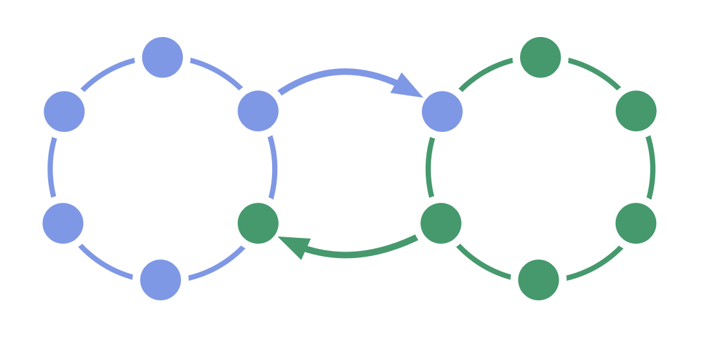

Facilita el flujo <em>bidireccional</em> de información e influencia entre dos grupos.

Dos equipos interdependientes seleccionan cada uno a uno de sus miembros para que represente sus intereses en las decisiones de <a href="glossary.html#entry-governance" class="glossary-tooltip" data-toggle="tooltip" title="Gobernanza: El proceso de establecer objetivos y tomar y evolucionar decisiones que orientan a las personas hacia la consecución de dichos objetivos.">gobernanza</a> del otro equipo.

El doble enlace permite la equivalencia entre dos equipos y puede ser utilizada para extraer información valiosa en estructuras jerárquicas.

