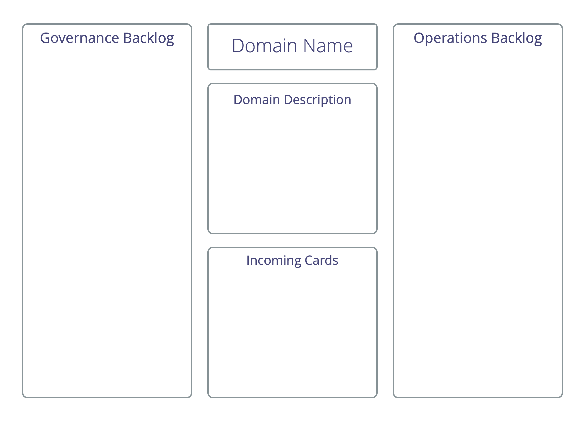

Un formato de taller para grupos grandes para cocrear y organizarse en respuesta a una situación compleja de alcance y escala significativos.

Durante el taller, las partes interesadas hacen suyo plenamente el proceso de principio a fin, al ir pasando del concepto a una colaboración completamente operativa.

Identifica las partes interesadas relevantes, determina los requisitos relacionados y utilízalos para identificar los elementos de trabajo y las decisiones que se deben tomar, distribuir el trabajo y definir una estructura inicial para la colaboración.

Puedes usar el mapeo de drivers para:

-   organizar start-ups,
-   iniciar proyectos,
-   abordar los principales obstáculos u oportunidades,
-   implementar la estrategia
-   desarrollar una estructura organizacional para permitir un mejor flujo de valor.

El resultado de un taller de mapeo de drivers es habitualmente:

-   una distribución del trabajo, clasificada en una serie de dominios, centrada en las necesidades de las partes interesadas.
-   una estructura organizacional hecha a medida que lo reúne todo, incluyendo la interconexión de dominios para gestionar dependencias.
-   un primer borrador de agenda de pendientes priorizados de gobernanza y operaciones para cada subdominio identificado.
-   la delegación de influencia y la distribución de personas a los subdominios por medio de la auto selección y nominación.

Aunque el mapeo de drivers se usa con frecuencia para identificar y definir nuevos dominios, también hay aplicaciones para identificar y distribuir drivers de gobernanza y operacionales entre los dominios existentes de una organización, por ejemplo, cuando una iniciativa va a ser abordada por equipos ya existentes en una organización, o si un grupo siente que está estancado en su estructura actual y busca inspiración sobre cómo adapatarla gradualmente. El grupo puede decidir si se mapean a los dominios existentes y averiguan cuáles nuevos necesitan crear, o incluso crear una nueva estructura de cero.

En un grupo pequeño o círculo (como máximo 6-8 personas), cuando no es una prioridad distribuir el trabajo, el equipo podría usar solo los pasos del 1 al 5, para entender el alcance y cubrir la agenda de pendientes de operaciones y gobernanza, y luego utilizar la formación de propuestas o algún otro enfoque para identificar la estrategia y/o los pasos siguientes.

Durante la preparación:

-   invita a personas que puedan hacer una contribución relevante a este proyecto. Envía el programa del taller con antelación.
-   envía con antelación el driver primario con el que trabajarás, y en caso de un dominio existente, la descripción del dominio para el proyecto/iniciativa para que la gente pueda familiarizarse con él. Intenta resolver cualquier objeción antes del taller.
-   los asistentes ya pueden prepararse pensando y registrando ideas de actores y necesidades relacionadas.
-   prepara un póster con la descripción del dominio para presentarlo en el primer paso. Para trabajar también necesitarás la A5 y las notas adhesivas, bolígrafos y una pared ancha.

## El proceso de mapeo de drivers

Estos son los pasos a seguir:

### 1. ¿Por qué estamos aquí?

_Presentación y consentimiento del driver primario_

-   Presentar el driver primario al grupo
-   Consentimiento al driver – _¿Es esta una descripción suficientemente clara del driver? ¿Es importante que respondamos a él_?
-   Aclara cualquier restricción existente por parte de la persona delegadora, por ejemplo, presupuesto, plazo previsto, expectativas, etc. En el caso de un dominio existente, presente la descripción del dominio. Invite más preguntas que ayuden a profundizar en la comprensión sobre lo que está sucediendo y lo que se necesita.
-   Haz explícito el nivel de compromiso que se espera de los participantes. P. ej. se espera que las personas estén aquí solo por la duración del taller, o durante toda la iniciativa, etc.
-   Registra cualquier información relevante que surja.

### 2. . ¿Quién se verá afectado?

_¿Quién se verá afectado cuando respondamos al driver principal? Considere quién puede ayudar / interponerse en el camino / beneficiarse / perder o ser perjudicado._

-   Lista los actores en notas adhesivas y pégalas en un tablero
-   Enfócate en las personas reales que se verán afectadas por esta iniciativa (grupos o individuos), y evita hacer suposiciones sobre roles futuros (como _Gestor de proyectos_) u otros dominios (por ejemplo, _Marketing_) en esta etapa.

### 3. ¿Qué se necesita?

_Considera los distintos actores y describe lo que se necesita: ¿qué necesitan en el contexto del  driver principal, y qué necesitamos de ellos?_

-   Escribe cada sugerencia en una nota adhesiva separada (tarjetas de necesidad)
-   Describe la necesidad así como el impacto previsto de responder a esa necesidad
-   Usa el formato _"Nosotros / ellos necesitamos … para que …"_
-   Añade el nombre del actor en la esquina superior izquierda de la tarjeta
-   Añade tu nombre en la esquina superior derecha de la tarjeta

### 4. Identificar experiencias y conocimientos

_Identificar quién tiene experiencia o conocimientos sobre responder a estas necesidades, de modo que más tarde cuando las personas respondan a una necesidad específica, sepan quién puede tener información valiosa._

-   Tómate tu tiempo para familiarizarte con las diferentes _tarjetas de necesidades_.
-   Añade su nombre a esas _tarjetas de necesidades_ sobre las que tiene experiencia, o ideas sobre cómo abordarlas, para que más adelante en el proceso la gente pueda consultarte si le es de ayuda.
-   Considera añadir nombres de personas que no están presentes si crees que podrían hacer una contribución valiosa.
-   Escribe el(los) nombre(s) de esas personas en la parte inferior de la _tarjeta de necesidades_.
-   Añadir tu nombre a una tarjeta en este paso, no significa que estés asumiendo la responsabilidad de la necesidad, solo que eres capaz y estás dispuesto a contribuir a encontrar una solución si esto es útil más adelante.

### 5. Identificar dominios

_Agrupa los actores y/o necesidades según su relevancia, en **dominios** coherentes como punto de partida para ordenar y priorizar las necesidades. Considera cómo optimizar la aportación de valor de principio a fin, a los diversos actores que identificó en el paso 2._

Modos de identificar dominios:

-   Agrupa a los actores similares (actorcéntrico)
-   Agrupa las necesidades similares (necesidadescéntrico)
-   Una combinación de ambas (de los anteriores) es común

Considera este paso finalizado, tan pronto como hayas acordado una primera iteración de una distribución significativa del trabajo. Recuerda, puedes hacer cambios en los dominios que definiste en cualquier momento (más adelante durante el taller o posteriormente), así que solo tienes que intentar lograr algo que sea lo suficientemente bueno como para empezar.

_Como facilitador, apoya con cuidado al grupo en la autoorganización y sé consciente de las personas que abandonan la conversación. Este proceso a menudo incluye una fase que parece caótica para algunos participantes, lo que puede hacer que se sientan incómodos. Para comprobar si un resultado es alcanzado, pide objeciones a que los dominios sean lo suficientemente buenos por ahora._

### 6. Asigna personas y define dominios

_La gente se organiza en equipos más pequeños en torno a los diferentes dominios, luego define el dominio y dale un nombre._

-   Forma un pequeño equipo alrededor de los dominios conforme a la experiencia e interés
-   Añade primero al menos 1 o 2 personas con experiencia. Usa la información en las tarjetas,
-   Comprueba que se da cuenta de todos los dominios de modo suficiente
-   En cada grupo:
    -   acuerda un nombre para el dominio.
    -   define el driver primario para el dominio (y redacta una breve descripción del dominio si eso ayuda).
-   Por último, haz que cada grupo presente brevemente su dominio, y durante cada informe busca las dependencias y cualquier superposición de estos dominios.

En esta fase algunas personas podrían ir de un dominio a otro hasta que encuentren uno en el que sientan que pueden contribuir.

### 7. Afina las agendas de pendientes

_Organiza el trabajo que hay por hacer en cada ámbito, asegúrate que las cosas se priorizan y describen con claridad._

-   Para cada dominio, copia la plantilla de abajo en un rotafolio
-   Ordena todas las necesidades restantes en los dos registros de asuntos pendientes del rotafolio:
    -   registro de operaciones pendientes: necesidades sobre las que se puede actuar
    -   registro de gobernanza pendiente: necesidades que se beneficiarían o necesitarían una decisión
-   Combina y reformula las tarjetas según sea necesario, de modo que la descripción en cada tarjeta sea clara. Consulta al autor de la tarjeta cuando hayan dudas.
-   Prioriza las cartas en cada tablón.
-   Archiva cualquier tarjeta de “necesidades” que parezca superflua.
-   Considera el dominio y describe y prioriza otras necesidades que puedan no haber sido identificadas.
-   Rechaza tarjetas que parecen ser la responsabilidad de otro dominio abordar.
-   Pon a un lado las cartas relativas a múltiples dominios. Puedes abordarlas en el paso 8.

_Como persona facilitadora del proceso de mapeo del driver, proporciona un espacio para recoger tarjetas relativas a múltiples dominios para que puedan ser abordadas más adelante._

Pausa con regularidad para compartir informes entre los distintos dominios. Nota: Algunos dominios podrían disolver, cambiar o fusionarse con otros.

### 8. Conecta dominios

_Crea estructura para gestionar dependencias y tratar asuntos que se extienden más allá del alcance de un dominio o afectan a la organización más amplia_

-   Para una nueva organización o proyecto, considera [Círculos de personas delegadas](delegate-circle.html), [ Círculos de servicio](service-circle.html) o [Enlace doble entre dominios](double-linking.html).
-   Para una organización existente, también considera conectarte a dominios existentes en la organización.

### 9. ¿Qué más?

_Tómate un momento para comprobar si falta algo._

¿Qué más debemos tener en cuenta…

-   …para funcionar de forma segura?
-   …para abordar el driver principal?

### 10. ¡Celebra!

_¡Tómate un momento para celebrar tus logros en poner en marcha su organización o iniciativa!_
	