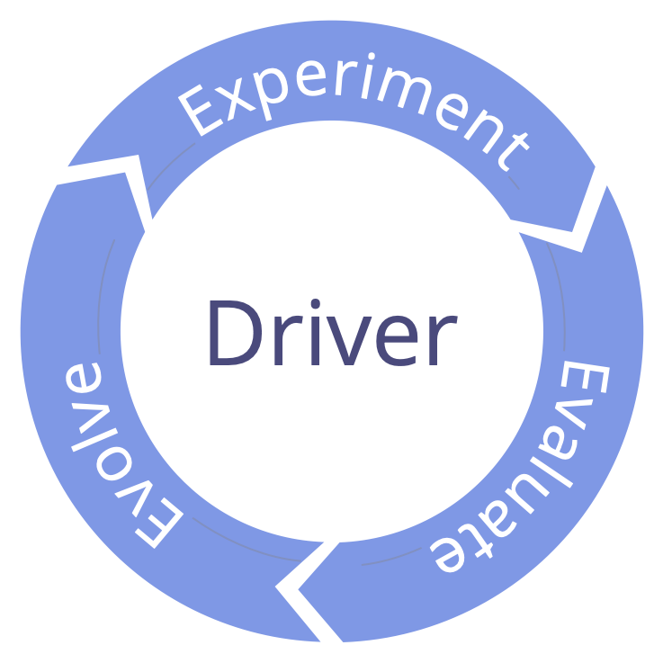

Desarrolla constantemente el conjunto de acuerdos, y elimina desperdicios.

La revisión frecuente y regular de acuerdos es una práctica esencial para el aprendizaje de una organización:

-   adapta los acuerdos para que se ajusten a un contexto cambiante
-   integra el aprendizaje para hacer los acuerdos más eficientes

Asegúrate de que todos los <a href="glossary.html#entry-agreement" class="glossary-tooltip" data-toggle="tooltip" title="Acuerdo: Una pauta, proceso, protocolo o política que ha sido acordado y se ha diseñado para guiar el flujo de valor.">acuerdos</a> tienen una fecha de revisión apropiada

Evaluar los acuerdos puede ser algo tan simple como revisar si el acuerdo es aún relevante, y que no hay objeciones para que mantenerlo como está.

Los acuerdos a menudo se revisan en [Reuniones de gobernanza](governance-meeting.html), sin embargo, a veces es más efectivo programar una sesión específica.

Ajusta la frecuencia de la revisión según sea necesario, y haz la revisión antes si es preciso.

Los elementos de este patrón también pueden ser utilizados por individuos para evaluar las decisiones que toman.

## Formato corto

-   _¿Cómo nos ha ayudado este acuerdo?_
-   _¿Hay alguna razón para abandonar este acuerdo?_
-   _¿Cómo se puede mejorar este acuerdo?_
-   Acordar una próxima fecha de revisión.

## Formato largo

Preparación:

-   Programar la revisión.
-   Asegurar que toda la información necesaria está disponible.

Seguimiento:

-   Acordar una próxima fecha de revisión.
-   Documentar decisiones y tareas, y compartir con personas relevantes.
-   Considerar los efectos de otros acuerdos relacionados.
