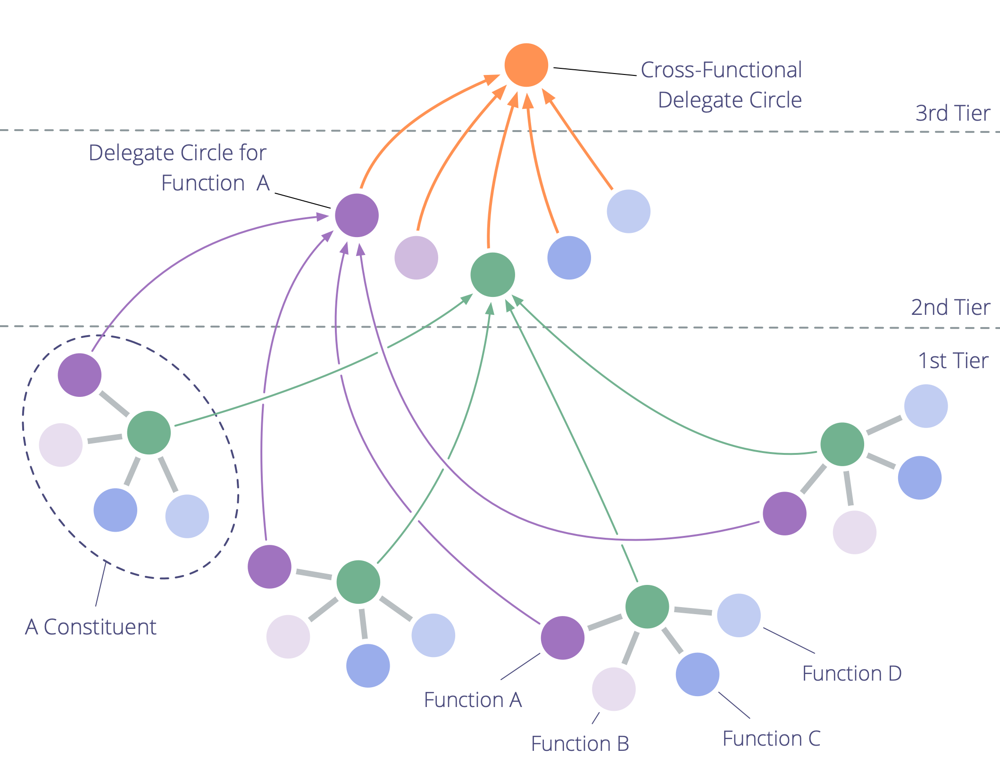

Múltiples constituyentes (organizaciones o proyectos) con el mismo (o similar) driver primario y estructura pueden compartir el aprendizaje a través de dominios funcionales, alinear la acción y tomar decisiones de gobernanza de alto nivel (p. ej., estrategia general).

Crear una organización fractal puede permitir que una red grande responda rápidamente a contextos cambiantes.

Si es necesario, el patrón se puede repetir para conectar múltiples organizaciones fractales en una.

## Requisitos

Una organización fractal puede ser formada por múltiples organizaciones in(ter)dependientes que comparten el mismo <a href="glossary.html#entry-driver" class="glossary-tooltip" data-toggle="tooltip" title="Driver: El motivo de una persona o de un grupo para responder a una situación específica.">driver</a> (primario), o por múltiples sucursales, departamentos o proyectos dentro de una organización más grande.

Estos <a href="glossary.html#entry-constituent" class="glossary-tooltip" data-toggle="tooltip" title="Constituyente: Un equipo (p. ej. un círculo, grupo, departamento, sucursal, proyecto u organización) que delega autoridad a un representante para que actúe en su nombre en otro equipo u organizaciones.">constituyentes</a> (es decir, organizaciones, sucursales, departamentos o proyectos) deben compartir al menos algunos — y normalmente la mayoría — de los dominios <a href="glossary.html#entry-domain" class="glossary-tooltip" data-toggle="tooltip" title="Dominio: Un área específica de influencia, actividad y toma de decisiones dentro de una organización.">funcionales</a> (por ejemplo, contabilidad, gestión de productos o desarrollo).

## Niveles

Una organización fractal tiene al menos tres niveles:

- primer nivel: los **constituyentes** (es decir, organizaciones, sucursales, departamentos o proyectos)
- segundo nivel: **específico de la función [círculos de delegados](delegate-circle.html)** para compartir aprendizajes y hacer y evolucionar acuerdos en nombre de dominios específicos de la función
- tercer nivel: un **círculo interfuncional de delegados** para hacer y evolucionar acuerdos en respuesta a los drivers que afectan al conjunto general de constituyentes

## Formando una organización fractal

1. Formando el **segundo nivel:** en cada constituyente, los miembros de cada dominio funcional común (y significativo) deciden quién de ellos los representará en un **círculo de delegados de función específica**, donde comparten conocimiento y aprendizajes, y contribuyen a la creación y evolución de acuerdos. Los representantes son seleccionados por un plazo limitado (después de lo cual se hace una nueva selección).
2. Formando el **tercer nivel:** cada círculo de delegados del segundo nivel selecciona un delegado para formar el **círculo delegado interfuncional**.

## Impacto en la(s) organización(es)

Cada constituyente:

- obtiene acceso a una amplia gama de experiencias, sabiduría y habilidades para aumentar la eficacia y la innovación.
- puede compartir recursos, infraestructura y experiencia con otros constituyentes en función de su capacidad y necesidad

El segundo y tercer nivel:

- puede poner a prueba decisiones simultáneamente a través de múltiples instancias de un dominio de función específica, proporcionando muchos comentarios y aprendizaje rápido
- organizar, alinear y mover todo el sistema preservando la autonomía y la agencia de cada uno de los constituyentes individuales