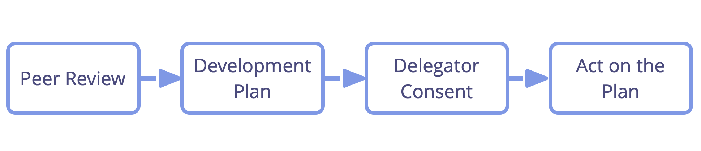

Apoyaros unos a los otros para aprender y crecer en los roles y equipos en los que sirves.

El responsable del rol (o equipo) dirige la revisión por pares configurando el proceso y hablando primero en cada paso.

Asegúrate de invitar a personas con perspectivas complementarias para que contribuyan a la revisión y a una persona [facilitadora](facilitate-meetings.html).

Tanto para apreciaciones como para sugerencias de mejora, asegúrate de tener en cuenta los siguientes aspectos:

- El **valor** que la persona delegada trajo a la organización al tomar cuenta del <a href="glossary.html#entry-domain" class="glossary-tooltip" data-toggle="tooltip" title="Dominio: Un área específica de influencia, actividad y toma de decisiones dentro de una organización.">dominio</a>.
- Los **procesos de trabajo** del guardián del rol o del equipo, y su **colaboración** con la <a href="glossary.html#entry-delegator" class="glossary-tooltip" data-toggle="tooltip" title="Persona delegadora: Un individuo o grupo que delega la responsabilidad de un dominio a otro(s).">persona delegadora</a> y con otras partes interesadas relevantes, y – en el caso de un equipo - unos con otros.
- Cómo de bien se encarga la **persona delegadora** de sus responsabilidades.
- El **diseño del dominio** mismo (y potencialmente el diseño de otros dominios relacionados).
- Las **competencias y habilidades** del guardián del rol o del equipo en relación con el dominio.
- La <a href="glossary.html#entry-strategy" class="glossary-tooltip" data-toggle="tooltip" title="Estrategia: Un enfoque de alto nivel sobre cómo las personas crearán valor para dar cuenta de un dominio con éxito.">estrategia</a> que la persona guardiana del rol o equipo sigue para dar cuenta de este dominio.

